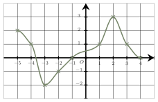
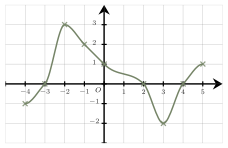

Séance 1 — Fonctions, puissances et algèbre


---Q---
On considère  la  fonction  $f$ définie par  $f(x)= 2x^2+2x+2$.

L'image de $-3$ par la fonction $f$ est égale à :

- $-7$
- $-22$
- $14$
- $2$

---CORR---
On a :
$$\begin{aligned}
          f(-3)&=2\times(-3)^2+2\times (-3)+2\\\\
          &=2\times 9-6+2\\\\
          &=18-6+2\\\\
          &=14
          \end{aligned}$$.

La bonne réponse est la réponse **C**.



---Q---
On considère le nombre $N=\dfrac{10^4}{5^2}$. On a :

- $N=2^{2}$
- $N=\dfrac{1}{10^{2}}$
- $N=20$
- $N=4\times 10^{2}$

---CORR---
$$\begin{aligned}
    N&=\dfrac{10^4}{5^2}\\\\
    &=\dfrac{5^4\times 2^4 }{5^2}\\\\
    &=2^4\times 5^{2}\\\\
    &=10^2\times 2^{2}\\\\
    &=4\times 10^{2}
    \end{aligned}$$
La bonne réponse est la réponse **D**.



---Q---
Une  factorisation de    $9x^2-100$ est :

- $(3x-10)(3x+10)$
- $(9x+100)(9x-100)$
- $(3x-10)^2$
- $(9x+10)(9x-10)$

---CORR---
On reconnaît le développement de l'égalité remarquable :  
$(a+b)(a-b)=a^2-b^2$ avec $a=3x$ et $b=10$.  
On a donc :
      $9x^2-100=(3x-10)(3x+10)$
La bonne réponse est la réponse **A**.



---Q---
On considère $A=\dfrac{27}{1\ 000}+\dfrac{267}{100}$.

On a :

- $A=2{,}697$
- $A=2{,}672\ 7$
- $A=0{,}029\ 4$
- $A=0{,}294$

---CORR---
On a : 

$$\begin{aligned}
    A&=\dfrac{27}{1\ 000}+\dfrac{267}{100}\\\\
    &=0{,}027+2{,}67\\\\
    &=2{,}697
    \end{aligned}$$
La bonne réponse est la réponse **A**.



---Q---
On considère la droite d'équation $y=5$.

Son coefficient directeur est :

- $m=5$
- $m=0$
- $m=-1$
- $m=1$

---CORR---
On reconnaît l'équation réduite d'une droite de la forme $y=mx+p$ où $m$ est son coefficient directeur. 
Ici, $m=0$ et $p=5$. 
La bonne réponse est la réponse **B**.



---Q---

L'image de $-3$ est :

- L'image de $-3$ n'existe pas
- $-2$
- $2$
- $-3$

---CORR---
Pour lire l'image de $-3$, on place la valeur de $-3$ sur l'axe des abscisses (axe de lecture  des antécédents) et on lit
    son image  sur l'axe des ordonnées (axe de lecture des images). 
     On obtient :  $f(-3)=-2$ 
La bonne réponse est la réponse **B**.


Devoirs — Séance 1 — Fonctions, puissances et algèbre


---Q---
On considère  la fonction $f$ définie par  $f(x)= (2x-2)(3x+2)$.

L'image de $-5$ par la fonction $f$ est égale à :

- $156$
- $-5$
- $204$
- $25$




---Q---
On considère le nombre $N=\dfrac{6^4}{2^2}$. On a :

- $N=18$
- $N=3^{2}$
- $N=\dfrac{1}{6^{2}}$
- $N=9\times 6^{2}$




---Q---
Une  factorisation de    $4x^2-4x+1$ est :

- $(2x+1)(2x-1)$
- $(-2x+1)^2$
- $x(4x-4)+1$
- $(2x+1)^2$




---Q---
On considère $A=\dfrac{92}{100}+\dfrac{18}{1\ 000}$.

On a :

- $A=0{,}921\ 8$
- $A=0{,}011$
- $A=0{,}938$
- $A=0{,}11$




---Q---
On considère la droite d'équation $y=\dfrac{x}{4}-6$.

Son coefficient directeur est :

- $m=-6$
- $m=\dfrac{1}{4}$
- $m=4$
- $m=\dfrac{x}{4}$




---Q---

L'image de $-1$ est :

- $-1$
- $2$
- L'image de $-1$ n'existe pas
- $3$



