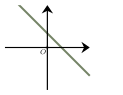

Séance 2 — Calcul, algèbre et pourcentages


---Q---
Choisir deux nombres puis calculer l'inverse de leur somme. 

 Le résultat obtenu si on choisit comme nombres $-1$ et $7$ est :

- $\dfrac{1}{6}$
- $-6$
- $-\dfrac{6}{7}$
- $-\dfrac{1}{6}$

---CORR---
La somme de $-1$ et $7$ est $6$. 

 Son inverse est : $\dfrac{1}{6}$.

La bonne réponse est la réponse **A**.




---Q---
On donne la relation : $9a+10y=5$.

 On cherche à isoler $a$. On a :

- $a=-10y+5$
- $a=\dfrac{5}{9}-10y$
- $a=\dfrac{10y-5}{9}$
- $a=\dfrac{-10y+5}{9}$

---CORR---
De la relation $9a+10y=5$, on déduit en ajoutant $-10y$ dans chaque membre :
 $9a=5-10y$

 Puis, en divisant par $9$, on obtient : $ a=\dfrac{5-10y}{9}$.

La bonne réponse est la réponse **D**.




---Q---
On considère une fonction affine $f$ telle que $f(4)=-11$ et $f(8)=-19$.

 L'image de $12$ par cette fonction affine est :

- $-35$
- $-24$
- $-27$
- $-30$

---CORR---
$f$ est une fonction affine, elle est donc de la forme $f(x)=mx+p$.

 $\begin{aligned}
    m&=\dfrac{f(8)-f(4)}{8-4}\\\\
    &=\dfrac{-19+11}{4}\\\\
    &=-2
    \end{aligned}$

 On a donc $f(x)=-2x+p$.

 Pour déterminer $p$, on utilise la valeur de $f(4)$ :

 $\begin{aligned}
    f(4)&=-2\times 4+p\\\\
    -11&=-8+p\\\\
    p&=-3
    \end{aligned}$

 On a donc $f(x)=-2x-3$.

 L'image de $12$ par cette fonction est :

 $\begin{aligned}
    f(12)&=-2\times 12  -3
     \\\\&=-24-3\\\\ 
    &=-27
    \end{aligned}$

La bonne réponse est la réponse **C**.




---Q---
La forme développée de $(3a+2)^2$ est :

- $9a^2+12a+4$
- $9a^2+6a+4$
- $9a^2+4$
- $a^2+4a+4$

---CORR---
On utilise l'égalité remarquable $(a+b)^2=a^2+2ab+b^2$ avec $a=3a$ et $b=2$.

 $\begin{aligned}
         (3a+2)^2&=(3a)^2+2 \times 3a \times 2 + 2^2\\\\
            &=9a^2+12a+4
            \end{aligned}$

La bonne réponse est la réponse **A**.




---Q---
La seule droite pouvant correspondre à l'équation $y=6x-5$ est :

- La droite $D_1$ 
- La droite $D_4$ 
- La droite $D_2$ 
- La droite $D_3$ 

---CORR---
On reconnaît la droite grâce à son ordonnée à l'origine ($-5<0$) et son coefficient directeur ($6>0$).

 Il s'agit de la droite coupant l'axe des ordonnées en-dessous de l'axe des abscisses et qui monte.

 Il s'agit de la droite $D_1$.

La bonne réponse est la réponse **A**.




---Q---
Le prix d'un vêtement est $35$ €.

 Il baisse de $20\ $%. Son nouveau prix est :

- $34{,}3 $ €
- $42 $ €
- $34{,}8 $ €
- $28$ €

---CORR---
Le nouveau prix est de $28 $ €.

Mentalement : 

 On calcule d'abord le montant de la réduction. 

 Pour calculer $20\ $% d'une quantité, on commence par calculer $10\ $% en divisant
 par $10$ :

 $10\ $% de $35$ est égal à $35\div 10=3,5$.

 Puisque $20\ $% est deux fois plus grand que $10\ $%, $20\ $% de $35$ est égal à $2\times 3,5=7$.

 La réduction est donc de : $7$ €.

 Le nouveau prix est : $35-7= 28$ €.

La bonne réponse est la réponse **D**.



Devoirs — Séance 2 — Calcul, algèbre et pourcentages


---Q---
Choisir deux nombres puis calculer le double de leur produit. 

 Le résultat obtenu si on choisit comme nombres $4$ et $2$ est :

- $12$
- $8$
- $16$




---Q---
On donne la relation : $3x-2c=2$.

 On cherche à isoler $x$. On a :

- $x=\dfrac{2c+2}{3}$
- $x=2c+2$
- $x=\dfrac{-2c-2}{3}$
- $x=\dfrac{2}{3}+2c$




---Q---
On considère une fonction affine $f$ telle que $f(5)=2$ et $f(7)=0$.

 L'image de $12$ par cette fonction affine est :

- $-5$
- $2$
- $-12$
- $-7$




---Q---
La forme développée de $(2x-9)(2x+9)$ est :

- $4x^2-36x+81$
- $4x^2+36x+81$
- $4x^2-36x-81$
- $4x^2-81$




---Q---
La seule droite pouvant correspondre à l'équation $y=-6x-10$ est :

- La droite $D_1$ 
- La droite $D_2$ 
- La droite $D_4$ 
- La droite $D_3$ 




---Q---
Le prix d'un vêtement est $50$ €.

 Il augmente de $20\ $%. Son nouveau prix est :

- $50{,}2 $ €
- $40 $ €
- $51 $ €
- $60$ €



