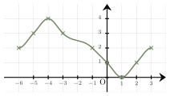
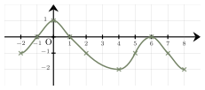

Séance 3 — Fractions, formules et fonctions affines


---Q---
On considère $A=\dfrac{4}{5-\dfrac{2}{3}}$.

 $A$ est égal à :

- $\dfrac{12}{13}$
- $\dfrac{52}{3}$
- $-\dfrac{52}{3}$
- $\dfrac{13}{3}$

---CORR---
$\begin{aligned}
A &= \dfrac{4}{5-\dfrac{2}{3}} \\\\
&= \dfrac{4}{\dfrac{15}{3}-\dfrac{2}{3}} \\\\
&= \dfrac{4}{\dfrac{13}{3}} \\\\
&= 4 \times \dfrac{3}{13} \\\\
&= \dfrac{12}{13}
\end{aligned}$

La bonne réponse est la réponse **A**.




---Q---
Soient $K$, $L$, $I$ et $J$ quatre nombres (avec $J$ non nul) vérifiant l'égalité : $K = \dfrac{L + I}{J}$.

 Une expression de $L$ en fonction de $K$, $I$ et $J$ est :

- $L = J \times K - I$
- $L = \dfrac{K - I}{J}$
- $L = J \times K + I$
- $L = K - I \times J$

---CORR---
On isole $L$ dans un membre de l'égalité :

 $\begin{aligned}
        K &= \dfrac{L + I}{J}\\\\
        K \times J &= L + I\\\\
        K \times J - I &= L
        \end{aligned}$

Une expression de $L$ en fonction de $K$, $I$ et $J$ est $L = J \times K - I$.

La bonne réponse est la réponse **A**.




---Q---
Voici la représentation graphique d'une fonction $f$ :  

 
L'ensemble des antécédents de $2$ est :

- {$-1\ ;\ 3$}
- {$-6\ ;\ -1$}
- {$-6\ ;\ -1\ ;\ 4$}
- {$-6\ ;\ -1\ ;\ 3$}

---CORR---
Déterminer les antécédents de $2$ revient à déterminer les nombres qui ont pour image $2$.

 On part de $2$ sur l'axe des ordonnées et on lit les antécédents (éventuels) sur l'axe des abscisses.

On en trouve $3$ : $-6\ ;\ -1\ ;\ 3$.

La bonne réponse est la réponse **D**.




---Q---
Augmenter une valeur de $40~\%$ revient à la multiplier par :

- $1{,}04$
- $1{,}4$
- $0{,}4$
- $0{,}6$

---CORR---
Augmenter de $40~\%$ revient à multiplier par $1+\dfrac{40}{100}$.

 Ainsi, le coefficient multiplicateur associé à une augmentation de $40~\%$ est $1+0{,}4$, soit $1{,}4$.

 
La bonne réponse est la réponse **B**.




---Q---
Le plan est muni d’un repère orthogonal. 

 On note $d$ la droite passant par les points $A(-3\ ;\ 2)$ et $E(-10\ ;\ -8)$. 

 Le coefficient directeur $m$ de la droite $(AE)$ est égal à :

- $-\dfrac{7}{10}$
- $\dfrac{10}{7}$
- $\dfrac{6}{13}$
- $\dfrac{7}{10}$

---CORR---
Le coefficient directeur $m$ de la droite $(AE)$ est donnée par la formule : $\dfrac{y_{E}-y_{A}}{x_{E}-x_{A}}$.

 $\begin{aligned}
    m&=\dfrac{-8-2}{-10-(-3)}\\\\
    &= \dfrac{-10}{-7}\\\\
    &=\dfrac{10}{7}
    \end{aligned}$

La bonne réponse est la réponse **B**.




---Q---
Soit $f$ la fonction définie par : $f(x)=\dfrac{2}{3}x-4$.

 L'image de $2$ par la fonction $f$ est :

- $-\dfrac{8}{3}$
- $-\dfrac{4}{3}$
- $-\dfrac{10}{3}$
- $0$

---CORR---
Comme $f(x)=\dfrac{2}{3}x-4$, on a :

 $\begin{aligned}
        f(2)&=\dfrac{2}{3}\times 2-4\\\\
        &=\dfrac{4}{3}-4\\\\
        &=-\dfrac{8}{3}
        \end{aligned}$

La bonne réponse est la réponse **A**.



Devoirs — Séance 3 — Fractions, formules et fonctions affines


---Q---
On considère $A=\dfrac{2}{3-\dfrac{2}{5}}$.

 $A$ est égal à :

- $\dfrac{10}{13}$
- $\dfrac{26}{5}$
- $10$
- $\dfrac{13}{5}$




---Q---
Soient $I$, $K$, $L$ et $J$ quatre nombres (avec $J$ non nul) vérifiant l'égalité : $I = K - LJ$.

 Une expression de $L$ en fonction de $I$, $K$ et $J$ est :

- $L = \dfrac{K + I}{J}$
- $L = \dfrac{K - I}{J}$
- $L = J(K - I)$
- $L = \dfrac{I - K}{J}$




---Q---
Voici la représentation graphique d'une fonction $f$ : 

L'ensemble des antécédents de $0$ est :

- {$1\ ;\ 6$}
- {$-1\ ;\ 1\ ;\ -2$}
- {$-1\ ;\ 1\ ;\ 6$}
- {$-1\ ;\ 1$}




---Q---
Augmenter une valeur de $90~\%$ revient à la multiplier par :

- $1{,}09$
- $1{,}9$
- $0{,}9$
- $0{,}1$




---Q---
Le plan est muni d’un repère orthogonal. 

 On note $d$ la droite passant par les points $C(-7\ ;\ 5)$ et $F(4\ ;\ -3)$.

 Le coefficient directeur $m$ de la droite $(CF)$ est égal à :

- $-\dfrac{11}{8}$
- $-\dfrac{8}{11}$
- $\dfrac{11}{8}$
- $-\dfrac{2}{3}$




---Q---
Soit $p$ la fonction définie par : $p(x)=\dfrac{5}{3}x-4$.

 L'image de $2$ par la fonction $p$ est :

- $6$
- $-\dfrac{2}{3}$
- $-\dfrac{7}{3}$
- $-\dfrac{1}{3}$



