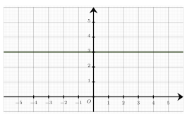
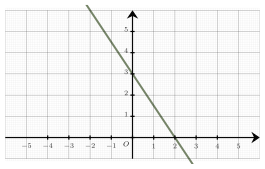

Séance 6 — Pourcentages, droites et algèbre


---Q---
Dans un lycée, il y a $1\ 000$ élèves inscrits. 

 $20\ $% d'entre eux étudient l'Espagnol.

 Le nombre d'élèves qui étudient l'Espagnol est égal à :

- $250$
- $50$
- $20$
- $200$

---CORR---
$20\ $% de $1\ 000  = 0{,}2 \times 1\ 000 = 200$

 Donc $200$ élèves étudient l'Espagnol.

La bonne réponse est la réponse **D**.




---Q---
Dans un repère du plan, on a représenté une droite.

 Le coefficient directeur de cette droite est égal à :

 

- $3$
- $1$
- $0$
- $-1$

---CORR---
La droite est horizontale. On en déduit que son coefficient directeur est $m=0$.

La bonne réponse est la réponse **C**.




---Q---
Parmi les quatre nombres suivants, lequel est le plus petit ?

- $32 \times 10^{-2}$
- $\dfrac{3}{10}$
- $\dfrac{28}{100}$
- $0{,}31$

---CORR---
Pour comparer ces quatre nombres, on les écrit sous forme décimale :

$\dfrac{3}{10} = 0{,}3$ 

$\dfrac{28}{100} = 0{,}28$ 

$32 \times 10^{-2} = 0{,}32$ 

$0{,}31$ 

On a donc : $0{,}28 < 0{,}3 < 0{,}31 < 0{,}32$.

Le plus petit nombre est donc : $\dfrac{28}{100}$.

La bonne réponse est la réponse **C**.




---Q---
Soit $x$ un réel non nul.

À quelle expression est égale $\dfrac{1}{6}-\dfrac{5x+3}{x}$ ?

- $\dfrac{29x +18}{6x}$
- $-\dfrac{31x +18}{6x}$
- $-\dfrac{29x +18}{6x}$
- $\dfrac{-29x +18}{6x}$

---CORR---
On met l'expression au même dénominateur : 

$\begin{aligned}
        \dfrac{1}{6}-\dfrac{5x+3}{x}&=\dfrac{x-6\times \left(5x+3\right)}{6x}\\\\
        &=\dfrac{x -30x -18}{6x}\\\\
        &=\dfrac{-29x -18}{6x}\\\\
     \end{aligned}$

$\phantom{\dfrac{1}{6}-\dfrac{5x+3}{x}}=-\dfrac{29x +18}{6x}$

La bonne réponse est la réponse **C**.




---Q---
On considère des réels $x$, $y$ et $u$ non nuls tels que $\dfrac{x}{y}+2= \dfrac{5}{u}$.

 On peut affirmer que :

- $u=\dfrac{5}{x+2y}$
- $u=\dfrac{5y}{x+2y}$
- $u=5y$
- $u=\dfrac{x+2y}{5y}$

---CORR---
On isole $u$ dans le premier membre : 

 $\begin{aligned}
               \dfrac{x}{y}+2&= \dfrac{5}{u} \\\\ 
              \dfrac{x+2y}{y}&= \dfrac{5}{u} \\\\ 
              u&=\dfrac{5\times y}{x+2y} \\\\
              u&= \dfrac{5y}{x+2y} 
              \end{aligned}$

La bonne réponse est la réponse **B**.




---Q---
Une augmentation de $10\ $% suivie d'une augmentation de $20\ $% équivaut à :

- une augmentation de $32\ $%
- une augmentation de $30\ $%
- une augmentation de $34\ $%
- une augmentation de $35\ $%

---CORR---
À partir des évolutions en pourcentage, on déduit les coefficients multiplicateurs : 

On note $CM_1 = 1 + \dfrac{10}{100}=1{,}1$ et $CM_2 = 1 + \dfrac{20}{100}=1{,}2$.

 Le coefficient multiplicateur global est : 

 $CM = CM_1 \times CM_2 = 1{,}1 \times 1{,}2 = 1{,}32$ 

Or, multiplier par $1{,}32$ revient à avoir **une** **augmentation** **de** $32\ $%.

La bonne réponse est la réponse **A**.



Devoirs — Séance 6 — Pourcentages, droites et algèbre


---Q---
Dans un lycée, il y a $400$ élèves inscrits. 

 $20\ $% d'entre eux étudient l'Espagnol.

 Le nombre d'élèves qui étudient l'Espagnol est égal à :

- $320$
- $130$
- $20$
- $80$




---Q---
Dans un repère du plan, on a représenté une droite.

 Le coefficient directeur de cette droite est égal à :

 

- $-\dfrac{2}{3}$
- $\dfrac{3}{2}$
- $3$
- $-\dfrac{3}{2}$




---Q---
Parmi les quatre nombres suivants, lequel est le plus grand ?

- $\dfrac{4}{5}$
- $\dfrac{85}{100}$
- $9 \times 10^{-1}$
- $0{,}88$




---Q---
Soit $x$ un réel non nul.

À quelle expression est égale $\dfrac{1}{3}-\dfrac{4x+4}{x}$ ?

- $\dfrac{11x +12}{3x}$
- $\dfrac{-11x +12}{3x}$
- $-\dfrac{11x +12}{3x}$
- $-\dfrac{13x +12}{3x}$




---Q---
On considère des réels $x$, $y$ et $u$ non nuls tels que $\dfrac{2}{x}+\dfrac{3}{y}= \dfrac{4}{u}$.

 On peut affirmer que :

- $u=\dfrac{3x+2y}{4xy}$
- $u=\dfrac{4xy}{3x+2y}$
- $u=3x+2y$
- $u=6xy$




---Q---
Une augmentation de $20\ $% suivie d'une augmentation de $10\ $% équivaut à :

- une augmentation de $31\ $%
- une augmentation de $32\ $%
- une augmentation de $30\ $%
- une augmentation de $35\ $%



