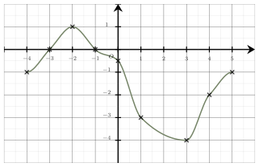
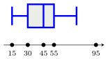
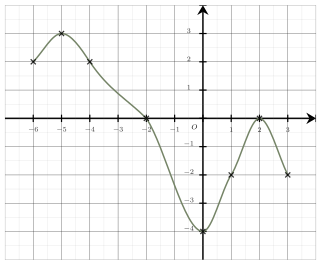
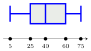

Séance 7 — Fonctions, évolutions et statistiques


---Q---
La fonction $f$ définie sur $\mathbb{R}$ par $f(x)=(-4x+24)(8x+56)$ admet pour tableau de signes :

- 
- 
- 
- 

---CORR---
L'équation $-4x+24=0$ a pour solution $x=6$.

 L'équation $8x+56=0$ a pour solution $x=-7$.

 Le tableau de signe du produit $(-4x+24)(8x+56)$ est : 

La bonne réponse est la réponse A.




---Q---
On considère une fonction $f$ dont la représentation graphique $\mathscr{C}$ est tracée dans un repère ci-dessous.

Une seule affirmation est correcte :

- Un antécédent de $-3$ est $0$
- $0$ est un antécédent de $-3$
- $0$ a pour image $-3$
- L'image de $-3$ est $0$

---CORR---
Les images se lisent sur l'axe des ordonnées et les antécédents sur l'axe des abscisses.

 Ainsi, on peut dire que :

 $\bullet$ $0$ est l'image de $-3$,

 $\bullet$ un antécédent de $0$ est $-3$, 

 $\bullet$ $-3$ est un antécédent de $0$,

 $\bullet$ **l'image de $-3$ est $0$**,

 $\bullet$ $-3$ a pour image $0$, 

 $\bullet$ $0$ a pour antécédent $-3$.

La bonne réponse est la réponse D.




---Q---
Une grandeur passe de $600$ à $900$.

 L'évolution est :

- Une augmentation de $33\  $%
- Une augmentation de $300\  $%
- Une augmentation de $50\ $%
- Une augmentation de $55\  $%

---CORR---
Le taux d'évolution $t$ est donné par la formule :

 $t = \dfrac{\text{valeur finale} - \text{valeur initiale}}{\text{valeur initiale}}$

 Ici :
 $t=\dfrac{900 - 600}{600}  = 0{,}5$

 Le taux d'évolution est donc de $50 \ $%.

La bonne réponse est la réponse C.




---Q---
Une série statistique est résumée par le diagramme en boite ci-dessous, utilisez-le pour donner la valeur de l'écart interquartile de cette série.

 

- $15$
- $25$
- $80$
- $65$

---CORR---
L'écart interquartile est la différence entre le troisième quartile et le premier quartile.

 D'après le diagramme en boite, on a $Q_3 = 55$ et $Q_1 = 30$.

 Donc l'écart interquartile est $Q_3 - Q_1 = 55 - 30 = 25$.

La bonne réponse est la réponse B.




---Q---
Dans un lycée, la moitié des élèves sont internes, parmi eux, trois cinquièmes sont des filles.  

 La proportion des filles internes par rapport à l'ensemble des élèves du lycée est égale à :

- $\dfrac{11}{10}$
- $3$
- $\dfrac{3}{10}$
- $50\ $%

---CORR---
La proportion des filles internes par rapport à l'ensemble des élèves du lycée est donnée par : 

 $\dfrac{1}{2}\times \dfrac{3}{5}=\dfrac{3}{10}$.

La bonne réponse est la réponse C.




---Q---
Soit $n$ un entier. 

À quelle expression est égale $\left(4^n\right)^{2}$ ?

- $4^{n^{2}}$
- Aucune de ces propositions
- $8^{n}$
- $16^{n}$

---CORR---
On applique la propriété des puissances de puissances d'un réel : 

 Soit $n\in \mathbb{N}$, et $p \in \mathbb{N}$, on a : 
 $\left(a^{n}\right)^{p}=a^{np}$

 $\begin{aligned}\left(4^{n}\right)^{2}&=4^{2n}\\\\
    &=\left(4^{2}\right)^{n}\\\\
    &=16^{n}
    \end{aligned}$

La bonne réponse est la réponse D.



Devoirs — Séance 7 — Fonctions, évolutions et statistiques


---Q---
La fonction $f$ définie sur $\mathbb{R}$ par $f(x)=(5x-20)(-5x+5)$ admet pour tableau de signes :

- 
- 
- 
- 




---Q---
On considère une fonction $f$ dont la représentation graphique $\mathscr{C}$ est tracée dans un repère ci-dessous.

Une seule affirmation est correcte :

- $3$ a pour image $-5$
- Un antécédent de $3$ est $-5$
- $3$ est un antécédent de $-5$
- $-5$ est l'image de $3$




---Q---
Une grandeur passe de $300$ à $600$.

 L'évolution est :

- Une augmentation de $300\  $%
- Une augmentation de $50\  $%
- Une augmentation de $100\ $%
- Une augmentation de $110\  $%




---Q---
Une série statistique est résumée par le diagramme en boite ci-dessous, utilisez-le pour donner la valeur de l'écart interquartile de cette série.

 

- $50$
- $70$
- $35$
- $15$




---Q---
Dans un lycée, un cinquième des élèves sont internes, parmi eux, un quart sont des filles.  

 La proportion des filles internes par rapport à l'ensemble des élèves du lycée est égale à :

- $\dfrac{9}{20}$
- $5\ $%
- $0{,}5$
- $20\ $%




---Q---
Soit $n$ un entier. 

À quelle expression est égale $\left(4^n\right)^{2}$ ?

- $8^{n}$
- Aucune de ces propositions
- $4^{n^{2}}$
- $16^{n}$



