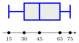
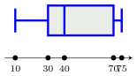

Séance 9 — Équations-produits, évolutions et statistiques


---Q---
Le prix d’un article a baissé : il est passé de $100$ euros à $90$ euros.

 Cela signifie que ce prix a été multiplié par :

- $1{,}1$
- $0{,}1$
- $0{,}9$
- $1{,}9$

---CORR---
**Correction 1 :**

On cherche le nombre $k$ tel que $ k \times 100=90 $.

On obtient $k=\dfrac{90}{100} = \dfrac{9}{10}=0{,}9$.

 **Correction 2 :**

 Le prix a diminué de $10$ euros, ce qui représente $10\ $% de $100$ euros.

 Le coefficient multiplicateur associé à cette baisse est $0{,}9$.

 On peut dire que le prix a été multiplié par $0{,}9$.

La bonne réponse est la réponse **C**.




---Q---
Une série statistique est résumée par le diagramme en boite ci-dessous. Quel pourcentage de valeurs sont comprises entre $15$ et $75$ ?

 

- $50$%
- $25$%
- $100$%
- $80$%

---CORR---
La valeur $15$ correspond au minimum et la valeur $75$ au maximum.

 Donc, la proportion de valeurs comprises entre $15$ et $75$ est de $100$%.

La bonne réponse est la réponse **C**.




---Q---
Le produit des solutions de l'équation $(4x+12)(4x+20)=0$ est égal à :

- $2$
- $0$
- $-8$
- $15$

---CORR---
On reconnaît une équation produit nul. 

Un produit de facteurs est nul, si et seulement si l'un au moins de ses facteurs est nul.

$\begin{aligned}
(4x+12)(4x+20)&=0\\\\
4x+12=0 &\text{ ou } 4x+20=0\\\\
4x=-12 &\text{ ou } 4x=-20\\\\
x=-3 &\text{ ou } x=-5
\end{aligned}$

Le produit de ces soltions est donc égal à : $(-3)\times (-5)=15$.

La bonne réponse est la réponse **D**.




---Q---
On considère la fonction $f$ définie sur $\mathbb{R}$ par $f(x)=7-\dfrac{6}{5}(x-2)^2$

 L'image de $2$ par cette fonction est :

- $7-\dfrac{6}{5}$
- $7$
- $0$
- $7-\dfrac{6}{5}(4+4)$

---CORR---
$\begin{aligned}
    f\left(2\right)&=7-\dfrac{6}{5}(2-2)^2\\\\
    &=7-\dfrac{6}{5}\times 0\\\\
    &=7
    \end{aligned}$

 L'image de $2$ par la fonction $f$ est : $7$.

La bonne réponse est la réponse **B**.




---Q---
On donne la série statistique suivante : 
 $7$ ; $10$ ; $18$ ; $5$ ; $14$ ; $8$ ; $16$ ; $19$ ; $12$ ; $13$.

 Parmi ces propositions, laquelle peut être la médiane de la série ?

- $11$
- $13$
- $12{,}5$
- $12$

---CORR---
La série triée dans l'ordre croissant est : $5$ ; $7$ ; $8$ ; $10$ ; $12$ ; $13$ ; $14$ ; $16$ ; $18$ ; $19$.

La série comporte $10$ valeurs, qui est un nombre pair, donc une médiane est une valeur **strictement** comprise entre les termes de rang $5$ et $6$, 
 soit entre $12$ et $13$. 

Prenons la moyenne de ces deux valeurs :

 $\dfrac{12 + 13}{2} = 12{,}5$.

La médiane est donc $12{,}5$.

La bonne réponse est la réponse **C**.




---Q---
On considère $A=\dfrac{5}{10\ 000}+\dfrac{5}{100}$. On a :

- $A=\dfrac{102}{2\ 000}$
- $A=0{,}050\ 5$
- $A=0{,}505$
- $A=\dfrac{10}{1\ 000\ 000}$

---CORR---
On a : 

 $\begin{aligned}
     A&=\dfrac{5}{10\ 000}+\dfrac{5}{100}\\\\
     &=0{,}000\ 5+0{,}05\\\\
     &=0{,}050\ 5
     \end{aligned}$

La bonne réponse est la réponse **B**.



Devoirs — Séance 9 — Équations-produits, évolutions et statistiques


---Q---
Le prix d’un article a augmenté : il est passé de $68$ euros à $85$ euros.

 Cela signifie que ce prix a été multiplié par :

- $0{,}75$
- $1{,}35$
- $0{,}25$
- $1{,}25$




---Q---
Une série statistique est résumée par le diagramme en boite ci-dessous. Quel pourcentage de valeurs sont comprises entre $30$ et $75$ ?

 

- $80$%
- $25$%
- $100$%
- $75$%




---Q---
Le produit des solutions de l'équation $(2x-12)(5x-25)=0$ est égal à :

- $1$
- $11$
- $30$
- $-30$




---Q---
On considère la fonction $f$ définie sur $\mathbb{R}$ par $f(x)=3-\dfrac{2}{3}(x-5)^2$

 L'image de $6$ par cette fonction est :

- $\dfrac{1}{3}$
- $\dfrac{7}{3}$
- $\dfrac{11}{3}$
- $3$




---Q---
On donne la série statistique suivante : 
 $17$ ; $11$ ; $5$ ; $14$ ; $8$.

 Parmi ces propositions, laquelle peut être la médiane de la série ?

- $14$
- $5$
- $8$
- $11$




---Q---
On considère $A=\dfrac{5}{10}+\dfrac{5}{100}$. On a :

- $A=0{,}55$
- $A=5{,}5$
- $A=\dfrac{12}{20}$
- $A=\dfrac{10}{1\ 000}$



