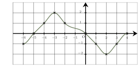
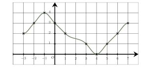

Séance 10 — Conversions, variations et fonctions


---Q---
Une durée de $2{,}4$ heures correspond à :

- $154$ minutes
- $240$ minutes
- $124$ minutes
- $144$ minutes

---CORR---
$2{,}4\text{ h} =2 \text{ h} + 0{,}4 \text{ h}$, soit $2\text{ h} + \dfrac{2}{5} \text{ h} = 120 \text{ min} + 24\text{ min} = 144 \text{ min}$.

 Ainsi, $2{,}4$ heures correspond à $144$ minutes.

La bonne réponse est la réponse D.




---Q---
Voici la représentation graphique d'une fonction $f$ définie sur $[-6\ ;\ 4]$.

Une seule affirmation est correcte :

- La somme des solutions de l'équation $f(x)=0$ est égal à $-20$.
- Soit $k\in[-1\ ;\ 0]$. L'équation $f(x)=k$ admet exactement trois solutions.
- Soit $k\in\mathbb{R}$. Il n'existe que deux valeurs de $k$ pour lesquelles l'équation $f(x)=k$ ait exactement trois solutions.
- Soit $k\in]1\ ;\ 2[$. L'équation $f(x)=k$ admet exactement trois solutions.

---CORR---
$\bullet$ Soit $k\in[-1\ ;\ 0]$. 

 L'équation $f(x)=k$ admet exactement trois solutions.

 Cette affirmation est correcte : 

Si $k\in[-1\ ;\ 0]$ la droite d'équation $y=k$ coupe bien trois fois la courbe.

$\bullet$ La somme des solutions de l'équation $f(x)=0$ est égal à $-20$.

 Cette affirmation est fausse : 

L'équation $f(x)=0$ a deux solutions : $-5$ et $4$.

 La somme de ces solutions est $-5+ 4= -1$.

$\bullet$ Soit $k\in\mathbb{R}$. 

 Il n'existe que deux valeurs de $k$ pour lesquelles l'équation $f(x)=k$ ait exactement trois solutions.

 Cette affirmation est fausse : 

Pour toutes les valeurs de $k$ comprises entre $-1$ et $0$, l'équation $f(x)=k$ admet exactement trois solutions.

$\bullet$ Soit $k\in]1\ ;\ 2[$. 

 L'équation $f(x)=k$ admet exactement trois solutions.

 Cette affirmation est fausse : 

Si $k\in]1\ ;\ 2&#91$, la droite d'équation $y=k$ coupe bien deux fois la courbe.

La bonne réponse est la réponse B.




---Q---
Voici quatre planètes et leur masse :

<table style="border-collapse: collapse; text-align: center;">
  <thead>
    <tr>
      <th style="border: 1px solid #B85C5C; padding: 8px;">Planètes</th>
      <th style="border: 1px solid #B85C5C; padding: 8px;">Masses</th>
    </tr>
  </thead>
  <tbody>
    <tr>
      <td style="border: 1px solid #B85C5C; padding: 8px;">Planète 1</td>
      <td style="border: 1px solid #B85C5C; padding: 8px;">36,19 × 1022 kg</td>
    </tr>
    <tr>
      <td style="border: 1px solid #B85C5C; padding: 8px;">Planète 2</td>
      <td style="border: 1px solid #B85C5C; padding: 8px;">51,59 × 1020 kg</td>
    </tr>
    <tr>
      <td style="border: 1px solid #B85C5C; padding: 8px;">Planète 3</td>
      <td style="border: 1px solid #B85C5C; padding: 8px;">655,46 × 1024 kg</td>
    </tr>
    <tr>
      <td style="border: 1px solid #B85C5C; padding: 8px;">Planète 4</td>
      <td style="border: 1px solid #B85C5C; padding: 8px;">18,98 × 1025 kg</td>
    </tr>
  </tbody>
</table>

La planète dont la masse est la plus importante est :

- Planète 2
- Planète 4
- Planète 1
- Planète 3

---CORR---
On écrit les masses en écriture scientifique pour les comparer :

• Planète 1 : $36{,}19\times 10^{22} = 3{,}619\times 10^{1}\times 10^{22} = 3{,}619\times 10^{23}$ kg

• Planète 2 : $51{,}59\times 10^{20} = 5{,}159\times 10^{1}\times 10^{20} = 5{,}159\times 10^{21}$ kg

• Planète 3 : $655{,}46\times 10^{24} = 6{,}554\ 6\times 10^{2}\times 10^{24} = 6{,}554\ 6\times 10^{26}$ kg

• Planète 4 : $18{,}98\times 10^{25} = 1{,}898\times 10^{1}\times 10^{25} = 1{,}898\times 10^{26}$ kg

On a donc : $6{,}554\ 6\times 10^{26}$ $>$ $1{,}898\times 10^{26}$ $>$ $3{,}619\times 10^{23}$ $>$ $5{,}159\times 10^{21}$

Donc il s'agit de la **Planète 3** qui a la masse la plus importante.

La bonne réponse est la réponse D.




---Q---
$15+10^{-22}$ est environ égal à :

- $15$
- $15\times 10^{-22}$
- $16$
- $10^{-22}$

---CORR---
$10^{-22}$ est très petit devant $15$.

 En effet, $10^{-22}=\dfrac{1}{10^{22}}=\underbrace{0,0\ldots 0}_{22 \text{ zéros}}1$.

 On en déduit que $15+10^{-22}$ est environ égal à $15$.

La bonne réponse est la réponse A.




---Q---
Un prix augmente de $300\ $%. 

 Pour retrouver le prix initial, il faut une baisse de :

- $300\ $%
- $25\ $%
- $100\ $%
- $75\ $%

---CORR---
Le coefficient multiplicateur associé à une augmentation de $300\ $% est $1+3=4$.

 Comme $4\times 0{,}25=1$, il faut donc multiplier par $0{,}25$ (coefficient multiplicateur réciproque) pour revenir au prix initial.

 Un coefficient multiplicateur de $0{,}25$ correspond à un taux d'évolution de $-75\ $%.

 On en déduit qu'il faut une baisse de $75\ $%.

La bonne réponse est la réponse D.




---Q---
Un prix a doublé. Cela signifie que le prix a augmenté de :

- $100$%
- $50\ $%
- $120\ $%
- $2\ $%

---CORR---
Si un prix a doublé, cela signifie que le coefficient multiplicateur est $CM = 2$.

 Le taux d'évolution $T$ vérifie : $T = CM - 1 = 2 - 1 = 1 = 100\ $%.

 Le prix a donc augmenté de $100\ $%.

La bonne réponse est la réponse A.



Devoirs — Séance 10 — Conversions, variations et fonctions


---Q---
Une durée de $0{,}25$ heure correspond à :

- $30$ minutes
- $15$ minutes
- $5$ minutes
- $25$ minutes




---Q---
Voici la représentation graphique d'une fonction $f$ définie sur $[-3\ ;\ 7]$.

Une seule affirmation est correcte :

- La somme des solutions de l'équation $f(x)=3$ est égal à $0$.
- Soit $k\in\mathbb{R}$. L'équation $f(x)=k$ a au plus $4$ solutions.
- Soit $k\in]0\ ;\ 1[$. L'équation $f(x)=k$ admet exactement trois solutions.
- Le produit des solutions de l'équation $f(x)=1$ est égal à $15$.




---Q---
Voici quatre cellules et leur taille :

<table style="border-collapse: collapse; text-align: center;">
  <thead>
    <tr>
      <th style="border: 1px solid #B85C5C; padding: 8px;">Cellules</th>
      <th style="border: 1px solid #B85C5C; padding: 8px;">Tailles</th>
    </tr>
  </thead>
  <tbody>
    <tr>
      <td style="border: 1px solid #B85C5C; padding: 8px;">Cellule 1</td>
      <td style="border: 1px solid #B85C5C; padding: 8px;">31,96 × 10-6 mm</td>
    </tr>
    <tr>
      <td style="border: 1px solid #B85C5C; padding: 8px;">Cellule 2</td>
      <td style="border: 1px solid #B85C5C; padding: 8px;">367 540 × 10-10 mm</td>
    </tr>
    <tr>
      <td style="border: 1px solid #B85C5C; padding: 8px;">Cellule 3</td>
      <td style="border: 1px solid #B85C5C; padding: 8px;">3,17 × 10-6 mm</td>
    </tr>
    <tr>
      <td style="border: 1px solid #B85C5C; padding: 8px;">Cellule 4</td>
      <td style="border: 1px solid #B85C5C; padding: 8px;">44,63 × 10-10 mm</td>
    </tr>
  </tbody>
</table>

La cellule dont la taille est la plus importante est :

- Cellule 3
- Cellule 2
- Cellule 1
- Cellule 4




---Q---
$3+10^{26}$ est environ égal à :

- $10^{26}$
- $4\times 10^{26}$
- $3$
- $10^{27}$




---Q---
Un prix augmente de $900\ $%. 

 Pour retrouver le prix initial, il faut une baisse de :

- $10\ $%
- $90\ $%
- $100\ $%
- $900\ $%




---Q---
Un prix a été divisé par $4$. Cela signifie que le prix a diminué de :

- $25\ $%
- $75$%
- $4\ $%
- $40\ $%



