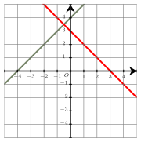
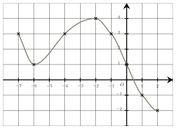
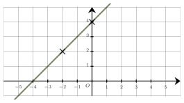
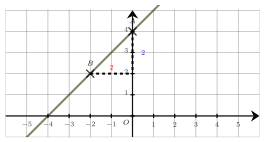
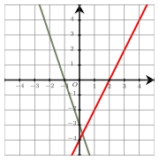
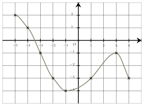
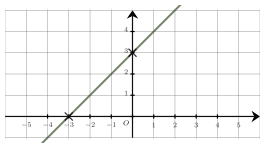

Séance 11 — Expressions algébriques et fonctions


---Q---
On additionne un nombre réel $x$ avec son triple, puis on élève le résultat au carré. 
On obtient :

- $x + (3x)^2$
- $4x^2$
- $4x + x^2$
- $(4x)^2$

---CORR---
On additionne d'abord $x$ avec son triple $3x$ : $x + 3x = 4x$.

 Puis on élève le résultat au carré : $\boldsymbol{(4x)^2}$.
La bonne réponse est la réponse D.



---Q---
On considère une fonction $f$ définie sur $\mathbb{R}$ dont le tableau de signes est donné ci-dessous. 

 Parmi les quatre expressions proposées pour la fonction $f$, une seule est possible.

- $f(x)=3x-3$
- $f(x)=x$
- $f(x)=2x+2$
- $f(x)=-4x+4$

---CORR---
Parmi les réponses proposées, on cherche la fonction affine qui s'annule en $1$ et dont le coefficient directeur est positif. En effet, 
 la droite représentant la fonction $f$ est croissante car la fonction donne des images négatives puis positives d'après le tableau de signes.

 Il s'agit de la fonction $f$ définie par $\boldsymbol{f(x)=3x-3}$.
La bonne réponse est la réponse A.



---Q---
L'ensemble des solutions $\mathscr{S}$ de l'équation $2x^2+3x-5=-5$ est :

- $\mathscr{S}=\left\lbrace-\dfrac{3}{2}\right\rbrace$
- $\mathscr{S}=\left\lbrace-\dfrac{2}{3}\ ;\ 0\right\rbrace$
- $\mathscr{S}=\left\lbrace0\ ;\ \dfrac{3}{2}\right\rbrace$
- $\mathscr{S}=\left\lbrace-\dfrac{3}{2}\ ;\ 0\right\rbrace$

---CORR---
L'équation $2x^2+3x-5=-5$ s'écrit $2x^2+3x=0$.

 En factorisant le premier membre (facteur commun $x$), on obtient $x(2x+3)=0$.

 On reconnaît une équation produit nul dont les solutions sont : $0$ et $\dfrac{-3}{2}=-\dfrac{3}{2}$.

 $\mathscr{S}=\boldsymbol{\lbrace 0;-\dfrac{3}{2}\rbrace}$
La bonne réponse est la réponse D.



---Q---
On donne les représentations graphiques de deux fonctions affines $g$ (en vert) et $h$ (en rouge) définies sur $\mathbb{R}$.

 

Le tableau de signes de la fonction $f$ définies par $f(x)=g(x)\times h(x)$ sur $\mathbb{R}$ est :

- 
- 
- 
- 
---CORR---
La fonction $g$ s'annule en $-4$ et la fonction $h$ s'annule en $3$.

 Quand la droite est en-dessous de l'axe des abscisses, la fonction est négative et quand elle est au-dessus, la fonction est positive.

 On en déduit le tableau de signes de leur produit :

La bonne réponse est la réponse C.



---Q---
On donne la représentation graphique d'une fonction $f$. 

L'équation $f(x)=3$ a :

- $3$ solutions
- $1$ solution
- $0$ solution
- $2$ solutions

---CORR---
Le nombre de solutions de l'équation $f(x)=3$ est le nombre d'antécédents de $3$ par la fonction $f$.

 Puisque la droite d'équation $y = 3$ (droite hrizontale) coupe $3$ fois la courbe, on en déduit que l'équation $f(x)=3$ admet $\boldsymbol{3}$ **solutions**.
La bonne réponse est la réponse A.



---Q---

L'équation réduite de cette droite est :

- $y=4$
- $y= x +4$
- $y= 4x-4$
- $y= -x+4$

---CORR---
Le coefficient directeur $m$ de la droite $(AB)$ est donné par : 

$m=\dfrac{\boldsymbol{2}}{\boldsymbol{2}}=1$.  
Son ordonnée à l'origine est $4$, ainsi l'équation réduite de la droite est $\boldsymbol{y=x+4}$.

La bonne réponse est la réponse B.


Devoirs — Séance 11 — Expressions algébriques et fonctions


---Q---
On additionne un nombre réel $x$, avec son double et son carré. 
Le résultat est égal à :

- $1 + 2x^2$
- $(x + 2x)^2$
- $3x + x^2$
- $x + (2x)^2$



---Q---
On considère une fonction $f$ définie sur $\mathbb{R}$ dont le tableau de signes est donné ci-dessous. 

 Parmi les quatre expressions proposées pour la fonction $f$, une seule est possible.

- $f(x)=2x+4$
- $f(x)=x-2$
- $f(x)=2x$
- $f(x)=-4x+8$



---Q---
L'ensemble des solutions $\mathscr{S}$ de l'équation $-7x^2-3x-8=-8$ est :

- $\mathscr{S}=\left\lbrace-\dfrac{3}{7}\right\rbrace$
- $\mathscr{S}=\left\lbrace-\dfrac{3}{7}\ ;\ 0\right\rbrace$
- $\mathscr{S}=\left\lbrace0\ ;\ \dfrac{3}{7}\right\rbrace$
- $\mathscr{S}=\left\lbrace-\dfrac{7}{3}\ ;\ 0\right\rbrace$



---Q---
On donne les représentations graphiques de deux fonctions affines $g$ (en vert) et $h$ (en rouge) définies sur $\mathbb{R}$.

 

Le tableau de signes de la fonction $f$ définies par $f(x)=g(x)\times h(x)$ sur $\mathbb{R}$ est :

- 
- 
- 
- 



---Q---
On donne la représentation graphique d'une fonction $f$. 

L'équation $f(x)=2$ a :

- $2$ solutions
- $0$ solution
- $3$ solutions
- $1$ solution



---Q---

L'équation réduite de cette droite est :

- $y= 3x-3$
- $y=3$
- $y= x +3$
- $y= -x+3$


