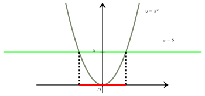
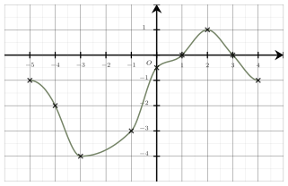
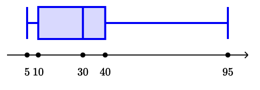
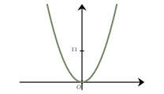
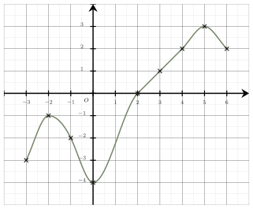
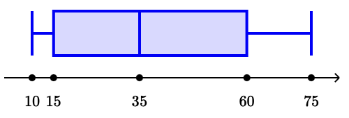

Séance 12 — Équations, suites et statistiques


---Q---
 On a représenté la parabole d'équation $y=x^2$. 

 On note $(I)$ l'inéquation, sur $\mathbb{R}$, $x^2 \leqslant 5$.

 L'inéquation $(I)$ est équivalente à :

 

- $x=-\sqrt{5}$ ou $x=\sqrt{5}$
- $ -\sqrt{5} < x < \sqrt{5}$
- $x \leqslant -\sqrt{5}$ ou $x \geqslant \sqrt{5}$
- $ -\sqrt{5} \leqslant x \leqslant \sqrt{5}$

---CORR---
Pour résoudre graphiquement cette inéquation : 

 $\bullet$ On trace la parabole d'équation $y=x^2$. 

 $\bullet$ On trace la droite horizontale d'équation $y=5$. Cette droite coupe la parabole en $-\sqrt{5}$ et $\sqrt{5}$. 

 $\bullet$ Les solutions de l'inéquation sont les abscisses des points de la courbe qui se situent sur ou sous la droite.

 

 On en déduit que l'inéquation $(I)$ est équivalente à : **$ -\sqrt{5} \leqslant x \leqslant \sqrt{5}$.**
La bonne réponse est la réponse **D**.



---Q---
La forme développée de $A=(3y+1)\times3$ est :

- $3y+3$
- $9y-3$
- $9y+3$
- $9y+1$

---CORR---
On développe en utilisant la simple distributivité : 

 $\begin{aligned}
 A&=(3y+1)\times3\\\\
 &=3\times 3y+3\times1\\\\
 &=\boldsymbol{9y+3}
 \end{aligned}$
 
 
La bonne réponse est la réponse **C**.



---Q---
On considère l'égalité $\dfrac{1}{C}=4-\dfrac{9}{10}$. 
On a :

- $C=\dfrac{10}{31}$
- $C=\dfrac{31}{10}$
- $C=\dfrac{9}{46}$
- $C=-2$

---CORR---
$\dfrac{1}{C}=4-\dfrac{9}{10} = \dfrac{4 \times 10}{10} - \dfrac{9}{10} = \dfrac{40}{10} - \dfrac{9}{10} =\dfrac{31}{10}$    

 L'inverse de $C$ vaut $\dfrac{31}{10}$, donc $C=\boldsymbol{\dfrac{10}{31}}$. 
La bonne réponse est la réponse **A**.



---Q---
$\bullet$ $1{,}9\times 1{,}2=2{,}28\ \ \ \  \bullet$ $0{,}1\times 1{,}2=0{,}12\ \ \ \  \bullet$ $0{,}9\times 0{,}2=0{,}18\ \ \ \ \bullet$ $1{,}9\times 0{,}8=1{,}52$  
 
 En utilisant l'un des résultats précédents, déterminer le taux global d'évolution d'un article qui diminue de
 $90\ $% dans un premier temps, puis qui augmente de $20\ $% dans un second temps.

- $-152\ $%
- $-70\ $%
- $-88\ $%
- $12\ $%

---CORR---
Diminuer de $90\ $% revient à multiplier par $0{,}1$ et augmenter de $20\ $% revient à multiplier par $1{,}2$. 

 Globalement cela revient donc à multiplier par $0{,}1\times 1{,}2=0{,}12$. 

 Multiplier par $0{,}12$ revient à multiplier par $1-0{,}88$.  

 Le taux d'évolution global est donc : $\boldsymbol{-88\ } $%. 
La bonne réponse est la réponse **C**.



---Q---
On considère une fonction $f$ dont la représentation graphique est tracée ci-dessous.

$f(-3) - f(-1)$ est égal à :

- $-2$
- $-5$
- $-1$
- $-4$

---CORR---
D'après le graphique, on lit :

 $f(-3) = -4$ et
 $f(-1) = -3$.

 Donc $f(-3) - f(-1) = -4 - (-3) = \boldsymbol{-1}$. 
La bonne réponse est la réponse **C**.



---Q---
Une série statistique est résumée par le diagramme en boite ci-dessous, utilisez-le pour donner la valeur de la médiane de cette série.

 
 

- $40$
- $30$
- $25$
- $10$

---CORR---
La médiane est la valeur qui partage la série statistique en deux parties égales. 

 D'après le diagramme en boite, on a $Q_1=10$ et $Q_3=40$. La médiane se trouve au niveau du trait intermédiaire. 

 La médiane de la série est donc : $\boldsymbol{30}$. 
La bonne réponse est la réponse **B**.


Devoirs — Séance 12 — Équations, suites et statistiques


---Q---

 On a représenté la parabole d'équation $y=x^2$. 

 On note $(I)$ l'inéquation, sur $\mathbb{R}$, $x^2 \leqslant 11$.

 L'inéquation $(I)$ est équivalente à :

 

- $x \leqslant -\sqrt{11}$ ou $x \geqslant \sqrt{11}$
- $x=-\sqrt{11}$ ou $x=\sqrt{11}$
- $ -\sqrt{11} < x < \sqrt{11}$
- $ -\sqrt{11} \leqslant x \leqslant \sqrt{11}$



---Q---
La forme développée de $A=-y(-2y-5)$ est :

- $2y^2+5y$
- $2y^2+5y^2$
- $2y^2-5y$
- $2y+5y$



---Q---
On considère l'égalité $\dfrac{1}{z}=4+\dfrac{4}{5}$.
 On a :

- $z=\dfrac{5}{24}$
- $z=\dfrac{4}{21}$
- $z=\dfrac{24}{5}$
- $z=\dfrac{8}{5}$



---Q---
$\bullet$ $0{,}7\times 0{,}5=0{,}35\ \ \ \  \bullet$ $0{,}3\times 0{,}5=0{,}15\ \ \ \  \bullet$ $1{,}3\times 0{,}5=0{,}65\ \ \ \ \bullet$ $1{,}3\times 1{,}5=1{,}95$  

En utilisant l'un des résultats précédents, déterminer le taux global d'évolution d'un article qui augmente de
$30\ $% dans un premier temps, puis qui diminue de $50\ $% dans un second temps.

- $-20\ $%
- $-35\ $%
- $65\ $%
- $-65\ $%



---Q---
On considère une fonction $f$ dont la représentation graphique est tracée ci-dessous.

$f(5) - f(4)$ est égal à :

- $9$
- $1$
- $-1$
- $7$



---Q---
Une série statistique est résumée par le diagramme en boite ci-dessous, utilisez-le pour donner la valeur de la médiane de cette série.

 
 

- $35$
- $37{,}5$
- $15$
- $60$


