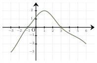
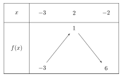
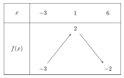
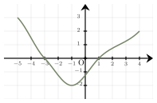
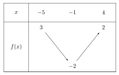
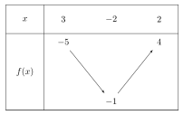

Séance 13 — Algèbre, fonctions et puissances


---Q---
Le produit de $3$ par la somme de $x$ et de $6$ est égal à :

- $(x+6)\times 3$
- $3\times 6+x$
- $3x\times 6$
- $3x+6$

---CORR---
Le produit de $3$ par la somme de $x$ et de $6$ s'écrit : $\boldsymbol{(x+6)\times 3}$.

La bonne réponse est la réponse A.



---Q---
Le degré Fahrenheit $F$ est une unité de mesure de la température utilisée aux États-Unis. 
Il est lié au degré Celsius $C$ par la formule suivante : 
$$F=\dfrac{9}{5}C+32$$
L'expression permettant, à partir de cette formule, d'exprimer $C$ est :

- $C=\dfrac{5}{9}(F-32)$
- $C=\dfrac{5}{9}F-32$
- $C=\dfrac{5F-32}{9}$
- $C=\dfrac{9}{5}(F-32)$

---CORR---
On part de la formule : $F = \dfrac{9}{5}C + 32$.

En isolant $C$, on obtient : $F - 32 = \dfrac{9}{5}C$.

En multipliant les deux membres par $\dfrac{5}{9}$, on obtient : $\boldsymbol{C = \dfrac{5}{9}(F - 32)}$.

La bonne réponse est la réponse A.



---Q---
Soit la fonction $f$ représentée ci-dessous.

Le tableau de variations de la fonction $f$ est :

- 
- 
- 
- 

---CORR---
La fonction $f$ est définie sur $[-3\ ;\ 6]$.

La fonction est croissante puis décroissante.

Elle atteint un maximum en $x=1$.

La bonne réponse est la réponse C.



---Q---
On considère la fonction $f$ définie sur $\mathbb{R}$ par $f(x)=-2x^2-4x-1$.

 L'image de $-\dfrac{3}{5}$ par cette fonction est :

- $\dfrac{17}{25}$
- $-\dfrac{17}{25}$
- $\dfrac{53}{25}$
- $-\dfrac{58}{25}$

---CORR---
On remplace $x$ par $-\dfrac{3}{5}$ dans l'expression de $f$ :

 
 $\begin{aligned}
 f\left(-\dfrac{3}{5}\right)&=-2\times \left(-\dfrac{3}{5}\right)^2-4\times \left(-\dfrac{3}{5}\right)-1\\\\
 &=-2\times\dfrac{9}{25}+\dfrac{12}{5}-1\\\\
 &=-\dfrac{18}{25}+\dfrac{12}{5}-1\\\\
 &=\dfrac{-18+60-25}{25}\\\\
 &=\dfrac{17}{25}
 \end{aligned}$

 
 L'image de $-\dfrac{3}{5}$ par la fonction $f$ est : $\boldsymbol{\dfrac{17}{25}}$.
 
 
La bonne réponse est la réponse A.



---Q---
Soient $a$ et $b$ deux nombres réels non nuls. 
À quelle expression est égale $a^4\times b^4$ ?

- $\left(ab\right)^3\times b^{}$
- $\left(ab\right)^4$
- Aucune de ces propositions.
- $\left(ab\right)^{8}$

---CORR---
Les deux exposants sont égaux, ainsi : 
$\begin{aligned}
 a^4\times b^4&=\boldsymbol{\left(ab\right)^4}\end{aligned}$

La bonne réponse est la réponse B.



---Q---
$p\ $% de $20$ est égal à $18$.
 On a :

- $p=9$
- $p=18$
- $p=90$
- $p=900$

---CORR---
Prendre $10\ $% d'une quantité revient à la diviser par $10$.

 $10\ $% de $20$ est égal à $2$.
 
 En multipliant par $9$, on obtient :  $90\ $% de $20$ est égal à $18$.
 
 Ainsi $p=\boldsymbol{90}$.
 
La bonne réponse est la réponse C.


Devoirs — Séance 13 — Algèbre, fonctions et puissances


---Q---
Le produit de $9$ par la somme de $x$ et de $8$ est égal à :

- $9+8x$
- $9(x+8)$
- $9(x\times 8)$
- $9\times 8+x$



---Q---
L'aire $A$ d'un trapèze de petite base $b$, de grande base $B$ et de hauteur $h$ est donnée par :
$$A=\dfrac{(b+B)\times h}{2}$$
L'expression permettant, à partir de cette formule, d'exprimer la hauteur $h$ est :

- $h=\dfrac{2A}{b+B}$
- $h=\dfrac{2A}{bB}$
- $h=2A(b+B)$
- $h=\dfrac{A}{b+B}$



---Q---
Soit la fonction $f$ représentée ci-dessous.

Le tableau de variations de la fonction $f$ est :

- 
- 
- 
- 



---Q---
On considère la fonction $f$ définie sur $\mathbb{R}$ par $f(x)=-2x^2+3x-2$.

 L'image de $-\dfrac{6}{5}$ par cette fonction est :

- $-\dfrac{68}{25}$
- $-\dfrac{152}{25}$
- $-\dfrac{212}{25}$
- $\dfrac{212}{25}$



---Q---
Soient $a$ et $b$ deux nombres réels non nuls. 
À quelle expression est égale $a^3\times b^3$ ?

- $\left(ab\right)^{6}$
- Aucune de ces propositions.
- $\left(ab\right)^3$
- $\left(ab\right)^2\times b^{}$



---Q---
$p\ $% de $60$ est égal à $3$.
 On a :

- $p=0{,}5$
- $p=3$
- $p=5$
- $p=50$


