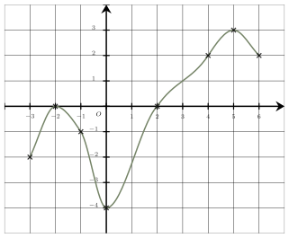

Séance 15 — Fonctions, variations et statistiques


---Q---
Voici la représentation graphique d'une fonction $f$ définie sur $[-3\ ;\ 6]$.

Une seule affirmation est correcte :

- L'équation $f(x)=0$ admet une unique solution.
- $f(1{,}2) \times f(1{,}6) < 0$
- L'inéquation $f(x) \leqslant 0$ a pour ensemble de solutions $[-3\ ;\ -2[\cup]-2\ ;\ 2]$.
- Le minimum de $f$ est $-4$.

---CORR---
$\bullet$ Le minimum de $f$ est $-4$.  
 Cette affirmation est correcte :  
Le point le plus bas de la courbe a pour ordonnée $-4$. C'est le minimum de $f$. 

$\bullet$ $f(1{,}2) \times f(1{,}6) < 0$ 
 Cette affirmation est fausse :  
$f(1{,}2) < 0$ et $f(1{,}6) < 0$, donc le produit est positif. 
$\bullet$ L'équation $f(x)=0$ admet une unique solution. 
 Cette affirmation est fausse :  
L'équation $f(x)=0$ admet deux solutions car la courbe coupe deux fois l'axe des abscisses pour des valeurs opposées en $-2$ et $2$. 
$\bullet$ L'inéquation $f(x) \leqslant 0$ a pour ensemble de solutions $[-3\ ;\ -2[\cup]-2\ ;\ 2]$. 
 Cette affirmation est fausse :  
Les solutions de l'inéquation $f(x) \leqslant 0$ sont les abscisses des points de la courbe situés en dessous ou sur l'axe des abscissses. 

La bonne réponse est la réponse **D**.



---Q---
Voici trois nombres.
$$A = 0,375 \ \ \ \  \ \ \ \  B = \dfrac{38}{100} \ \ \ \  \ \ \ \  C = \dfrac{7}{20}$$

 Le classement par ordre croissant de ces trois nombres est :

- $B < A < C$
- $A < B < C$
- $A < C < B$
- $C < A < B$

---CORR---
Pour comparer ces trois nombres, on les écrit sous forme décimale :
$A = 0,375$ 

$B = \dfrac{38}{100} = 0,38$  

$C = \dfrac{7}{20} = \dfrac{7 \times 5}{20\times 5} = \dfrac{35}{100}=0,35$  

On a donc : $0,35 < 0,375 < 0,38$.
Finalement : $\boldsymbol{C < A < B}$.
La bonne réponse est la réponse **D**.



---Q---
Une simplification de $a \times 1$ est :

- $1$
- $-a$
- $0$
- $a$

---CORR---
Tout nombre multiplié par $1$ est égal à lui-même.

$a \times 1 = \boldsymbol{a}$
La bonne réponse est la réponse **D**.



---Q---
L'ensemble des solutions dans $\mathbb{R}$ de l'inéquation
 $-3(x+7)(x-2) > 0$ est :

- $]-7\ ;\ 2[$
- $]-\infty\ ;\ -7]\cup[2\ ;\ +\infty[$
- $[-7\ ;\ 2]$
- $]-\infty\ ;\ -7[\cup]2\ ;\ +\infty[$

---CORR---
$(x+7)(x-2)$ est un produit de deux fonctions affines.

 L'équation $x+7=0$ a pour solution $x=-7$.

 L'équation $x-2=0$ a pour solution $x=2$.

 Le tableau de signe du produit $-3(x+7)(x-2)$ est : 

On en déduit que l'ensemble des solutions est $\boldsymbol{]-7\ ;\ 2[}.$
La bonne réponse est la réponse **A**.



---Q---
Soit $h$ la fonction définie par : $h(x)=-6x+3$.  
$h(-3)+h(1)$ est égal à :

- $-2$
- $18$
- $15$
- $0$

---CORR---
On a : $h(-3)=-6\times (-3)+3=21$ et $h(1)=-6\times 1+3=-3$.  

 On en déduit que $h(-3)+h(1)=21-3=\boldsymbol{18}$.  
La bonne réponse est la réponse **B**.



---Q---
On donne la série statistique suivante : 
 $5 ; 17 ; 14 ; 6 ; 20 ; 23 ; 8 ; 16 ; 15$.  

 Le premier quartile de la série est :

- $6$
- $14$
- $8$
- $9$ E. $17$

---CORR---
La série triée par ordre croissant est : $5$ ; $6$ ; $8$ ; $14$ ; $15$ ; $16$ ; $17$ ; $20$ ; $23$.  
La série contient $9$ valeurs.  

 Pour trouver le rang de $Q_1$, on calcule le quart de 9 qui vaut
 $\dfrac{9}{4}=2{,}25$  
On arrondit à l'entier supérieur qui vaut $3$.  
 Le premier quartile est donc la valeur de rang $3$ de la série classée : $Q_1=8$.  
La bonne réponse est la réponse **C**.


Devoirs — Séance 15 — Fonctions, variations et statistiques


---Q---
Voici la représentation graphique d'une fonction $f$ définie sur $[-3\ ;\ 6]$.

Une seule affirmation est correcte :

- Le maximum de $f$ est $6$.
- $f(-0{,}2) \times f(-1{,}3) < 0$
- L'inéquation $f(x) \leqslant 0$ a pour ensemble de solutions $[-3\ ;\ -2[\cup]-2\ ;\ 2]$.
- $f$ est positive sur $[3{,}3\ ;\ 5{,}9]$



---Q---
Voici trois nombres.
$$A = \dfrac{6}{10} \ \ \ \  \ \ \ \  B = \dfrac{31}{50} \ \ \ \  \ \ \ \  C = 0,59$$

 Le classement par ordre croissant de ces trois nombres est :

- $C < A < B$
- $B < A < C$
- $A < C < B$
- $A < B < C$



---Q---
Que vaut $0 \times a$ ?

- $a$
- $0$
- $-a$
- $1$



---Q---
L'ensemble des solutions dans $\mathbb{R}$ de l'inéquation
 $9(x-6)(x+9) < 0$ est :

- $[-9\ ;\ 6]$
- $]-\infty\ ;\ -9[\cup]6\ ;\ +\infty[$
- $]-\infty\ ;\ -9]\cup[6\ ;\ +\infty[$
- $]-9\ ;\ 6[$



---Q---
Soit $k$ la fonction définie par : $k(x)=6x-5$.  
$k(0)+k(3)$ est égal à :

- $-65$
- $10$
- $3$
- $8$



---Q---
On donne la série statistique suivante :  
 $28 ; 9 ; 20 ; 12 ; 13$.  

 Le premier quartile de la série est :

- $12$
- $14$
- $13$
- $9$ E. $20$


