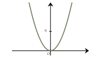
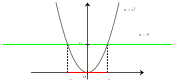
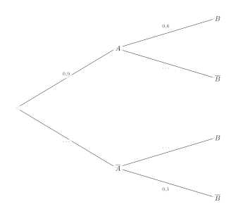

Séance 16 — Puissances, équations et probabilités


---Q---
Soit $a$ un nombre réel non nul et $n$ un entier non nul.
 À quelle expression est égale $\dfrac{a^{n}}{a^{n^{3}}}$ ?

- $a^{-2n}$
- $a^{-n(n^{2}-1)}$
- $a^{n(n^{2}-1)}$
- $a^{-n^2}$

---CORR---
On applique la propriété du quotient des puissances d'un réel : 

 Soit $n$ et $p$ deux entiers et $a$ un réel : $\dfrac{a^n}{a^p}=a^{n-p}$

 $\begin{aligned} \dfrac{a^{n}}{a^{n^{3}}}&=a^{n-n^{3}}\\
 &=a^{-n(-1+n^{2})}\\
 &=\boldsymbol{a^{-n(n^{2}-1)}}
 \end{aligned}$

La bonne réponse est la réponse **B**.



---Q---

 On a représenté la parabole d'équation $y=x^2$. 

 On note $(I)$ l'inéquation, sur $\mathbb{R}$, $x^2 \leqslant 6$.

 

 
 L'ensemble des solutions $S$ de cette inéquation est :

- $S = [-\sqrt{6}\ ;\ \sqrt{6}]$
- $S = ${$-\sqrt{6}\  ; \ \sqrt{6}$}
- $S = ]-\infty\ ;\ -\sqrt{6}] \cup [\sqrt{6}\ ;\ +\infty[$
- $S = [-3\ ;\ 3]$

---CORR---
Pour résoudre graphiquement cette inéquation : 

 $\bullet$ On trace la parabole d'équation $y=x^2$. 

 $\bullet$ On trace la droite horizontale d'équation $y=6$. Cette droite coupe la parabole en $-\sqrt{6}$ et $\sqrt{6}$. 

 $\bullet$ Les solutions de l'inéquation sont les abscisses des points de la courbe qui se situent sur ou sous la droite.

 

 On en déduit que l'ensemble des solutions de l'inéquation $(I)$ est : $S = [-\sqrt{6}\ ;\ \sqrt{6}]$.
La bonne réponse est la réponse **A**.



---Q---
Un prix augmente de $25\ $% puis baisse de $25\ $%. 

Sachant que le taux réciproque d'une augmentation de $25\ $% est une baisse de $20\ $%, après ces deux évolutions, on peut affirmer que :

- Le prix est égal à sa valeur de départ.
- On ne peut pas savoir : cela dépend de la valeur de départ.
- Le prix est strictement supérieur à sa valeur de départ.
- Le prix est strictement inférieur à sa valeur de départ.

---CORR---
Le taux réciproque d'une augmentation de $25\ $% est une baisse de $20\ $%.

Comme $25\ $%$ > 20\ $%, la baisse appliquée est plus forte que celle nécessaire pour retrouver le prix initial.

 **Le prix final sera donc strictement inférieur au prix initial.**  
 
La bonne réponse est la réponse **D**.



---Q---
$(D)$ et $(D')$ sont deux droites dans un repère du plan.

 L'équation réduite de $(D)$ est : $y=-3x+5$ et celle de $(D')$ est : $y=x-2$.

 La droite $(D)$ est strictement au-dessus de la droite $(D')$ sur :

- $\left]\dfrac{7}{4}\ ;\  +\infty\right[$
- $\left]-\infty\ ;\ \dfrac{4}{7}\right[$
- $\left]\dfrac{4}{7}\ ;\  +\infty\right[$
- $\left]-\infty\ ;\ \dfrac{7}{4}\right[$

---CORR---
La droite $(D)$ est strictement au-dessus de la droite $(D')$ lorsque $-3x+5>x-2$.

 $\begin{aligned}
 -3x+5&>x-2\\
 -4x&>-7\\
 x&<\dfrac{7}{4}
 \end{aligned}$

 La droite $(D)$ est donc strictement au-dessus de la droite $(D')$ sur : 
 $\boldsymbol{\left]-\infty\ ;\ \dfrac{7}{4}\right[}$.  
La bonne réponse est la réponse **D**.



---Q---

 On considère l'arbre de probabilités ci-contre.

 On cherche la probabilité de l'événement $B$.

 On a :

 
 

- $p(B)=0{,}26$
- $p(B)=0{,}18$
- $p(B)=0{,}3$
- $p(B)=0{,}5 $

---CORR---
Comme $A$ et $\overline A$ fonrment une partition de l'univers, on applique la formule de probabilité totale :

 $\begin{aligned}
 p(B)&=p(A)\times p_A(B)+p(\overline A)\times p_{\overline A}(B)\\\\
 &=0{,}6\times 0{,}3+0{,}4\times 0{,}8\\\\
 &=\boldsymbol{0{,}5}.
 \end{aligned}$
 
 
La bonne réponse est la réponse **D**.



---Q---
Un appareil a besoin d'une énergie de $16{,}56 \times 10^{6}$ Joules (J) pour se mettre en route. 

À combien de kiloWatts-heure (kWh) cela correspond-il ? 

$Données :$ $1\text{ kWh} = 3,6 \times 10^{6}\text{ J}.$

- $1{,}1~\text{kWh}$
- $11{,}6~\text{kWh}$
- $4{,}6~\text{kWh}$
- $46~\text{kWh}$

---CORR---
Pour convertir des Joules en kWh, on utilise la relation donnée : 

$1 \text{ kWh} = 3,6 \times 10^{6}\text{ J}$ 

L'énergie en Joules est : $E = 16{,}56 \times 10^{6} \text{ J}$ 

Pour trouver l'énergie en kWh, on divise par $3,6 \times 10^{6}$ : 

$E_{\text{kWh}} = \dfrac{16{,}56 \times 10^{6}}{3,6 \times 10^{6}} = \dfrac{16{,}56}{3,6} = 4{,}6~\text{kWh}$ 

Sans calculatrice, on peut estimer la valeur en approchant $16{,}56$ par $17$ et $3,6$ par $4$. 

On obtient alors : $\dfrac{17}{4} = 4{,}25$, ce qui nous indique que le résultat est proche de $4{,}25$. 

La seule réponse possible est $\boldsymbol{4{,}6}$ $\text{kWh}$. 
La bonne réponse est la réponse **C**.


Devoirs — Séance 16 — Puissances, équations et probabilités


---Q---
Soit $a$ un nombre réel non nul et $n$ un entier non nul.
 À quelle expression est égale $\dfrac{a^{n^{2}}}{a^{n}}$ ?

- $a^{n(n^{}-1)}$
- $a^{n}$
- $a^{2}$
- $a^{n-1}$



---Q---
 On a représenté la parabole d'équation $y=x^2$. 

 On note $(I)$ l'inéquation, sur $\mathbb{R}$, $x^2 \leqslant 12$.

 

 
 L'ensemble des solutions $S$ de cette inéquation est :

- $S = ]-\infty\ ;\ -\sqrt{12}] \cup [\sqrt{12}\ ;\ +\infty[$
- $S = ${$-\sqrt{12}\  ; \ \sqrt{12}$}
- $S = [-\sqrt{12}\ ;\ \sqrt{12}]$
- $S = [-6\ ;\ 6]$



---Q---
Un prix diminue de $20\ $% puis augmente de $30\ $%. 

Sachant que le taux réciproque d'une baisse de $20\ $% est une augmentation de $25\ $%, après ces deux évolutions, on peut affirmer que :

- Le prix est strictement inférieur à sa valeur de départ.
- Le prix est égal à sa valeur de départ.
- On ne peut pas savoir : cela dépend de la valeur de départ.
- Le prix est strictement supérieur à sa valeur de départ.



---Q---
$(D)$ et $(D')$ sont deux droites dans un repère du plan. 

 L'équation réduite de $(D)$ est : $y=4x-3$ et celle de $(D')$ est : $y=-9x+4$. 

 La droite $(D)$ est strictement au-dessus de la droite $(D')$ sur :

- $\left]-\infty\ ;\ \dfrac{7}{13}\right[$
- $\left]\dfrac{7}{13}\ ;\  +\infty\right[$
- $\left]\dfrac{13}{7}\ ;\  +\infty\right[$
- $\left]-\infty\ ;\ \dfrac{13}{7}\right[$



---Q---

 On considère l'arbre de probabilités ci-contre.

 On cherche la probabilité de l'événement $B$.

 On a :

 
 
- $p(B)=0{,}6$
- $p(B)=0{,}55$
- $p(B)=0{,}54$
- $p(B)=0{,}63 $



---Q---
Un appareil a besoin d'une énergie de $6{,}12 \times 10^{6}$ Joules (J) pour se mettre en route. 

À combien de kiloWatts-heure (kWh) cela correspond-il ? 

$Données :$ $1\text{ kWh} = 3,6 \times 10^{6}\text{ J}.$

- $1{,}7~\text{kWh}$
- $4{,}3~\text{kWh}$
- $0{,}41~\text{kWh}$
- $17~\text{kWh}$


