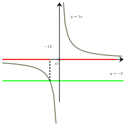
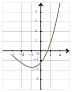
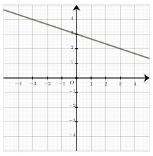
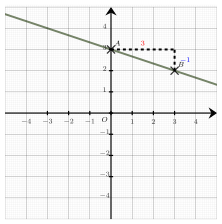
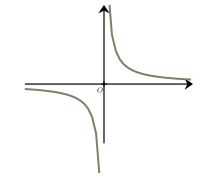
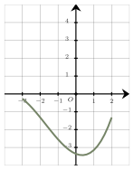
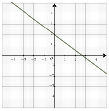

Séance 17 — Calcul, équations et fonctions


---Q---
Le prix d'une maison est $229\ 500\ $€.

 Le vendeur propose une remise de $500\ $€.

 Le pourcentage de remise le plus proche est :

- $1\ $%
- $0{,}1\ $%
- $20\ $%
- $10\ $%

---CORR---
Pour déterminer un ordre de grandeur, on cherche à comparer la remise avec des pourcentages simples du prix initial.

 Les pourcentages de référence les plus utiles sont $1\ $% et $10\ $% car ils sont faciles à calculer mentalement.

 La remise ($500\ $€) est très petite par rapport au prix.

 On prend $1\ $% de $229\ 500\ $€. Cela revient à diviser par $100$.

 On obtient $2\ 295\ $€.

 On remarque que la remise est environ $10$ fois plus petite que $1\ $% du prix.

 Le pourcentage le plus proche parmi les propositions est $0{,}1$%.
 
La bonne réponse est la réponse **B**.



---Q---
Le prix d'un article a diminué de $15\ $%.

 Pour retrouver son prix avant la réduction, il faut multiplier son prix actuel par :

- $\dfrac{20}{3}$
- $\dfrac{20}{17}$
- $\dfrac{20}{23}$
- $\dfrac{17}{20}$

---CORR---
Diminuer de $15~$% revient à multiplier par $1-\dfrac{15}{100}=0{,}85$.

 Pour retrouver le prix initial, il faut diviser par ce coefficient, c'est-à-dire multiplier par le coefficient multiplicateur réciproque $\dfrac{1}{0{,}85}$.

 En multipliant par $100$ le numérateur et le dénominateur, on a $\dfrac{1}{0{,}85}=\dfrac{100}{85}$, puis en simplifiant par $5$, on obtient $\dfrac{100}{85}=\dfrac{20}{17}$.

 Le coefficient multiplicateur pour retrouver le prix initial est donc $\boldsymbol{\dfrac{20}{17}}$.
 
La bonne réponse est la réponse **B**.



---Q---
Soit $a$ un nombre réel non nul et $n$ un entier non nul. 
À quelle expression est égale $a^{2n}(a^n)^5$ ?

- $a^{10n}$
- $a^{7n}$
- $a^{7n^2}$
- $a^{10n^2}$

---CORR---
On applique la propriété du produit des puissances d'un réel : 

 Soient $n$ et $p$ deux entiers et $a$ un réel : $a^n\times a^p=a^{n+p}$

 et la propriété des puissances de puissances : 

 Pour tous entiers $n$ et $p$ et $a$ réel, on a : $\left(a^{n}\right)^p=a^{np}$

 $\begin{aligned} a^{2n}(a^n)^5&=a^{2n}\times a^{5n}\\
 &=\boldsymbol{a^{7n}}
 \end{aligned}$

La bonne réponse est la réponse **B**.



---Q---

 On a représenté l'hyperbole d'équation $y=\dfrac{1}{x}$. 

 On note $(I)$ l'inéquation, sur $\mathbb{R}^*$, $\dfrac{1}{x}> -2$.

 

 L'ensemble des solutions $S$ de cette inéquation est :

- $S = \left]-\infty\ ;\ -\dfrac{1}{2}\right[ \cup ]0\ ;\ +\infty[$
- $S = \left]-2\ ;\ 0\right[$
- $S = \left]-\dfrac{1}{2}\ ;\ 0\right[$
- $S = \left]-\infty\ ;\ -2\right[ \cup ]0\ ;\ +\infty[$

---CORR---
Pour résoudre graphiquement cette inéquation : 

 $\bullet$ On trace l'hyperbole d'équation $y=\dfrac{1}{x}$. 

 $\bullet$ On trace la droite horizontale d'équation $y=-2$. Cette droite coupe l'hyperbole en un point dont l'abscisse est : $-\dfrac{1}{2}$. 

 $\bullet$ Les solutions de l'inéquation sont les abscisses des points de la courbe qui se situent strictement au-dessus de la droite.

 

 Comme la fonction inverse est définie sur $\mathbb{R}^*$, $0$ est une valeur interdite et donc l'ensemble des solutions de l'inéquation $(I)$ est : $S = \left]-\infty\ ;\ -\dfrac{1}{2}\right[ \cup ]0\ ;\ +\infty[$.
 
 
La bonne réponse est la réponse **A**.



---Q---
 On donne ci-contre la courbe représentative $\mathscr{C}$ d'une fonction $f$ définie sur $[-3\ ;\ 2]$.
 On s'intéresse à l'équation $f(x)=0$.

Une seule de ces propositions est exacte :

 

- L'équation $f(x)=0$ admet exactement deux solutions et ces solutions sont de signes contraires.
- L'équation $f(x)=0$ admet exactement deux solutions et ces solutions sont négatives.
- L'équation $f(x)=0$ admet exactement une solution.
- L'équation $f(x)=0$ n'admet aucune solution.

---CORR---
Il y a un point d'intersection entre la courbe et l'axe des abscisses.

 Par conséquent, **l'équation $f(x)=0$ admet exactement une solution.**.
La bonne réponse est la réponse **C**.



---Q---
 On a représenté ci-contre une droite $\mathcal{D}$ dans un repère orthonormé.

Une équation de la droite $\mathcal{D}$ est :

 

- $y=\dfrac{1}{3}x+3$
- $x+3y+9=0$
- $y=-3x+3$
- $x+3y-9=0$

---CORR---
En prenant deux points $A$ et $B$ sur la droite, on obtient le coefficient directeur :

 $m=\dfrac{\boldsymbol{-1}}{\boldsymbol{3}}=\boldsymbol{-\dfrac{1}{3}}$.

 L'ordonnée à l'origine est $p=3$.

 L'équation réduite de la droite est donc : $\boldsymbol{y=-\dfrac{1}{3}x+3}$.

On a :

 $\begin{aligned}
 y&=-\dfrac{1}{3}x+3\\\\
 \dfrac{1}{3}x+y-3&=0\\\\
 \boldsymbol{x+3y-9=0}&\quad\text{(en multipliant par } 3\text{)}
 \end{aligned}$
 
 
La bonne réponse est la réponse **D**.


Devoirs — Séance 17 — Calcul, équations et fonctions


---Q---
Le prix d'une maison est $334\ 000\ $€.

 Le vendeur propose une remise de $68\ 000\ $€.

 Le pourcentage de remise le plus proche est :

- $1\ $%
- $20\ $%
- $10\ $%
- $0{,}1\ $%



---Q---
Le prix d'un article a augmenté de $15\ $%.

 Pour retrouver son prix avant l'augmentation, il faut multiplier son prix actuel par :

- $\dfrac{20}{23}$
- $\dfrac{20}{17}$
- $\dfrac{23}{20}$
- $\dfrac{20}{3}$



---Q---
Soit $a$ un nombre réel non nul et $n$ un entier non nul. 
À quelle expression est égale $a^{3n}(a^n)^4$ ?

- $a^{7n^2}$
- $a^{12n^2}$
- $a^{7n}$
- $a^{12n}$



---Q---

 On a représenté l'hyperbole d'équation $y=\dfrac{1}{x}$. 

 On note $(I)$ l'inéquation, sur $\mathbb{R}^*$, $\dfrac{1}{x}> 2$.

 

 L'ensemble des solutions $S$ de cette inéquation est :

- $S = \left]0\ ;\ 2\right[$
- $S = ]-\infty\ ;\ 0[ \cup \left]\dfrac{1}{2}\ ;\ +\infty\right[$
- $S = ]-\infty\ ;\ 0[ \cup \left]2\ ;\ +\infty\right[$
- $S = \left]0\ ;\ \dfrac{1}{2}\right[$



---Q---

 On donne ci-contre la courbe représentative $\mathscr{C}$ d'une fonction $f$ définie sur $[-3\ ;\ 2]$.
 On s'intéresse à l'équation $f(x)=0$.

Une seule de ces propositions est exacte :

 

- L'équation $f(x)=0$ n'admet aucune solution.
- L'équation $f(x)=0$ admet exactement deux solutions et ces solutions sont de signes contraires.
- L'équation $f(x)=0$ admet exactement deux solutions et ces solutions sont négatives.
- L'équation $f(x)=0$ admet exactement une solution.



---Q---

 On a représenté ci-contre une droite $\mathcal{D}$ dans un repère orthonormé.

Une équation de la droite $\mathcal{D}$ est :

 

- $3x+4y+8=0$
- $y=-\dfrac{4}{3}x+2$
- $y=-\dfrac{3}{4}x+2$
- $y=\dfrac{3}{4}x+2$


