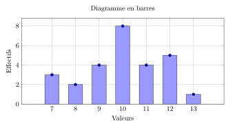
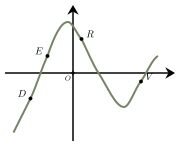
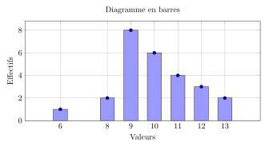
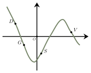

Séance 18 — Calcul en contexte et statistiques


---Q---
Deux amis, Alice et Louis, décident d'offrir un voyage d'anniversaire à leur ami Charles.  

 Ils organisent les dépenses de la façon suivante : 
$\bullet$ Alice règle les billets de train ;  

$\bullet$
Louis règle l'hébergement. 
Une fois le voyage terminé, ils souhaitent répartir équitablement toutes les dépenses entre eux deux, c'est-à-dire que chacun doit finalement payer la même somme. 

Les billets de train représentent $\dfrac{2}{9}$ de la dépense totale et l'hébergement représente le reste. 
 
Quelle fraction de la dépense totale Alice doit-elle donner à Louis pour que leurs contributions finales soient parfaitement équilibrées ?

- $\dfrac{5}{18}$
- $\dfrac{5}{9}$
- $\dfrac{7}{9}$
- $\dfrac{2}{18}$

---CORR---
En notant $D$ la dépense totale, Alice a dépensé $\dfrac{2}{9}D$ et Louis, $\dfrac{7}{9}D$.

Leur participation équilibrée doit être de $\dfrac{1}{2}D$ chacun.

Alice doit donc donner à Louis la somme de $\dfrac{1}{2}D - \dfrac{2}{9}D = \dfrac{5}{18}D$.

La fraction de la dépense totale que Alice doit donner à Louis est donc $\boldsymbol{\dfrac{5}{18}}$. 

La bonne réponse est la réponse A.



---Q---
Soit $x$ un réel.
À quelle expression est égale $-8x^2-16x-6$ ?

- $\left( -4x+2\right)\left( 2x+3\right)$
- $\left( -4x-2\right)\left( 2x+3\right)$
- $\left( x+\dfrac{1}{2}\right)\left( 2x+3\right)$
- $\left( -4x+2\right)\left( 2x-3\right)$

---CORR---
On cherche parmi les propositions, lesquelles peuvent donner, après développement, l'expression de l'énoncé. 

 $\begin{aligned}
 \left (-4x-2\right)\left(2x+3\right)&=-8x^2-12x-4x-6\\\\
 &=-8x^2-16x-6\\\\
 \end{aligned}$
   
La bonne réponse est la réponse B.



---Q---
Le double du carré de $2$ est égal à :

- $4$
- $22$
- $4^2$
- $8$

---CORR---
Le carré de $2$ est $2^2 = 4$. 

 Le double de $4$ est $2 \times 4 = 8$.

 Le double du carré de $2$ est égal à $\boldsymbol{8}$.
 
La bonne réponse est la réponse D.



---Q---
Voici la répartition des notes sur 20 d'une classe de première.

 

 Quel est l'effectif total de cette classe ?

- $28$
- $70$
- $27$
- $7$

---CORR---
L'effectif total est le nombre de notes représentées dans l'histogramme.

 On peut le calculer en additionnant les effectifs de chaque barre.

 Les effectifs sont :  
$\bullet$ $3$ pour la note $7$  
$\bullet$ $2$ pour la note $8$ 
$\bullet$ $4$ pour la note $9$ 
$\bullet$ $8$ pour la note $10$ 
$\bullet$ $4$ pour la note $11$ 
$\bullet$ $5$ pour la note $12$ 
$\bullet$ $1$ pour la note $13$. 

 Ici, on trouve un effectif total de $\boldsymbol{27}$ élèves. 
La bonne réponse est la réponse C.



---Q---
On lance un dé à 4 faces. La probabilité d'obtenir chacune des faces est donnée dans le tableau ci-dessous :

<table style="border-collapse: collapse; text-align: center;">
  <thead>
    <tr>
      <th style="border: 1px solid #B85C5C; padding: 8px;">Numéro de la face</th>
      <th style="border: 1px solid #B85C5C; padding: 8px;">1</th>
      <th style="border: 1px solid #B85C5C; padding: 8px;">2</th>
      <th style="border: 1px solid #B85C5C; padding: 8px;">3</th>
      <th style="border: 1px solid #B85C5C; padding: 8px;">4</th>
    </tr>
  </thead>
  <tbody>
    <tr>
      <td style="border: 1px solid #B85C5C; padding: 8px;">Probabilité</td>
      <td style="border: 1px solid #B85C5C; padding: 8px;">$\frac{1}{6}$</td>
      <td style="border: 1px solid #B85C5C; padding: 8px;">$0,3$</td>
      <td style="border: 1px solid #B85C5C; padding: 8px;">$\frac{1}{5}$</td>
      <td style="border: 1px solid #B85C5C; padding: 8px;">$x$</td>
    </tr>
  </tbody>
</table>

On peut affirmer que :

- $x=\dfrac{1}{3}$
- $x=0{,}7$
- $x=\dfrac{19}{30}$
- $x=\dfrac{2}{3}$

---CORR---
La somme des probabilités doit être égale à 1. 
Comme $0{,}3=\dfrac{3}{10}$, on a : 

 $\begin{aligned}
 x&=1-\left(\dfrac{1}{6}+\dfrac{3}{10}+\dfrac{1}{5}\right)\\\\
 x&=1-\left(\dfrac{5}{30}+\dfrac{9}{30}+\dfrac{6}{30}\right)\\\\
 x&=1-\dfrac{2}{3}\\\\
 x&=\boldsymbol{\dfrac{1}{3}}
 \end{aligned}$ 

La bonne réponse est la réponse A.



---Q---

 On a représenté une courbe $\mathscr{C}$ d'une fonction $f$.

Les points $D, E, R \text{ et } V$ appartiennent à $\mathscr{C}$.

Leurs abscisses sont notées respectivement $x_D, x_E, x_R \text{ et } x_V$.

 

L'inéquation $x\times f(x) > 0$ est vérifiée par :

- $x_E \text{ et } x_R$
- $x_D \text{ et } x_R$
- $x_D, x_E \text{ et } x_R$
- $x_E \text{ et } x_V$

---CORR---
L'inéquation est vérifiée lorsque $x$ et $f(x)$ sont de même signe, c'est-à-dire lorsque $x$ et $f(x)$ sont tous les deux positifs ou tous les deux négatifs.

Ici, $x_D$ est négatif et $f(x_D)$ est négatif. Aussi, $x_R$ est positif et $f(x_R)$ est positif.

L'inéquation est donc vérifiée pour $\boldsymbol{x_D \text{ et } x_R}$.

La bonne réponse est la réponse B.


Devoirs — Séance 18 — Calcul en contexte et statistiques


---Q---
Deux amis, Alice et Louis, décident d'offrir un voyage d'anniversaire à leur ami Charles.  

 Ils organisent les dépenses de la façon suivante : 
$\bullet$ Alice règle les billets de train ;  

$\bullet$
Louis règle l'hébergement. 
Une fois le voyage terminé, ils souhaitent répartir équitablement toutes les dépenses entre eux deux, c'est-à-dire que chacun doit finalement payer la même somme. 

Les billets de train représentent $\dfrac{3}{10}$ de la dépense totale et l'hébergement représente le reste. 
 
Quelle fraction de la dépense totale Alice doit-elle donner à Louis pour que leurs contributions finales soient parfaitement équilibrées ? 

- $\dfrac{3}{20}$
- $\dfrac{4}{10}$
- $\dfrac{2}{10}$
- $\dfrac{7}{10}$



---Q---
Soit $x$ un réel.
À quelle expression est égale $-3x^2-9x-6$ ?

- $\left( -3x+3\right)\left( x-2\right)$
- $\left( -3x+3\right)\left( x+2\right)$
- $\left( -3x-3\right)\left( x+2\right)$
- $\left( x+1\right)\left( x+2\right)$



---Q---
Le double de l'inverse de $7$ est égal à :

- $\dfrac{1}{14}$
- $14$
- $\dfrac{2}{7}$
- $\dfrac{7}{2}$



---Q---
Voici la répartition des notes sur 20 d'une classe de première.

 

 Quel est l'effectif total de cette classe ?

- $28$
- $69$
- $7$
- $26$



---Q---
On lance un dé à 4 faces. La probabilité d'obtenir chacune des faces est donnée dans le tableau ci-dessous :

<table style="border-collapse: collapse; text-align: center;">
  <thead>
    <tr>
      <th style="border: 1px solid #B85C5C; padding: 8px;">Numéro de la face</th>
      <th style="border: 1px solid #B85C5C; padding: 8px;">1</th>
      <th style="border: 1px solid #B85C5C; padding: 8px;">2</th>
      <th style="border: 1px solid #B85C5C; padding: 8px;">3</th>
      <th style="border: 1px solid #B85C5C; padding: 8px;">4</th>
    </tr>
  </thead>
  <tbody>
    <tr>
      <td style="border: 1px solid #B85C5C; padding: 8px;">Probabilité</td>
      <td style="border: 1px solid #B85C5C; padding: 8px;">$\frac{3}{10}$</td>
      <td style="border: 1px solid #B85C5C; padding: 8px;">$0,35$</td>
      <td style="border: 1px solid #B85C5C; padding: 8px;">$0,1$</td>
      <td style="border: 1px solid #B85C5C; padding: 8px;">$x$</td>
    </tr>
  </tbody>
</table>

On peut affirmer que :

- $x=0{,}25$
- $x=\dfrac{7}{10}$
- $x=0{,}75$
- $x=0{,}55$



---Q---

 On a représenté une courbe $\mathscr{C}$ d'une fonction $f$.

Les points $D, G, S \text{ et } V$ appartiennent à $\mathscr{C}$.

Leurs abscisses sont notées respectivement $x_D, x_G, x_S \text{ et } x_V$.

 

L'inéquation $x\times f(x) < 0$ est vérifiée par :

- $x_G \text{ et } x_S$
- $x_G \text{ et } x_V$
- $x_D, x_G \text{ et } x_S$
- $x_D \text{ et } x_S$


