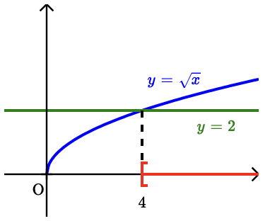

Séance 20 — Formules, fonctions et statistiques


---Q---
On considère la relation $F=\dfrac{a}{b}+cd$.

Lorsque $a=2$, $b=\dfrac{1}{7}$, $c=4$ et $d=\dfrac{3}{5}$, la valeur de $F$ est égale à :

- $\dfrac{94}{35}$
- $\dfrac{18}{5}$
- $\dfrac{77}{5}$
- $\dfrac{82}{5}$

---CORR---
On remplace $a$, $b$, $c$ et $d$ par les valeurs données :

$\begin{aligned}
F &= \dfrac{2}{\dfrac{1}{7}} +4 \times \dfrac{3}{5} \\\\
 &= 14 +\dfrac{12}{5}\\\\
 &= \boldsymbol{\dfrac{82}{5}}
\end{aligned}$

La bonne réponse est la réponse D.



---Q---
On considère les trois fonctions définies par : 

 $f_1\ :\ x \longmapsto x^2-(x+3)(x-5)\ \ \ \ \ \ \ \ f_2\ :\ x \longmapsto 5\sqrt{x}+3\ \ \ \ \ \ \ \ f_3\ :\ x \longmapsto\dfrac{3}{x}-6$ 
 On peut affirmer que :

- Uniquement la fonction $f_1$ est affine
- Toutes ces fonctions sont affines
- Uniquement les fonctions $f_2$ et $f_3$ sont affines
- Aucune de ces fonctions n'est affine

---CORR---
On cherche si les fonctions $f$ peuvent s'écrire sous la forme $f(x)=mx+p$.
 $\bullet$ En développant, on obtient :
 
 $\begin{aligned}
 f_1(x)&=x^2-(x+3)(x-5)\\\\
 &=x^2-(x^2-5x+3x-15)\\\\
 &=x^2-x^2+5x-3x+15\\\\
 &=2x+15
 \end{aligned}$

 On retrouve une forme $mx+p$, donc $f_1$ est une fonction affine.

 
 $\bullet$ $f_2(x)=5\sqrt{x}+3$

 Cette fonction contient un terme en $\sqrt{x}$, elle n'est donc pas affine.
 $\bullet$ $f_3(x)=\dfrac{3}{x}-6$

 Cette fonction contient un terme en $\dfrac{1}{x}$, elle n'est donc pas affine.

 **Uniquement la fonction $f_1$ est affine.**
 
La bonne réponse est la réponse A.



---Q---
Soit $n$ un entier non nul.
 À quelle expression est égale $\left(-1\right)^{n+4}$ ?

- $\left(-1\right)^{n} $
- $-\left(-1\right)^{n} $
- $\left(-1\right)^{n+1}$
- $\left(-1\right)^{n-1}$

---CORR---
$\begin{aligned} \left(-1\right)^{n+4}&=\left(-1\right)^{4} \times \left(-1\right)^{n} \\\\
 &=1\times \left(-1\right)^{n} \\\\
 &=\boldsymbol{\left(-1\right)^{n}} 
 \end{aligned}$

La bonne réponse est la réponse A.



---Q---
\begin{multicols}{2}
 On a représenté la courbe d'équation $y=\sqrt{x}$. 

 On note $(I)$ l'inéquation, sur $[0\ ;\ +\infty[$, $\sqrt{x} \geqslant 2$.
 
 \end{multicols}
 L'ensemble des solutions $S$ de cette inéquation est :

- $S = [1\ ;\ +\infty[$
- $S = [4\ ;\ +\infty[$
- $S = [2\ ;\ +\infty[$
- $S = [\sqrt{2}\ ;\ +\infty[$

---CORR---
Pour résoudre graphiquement cette inéquation : 

 $\bullet$ On trace la courbe d'équation $y=\sqrt{x}$. 

 $\bullet$ On trace la droite horizontale d'équation $y=2$. Cette droite coupe la courbe en $2^2=4$. 

 $\bullet$ Les solutions de l'inéquation sont les abscisses des points de la courbe qui se situent sur ou au dessus de la droite.

 

 Comme la fonction racine carrée est définie sur $[0\ ;\ +\infty[$, l'ensemble des solutions de l'inéquation $(I)$ est : **$S = [4\ ;\ +\infty[$**.
 
La bonne réponse est la réponse B.



---Q---
On donne la série statistique suivante : $7 ; 11 ; 15 ; 7 ; 5$.

 Quelle valeur faut-il ajouter à la série pour que sa moyenne soit égale à $10$ ?

- $17$
- $15$
- $16$
- $14$

---CORR---
Appelons $x$ la valeur cherchée.

 On commence par calculer la somme des valeurs de la série de l'énoncé :

 $7 + 11 + 15 + 7 + 5 = 45$.

 Comme la série de l'énoncé contient $5$ valeurs, la nouvelle série avec $x$ en contient $6$.
 
On peut calculer sa moyenne avec l'expression : $\dfrac{45 + x}{6}$

 Comme cette moyenne vaut $10$ d'après l'énoncé, il faut alors résoudre l'équation : 

 $\dfrac{45 + x}{6} = 10$
 

 $45 + x = 10 \times 6$
 

 $x = 10 \times 6 - 45$
 
$x = \boldsymbol{15}$

La bonne réponse est la réponse B.



---Q---
Dans un lycée, $160$ élèves étudient l'Espagnol, ce qui représente $25\ $% du nombre d'élèves inscrits dans ce lycée.

 Le nombre d'élèves inscrits dans ce lycée est égal à :

- $540$
- $64$
- $740$
- $640$

---CORR---
En notant $N$ le nombre total d'élèves, 
 $25\ $% de $N$ est égal à $160$ élèves.

Puisque $25\ $%$ =\dfrac{25}{100}=\dfrac{1}{4}$, alors $N$ est $4$ fois plus grand que $160$.

Ainsi, $N=4\times 160$ élèves soit 
 $\boldsymbol{640}$ élèves au total.
 
 
La bonne réponse est la réponse D.


Devoirs — Séance 20 — Formules, fonctions et statistiques


---Q---
On considère la relation $F=a+\dfrac{b}{cd}$.

Lorsque $a=\dfrac{1}{7}$, $b=1$, $c=8$ et $d=-\dfrac{1}{8}$, la valeur de $F$ est égale à :

- $0$
- $-\dfrac{6}{7}$
- $-\dfrac{48}{7}$
- $\dfrac{57}{448}$



---Q---
On considère les trois fonctions définies par : 

 $f_1\ :\ x \longmapsto x^2-(x+2)(x-4)\ \ \ \ \ \ \ \ f_2\ :\ x \longmapsto 2\sqrt{x}+4\ \ \ \ \ \ \ \ f_3\ :\ x \longmapsto\dfrac{2}{x}-7$  
 On peut affirmer que :

- Uniquement la fonction $f_1$ est affine
- Uniquement les fonctions $f_2$ et $f_3$ sont affines
- Aucune de ces fonctions n'est affine
- Toutes ces fonctions sont affines



---Q---
Soit $n$ un entier non nul.
 À quelle expression est égale $\left(-1\right)^{n+6}$ ?

- $-\left(-1\right)^{n} $
- $\left(-1\right)^{n-1}$
- $\left(-1\right)^{n} $
- $\left(-1\right)^{n+1}$



---Q---
\begin{multicols}{2}
 On a représenté la courbe d'équation $y=\sqrt{x}$. 

 On note $(I)$ l'inéquation, sur $[0\ ;\ +\infty[$, $\sqrt{x}> 7$.
 
 \end{multicols}
 L'ensemble des solutions $S$ de cette inéquation est :

- $S = ]3{,}5\ ;\ +\infty[$
- $S = ]7\ ;\ +\infty[$
- $S = ]49\ ;\ +\infty[$
- $S = ]\sqrt{7}\ ;\ +\infty[$



---Q---
On donne la série statistique suivante : $11 ; 15 ; 5 ; 14$.

 Quelle valeur faut-il ajouter à la série pour que sa moyenne soit égale à $10$ ?

- $5$
- $6$
- $2$
- $4$



---Q---
Dans un lycée, $40$ élèves étudient le Grec, ce qui représente $4\ $% du nombre d'élèves inscrits dans ce lycée.

 Le nombre d'élèves inscrits dans ce lycée est égal à :

- $100$
- $1\ 000$
- $1\ 100$
- $900$


