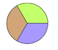
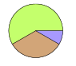
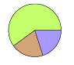
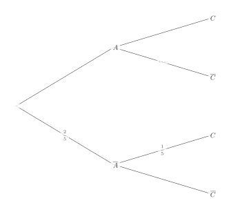
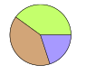
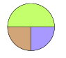
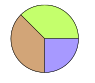
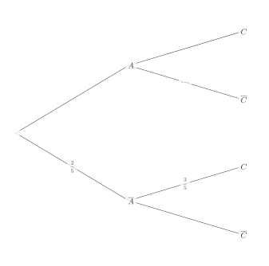

Séance 21 — Probabilités, fonctions et calcul


---Q---
On considère deux réels $a$ et $b$ strictement positifs. Si $a > b$ alors :

- $a - b < 0$
- $a - b > 0$
- $a^2 < b^2$
- $\sqrt{a} < \sqrt{b}$

---CORR---
Comme $a > b$, on a $a - b > 0$.

Pour les autres propositions :
$a - b < 0$ : Faux. Comme $a > b$, on a $a - b > 0$.
$\sqrt{a} < \sqrt{b}$ : Faux. La fonction racine carrée est croissante sur $[0\,;+\infty[$, donc $\sqrt{a} > \sqrt{b}$.
$a^2 < b^2$ : Faux. La fonction carré est croissante sur $[0\,;+\infty[$, donc $a^2 > b^2$.

La bonne réponse est la réponse B.



---Q---
La probabilité d'un événement $A$ est $\dfrac{5}{8}$. Quelle est la probabilité de son événement contraire ?

- $\dfrac{8}{5}$
- $\dfrac{3}{8}$
- $-\dfrac{5}{8}$
- $\dfrac{5}{8}$

---CORR---
La relation entre la probabilité d'un événement $A$ et celle de son contraire $\overline{A}$ est : $P(\overline{A})=1-P(A)$.

Ainsi : $P(\overline{A})=1-\dfrac{5}{8}=\dfrac{3}{8}$.

La bonne réponse est la réponse B.



---Q---
Sur $60$ arbres dans un parc, on distingue trois groupes : chênes ($20$ arbres), érables ($20$ arbres), autres essences (le reste). Quel diagramme circulaire représente la situation ?

- 
- 
- 
- 

---CORR---
Les effectifs des $3$ groupes sont respectivement $20$, $20$ et $60-20-20=20$.

$$\begin{array}{|c|c|c|c|}
\hline
\text{Groupe} & \text{chênes} & \text{érables} & \text{autres}\\
\hline
\text{Effectif} & 20 & 20 & 20\\
\hline
\text{Part} & \dfrac{1}{3} & \dfrac{1}{3} & \dfrac{1}{3}\\
\hline
\text{Angle} & 120^{\circ} & 120^{\circ} & 120^{\circ}\\
\hline
\end{array}$$

Le bon diagramme est le seul avec trois angles égaux de $120^{\circ}$.

La bonne réponse est la réponse A.



---Q---
Les coordonnées du point d'intersection entre la droite d'équation $y=\dfrac{x}{9}-5$ et l'axe des abscisses sont :

- $(9\,;\,0)$
- $(0\,;\,45)$
- $(45\,;\,0)$
- $(-5\,;\,0)$

---CORR---
L'ordonnée de ce point est $0$ puisqu'il se situe sur l'axe des abscisses. Son abscisse est donc donnée par la solution de $\dfrac{x}{9}-5=0$, c'est-à-dire $x=45$.

Les coordonnées de ce point sont donc $(45\,;\,0)$.

La bonne réponse est la réponse C.



---Q---
Dans une région de France, le tarif de l'eau est le suivant : un abonnement annuel de $50{,}80$\,€ et $3{,}84$\,€ par mètre cube consommé. Une famille a payé une facture de $373{,}36$\,€ pour sa consommation annuelle. Le nombre de mètres cubes consommés est donné par le calcul :

- $\dfrac{373{,}36-3{,}84}{50{,}80}$
- $50{,}80\times3{,}84-373{,}36$
- $373{,}36-50{,}80\times 3{,}84$
- $\dfrac{373{,}36-50{,}80}{3{,}84}$

---CORR---
En notant $a$ le nombre de mètres cubes consommés, la facture s'écrit :

$$\begin{aligned}
50{,}80+3{,}84\times a &= 373{,}36\\
a &= \dfrac{373{,}36-50{,}80}{3{,}84}
\end{aligned}$$

La bonne réponse est la réponse D.



---Q---
On donne l'arbre de probabilités ci-dessous :

On sait que $P(A \cap C)=\dfrac{6}{25}$. Calculer $P_A(\overline{C})$.

- $\dfrac{3}{5}$
- $\dfrac{9}{10}$
- $\dfrac{1}{5}$
- $\dfrac{2}{5}$

---CORR---
On déduit de l'arbre : $P(A)=1-P(\overline{A})=1-\dfrac{2}{5}=\dfrac{3}{5}$.

Avec $P(A \cap C)=\dfrac{6}{25}$, on calcule :

$$P_A(C)=\dfrac{P(A \cap C)}{P(A)}=\dfrac{\dfrac{6}{25}}{\dfrac{3}{5}}=\dfrac{6}{25}\times\dfrac{5}{3}=\dfrac{2}{5}$$

On obtient alors :

$$P_A(\overline{C})=1-P_A(C)=1-\dfrac{2}{5}=\dfrac{3}{5}$$

La bonne réponse est la réponse A.


Devoirs — Séance 21 — Probabilités, fonctions et calcul


---Q---
On considère deux réels $a$ et $b$ strictement positifs. Si $a > b$ alors :

- $a - b < 0$
- $a - b > 0$
- $a^2 < b^2$
- $\sqrt{a} < \sqrt{b}$




---Q---
La probabilité d'un événement $A$ est $\dfrac{8}{9}$. Quelle est la probabilité de son événement contraire ?

- $-\dfrac{8}{9}$
- $\dfrac{1}{9}$
- $\dfrac{8}{9}$
- $\dfrac{9}{8}$




---Q---
Sur $160$ logements dans un quartier, on distingue trois groupes : appartements ($80$ logements), maisons individuelles ($40$ logements), autres types (le reste). Quel diagramme circulaire représente la situation ?

- 
- 
- 
- 




---Q---
Les coordonnées du point d'intersection entre la droite d'équation $y=\dfrac{x}{3}+5$ et l'axe des abscisses sont :

- $(-15\,;\,0)$
- $(15\,;\,0)$
- $(0\,;\,-15)$
- $(3\,;\,0)$




---Q---
Dans une région de France, le tarif de l'eau est le suivant : un abonnement annuel de $49{,}30$\,€ et $3{,}57$\,€ par mètre cube consommé. Une famille a payé une facture de $313{,}48$\,€ pour sa consommation annuelle. Le nombre de mètres cubes consommés est donné par le calcul :

- $313{,}48-49{,}30\times 3{,}57$
- $49{,}30\times3{,}57-313{,}48$
- $\dfrac{313{,}48-3{,}57}{49{,}30}$
- $\dfrac{313{,}48-49{,}30}{3{,}57}$




---Q---
On donne l'arbre de probabilités ci-dessous :

On sait que $P(A \cap C)=\dfrac{21}{50}$. Calculer $P_A(\overline{C})$.

- $\dfrac{3}{10}$
- $\dfrac{3}{5}$
- $\dfrac{1}{10}$
- $\dfrac{7}{10}$



