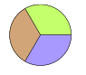
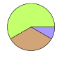
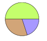
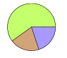
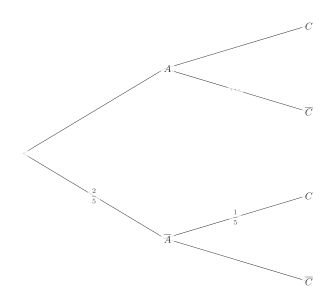
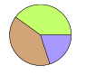
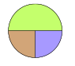
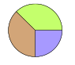
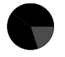
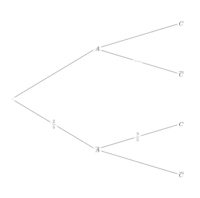

Séance 21 — Probabilités, fonctions et calcul


---Q---
On considère deux réels $a$ et $b$ strictement positifs. Si $a > b$ alors :

- $a - b < 0$
- $a - b > 0$
- $a^2 < b^2$
- $\sqrt{a} < \sqrt{b}$

---CORR---
Comme $a > b$, on a $a - b > 0$.

Pour les autres propositions :
$a - b < 0$ : Faux. Comme $a > b$, on a $a - b > 0$.
$\sqrt{a} < \sqrt{b}$ : Faux. La fonction racine carrée est croissante sur $[0\,;+\infty[$, donc $\sqrt{a} > \sqrt{b}$.
$a^2 < b^2$ : Faux. La fonction carré est croissante sur $[0\,;+\infty[$, donc $a^2 > b^2$.

La bonne réponse est la réponse B.



---Q---
La probabilité d'un événement $A$ est $\dfrac{5}{8}$. Quelle est la probabilité de son événement contraire ?

- $\dfrac{8}{5}$
- $\dfrac{3}{8}$
- $-\dfrac{5}{8}$
- $\dfrac{5}{8}$

---CORR---
La relation entre la probabilité d'un événement $A$ et celle de son contraire $\overline{A}$ est : $P(\overline{A})=1-P(A)$.

Ainsi : $P(\overline{A})=1-\dfrac{5}{8}=\dfrac{3}{8}$.

La bonne réponse est la réponse B.



---Q---
Sur $60$ arbres dans un parc, on distingue trois groupes : chênes ($20$ arbres), érables ($20$ arbres), autres essences (le reste). Quel diagramme circulaire représente la situation ?

- 
- 
- 
- 

---CORR---
Les effectifs des $3$ groupes sont respectivement $20$, $20$ et $60-20-20=20$.

$$\begin{array}{|c|c|c|c|}
\hline
\text{Groupe} & \text{chênes} & \text{érables} & \text{autres}\\
\hline
\text{Effectif} & 20 & 20 & 20\\
\hline
\text{Part} & \dfrac{1}{3} & \dfrac{1}{3} & \dfrac{1}{3}\\
\hline
\text{Angle} & 120^{\circ} & 120^{\circ} & 120^{\circ}\\
\hline
\end{array}$$

Le bon diagramme est le seul avec trois angles égaux de $120^{\circ}$.

La bonne réponse est la réponse A.



---Q---
Les coordonnées du point d'intersection entre la droite d'équation $y=\dfrac{x}{9}-5$ et l'axe des abscisses sont :

- $(9\,;\,0)$
- $(0\,;\,45)$
- $(45\,;\,0)$
- $(-5\,;\,0)$

---CORR---
L'ordonnée de ce point est $0$ puisqu'il se situe sur l'axe des abscisses. Son abscisse est donc donnée par la solution de $\dfrac{x}{9}-5=0$, c'est-à-dire $x=45$.

Les coordonnées de ce point sont donc $(45\,;\,0)$.

La bonne réponse est la réponse C.



---Q---
Dans une région de France, le tarif de l'eau est le suivant : un abonnement annuel de $50{,}80$\,€ et $3{,}84$\,€ par mètre cube consommé. Une famille a payé une facture de $373{,}36$\,€ pour sa consommation annuelle. Le nombre de mètres cubes consommés est donné par le calcul :

- $\dfrac{373{,}36-3{,}84}{50{,}80}$
- $50{,}80\times3{,}84-373{,}36$
- $373{,}36-50{,}80\times 3{,}84$
- $\dfrac{373{,}36-50{,}80}{3{,}84}$

---CORR---
En notant $a$ le nombre de mètres cubes consommés, la facture s'écrit :

$$\begin{aligned}
50{,}80+3{,}84\times a &= 373{,}36\\
a &= \dfrac{373{,}36-50{,}80}{3{,}84}
\end{aligned}$$

La bonne réponse est la réponse D.



---Q---
On donne l'arbre de probabilités ci-dessous :

On sait que $P(A \cap C)=\dfrac{6}{25}$. Calculer $P_A(\overline{C})$.

- $\dfrac{3}{5}$
- $\dfrac{9}{10}$
- $\dfrac{1}{5}$
- $\dfrac{2}{5}$

---CORR---
On déduit de l'arbre : $P(A)=1-P(\overline{A})=1-\dfrac{2}{5}=\dfrac{3}{5}$.

Avec $P(A \cap C)=\dfrac{6}{25}$, on calcule :

$$P_A(C)=\dfrac{P(A \cap C)}{P(A)}=\dfrac{\dfrac{6}{25}}{\dfrac{3}{5}}=\dfrac{6}{25}\times\dfrac{5}{3}=\dfrac{2}{5}$$

On obtient alors :

$$P_A(\overline{C})=1-P_A(C)=1-\dfrac{2}{5}=\dfrac{3}{5}$$

La bonne réponse est la réponse A.


Devoirs — Séance 21 — Probabilités, fonctions et calcul


---Q---
On considère deux réels $a$ et $b$ strictement positifs. Si $a > b$ alors :

- $a - b < 0$
- $a - b > 0$
- $a^2 < b^2$
- $\sqrt{a} < \sqrt{b}$

---CORR---
La bonne réponse est $\boldsymbol{\sqrt{a} > 1}$. 
La fonction racine carrée est croissante : comme $a > 1$, $\sqrt{a} > \sqrt{1} = 1$.

Pour les autres propositions : 
$\sqrt{a} < 1$ : Faux. Comme $a > 1$, $\sqrt{a} > 1$. 
$\dfrac{1}{a} > 1$ : Faux. La fonction inverse est décroissante : comme $a > 1$, on a $\dfrac{1}{a} < 1$. 
$a^2 < 1$ : Faux. Comme $a^2 > a > 1$, on a $a^2 > 1$. 
La bonne réponse est la réponse B.




---Q---
La probabilité d'un événement $A$ est $\dfrac{8}{9}$. Quelle est la probabilité de son événement contraire ?

- $-\dfrac{8}{9}$
- $\dfrac{1}{9}$
- $\dfrac{8}{9}$
- $\dfrac{9}{8}$

---CORR---
La relation entre la probabilité d'un événement $A$ et celle de son contraire $\overline{A}$ est :  $P(\overline{A})=1-P(A)$. 
Ainsi : $P(\overline{A})=1-\dfrac{8}{9}=\dfrac{1}{9}$. 
La bonne réponse est la réponse B.




---Q---
Sur $160$ logements dans un quartier, on distingue trois groupes : appartements ($80$ logements), maisons individuelles ($40$ logements), autres types (le reste). Quel diagramme circulaire représente la situation ?

- 
- 
- 
- 

---CORR---
Les effectifs des $3$ groupes sont respectivement $80$, $40$ et $160-80-40=40$.

$$
\begin{array}{|c|c|c|c|}
\hline
\cellcolor{lightgray} \text{Groupe} & \text{appartements} & \text{maisons individuelles} & \text{autres types}\\\\
\hline
\cellcolor{lightgray} \text{Effectif} & 80 & 40 & 40\\\\
\hline
\cellcolor{lightgray} \text{Part} & \dfrac{80}{160}=\dfrac{1}{2} & \dfrac{40}{160}=\dfrac{1}{4} & \dfrac{40}{160}=\dfrac{1}{4}\\\\
\hline
\cellcolor{lightgray} \text{Angle} & \ang{180} & \ang{90} & \ang{90}\\\\
\hline
\end{array}
$$

Le bon diagramme est le seul avec : deux angles droits égaux (de $\ang{90}$) et un angle plat (de $\ang{180}$).

$\boldsymbol{\cancel{\textbf{A}}}$.

\qquad $\boldsymbol{\cancel{\textbf{B}}}$. \begin{tikzpicture}[baseline,scale = 0.4]

\tikzset{
point/.style={
thick,
draw,
cross out,
inner sep=0pt,
minimum width=5pt,
minimum height=5pt,
},
\clip (-0.5,-0.5) rectangle (7,6);
\draw[color={black},fill opacity = 1.1] (3,3) circle (3);
\draw  [color={black},preaction={fill,color = {GreenYellow},opacity = 0.7},pattern color = {blue}, pattern = {Lines[angle=45, distance=10pt, line width=0.3pt]}] (0.5729490168751581,1.2366442431225804) -- (3,3) -- (6,3) arc (0:216:3) ;
\draw  [color={black},preaction={fill,color = {brown},opacity = 0.7},pattern color = {GreenYellow}, pattern = {Lines[angle=0, distance=10pt, line width=0.3pt]}] (3.927050983124842,0.1468304511145393) -- (3,3) -- (0.5729490168751576,1.2366442431225808) arc (-144:-72:3) ;
\draw  [color={black},preaction={fill,color = {LightSlateBlue},opacity = 0.7},pattern color = {brown}, pattern = dots] (6,2.999999999999999) -- (3,3) -- (3.9270509831248415,0.14683045111453907) arc (-72:0:3) ;

\end{tikzpicture}\qquad C. \begin{tikzpicture}[baseline,scale = 0.4]

\tikzset{
point/.style={
thick,
draw,
cross out,
inner sep=0pt,
minimum width=5pt,
minimum height=5pt,
},
\clip (-0.5,-0.5) rectangle (7,6);
\draw[color={black},fill opacity = 1.1] (3,3) circle (3);
\draw  [color={black},preaction={fill,color = {GreenYellow},opacity = 0.7},pattern color = {blue}, pattern = {Lines[angle=45, distance=10pt, line width=0.3pt]}] (0,3.0000000000000004) -- (3,3) -- (6,3) arc (0:180:3) ;
\draw  [color={black},preaction={fill,color = {brown},opacity = 0.7},pattern color = {GreenYellow}, pattern = {Lines[angle=0, distance=10pt, line width=0.3pt]}] (2.9999999999999996,2.719262146893782e-32) -- (3,3) -- (0,3.0000000000000004) arc (180:270:3) ;
\draw  [color={black},preaction={fill,color = {LightSlateBlue},opacity = 0.7},pattern color = {brown}, pattern = dots] (6,2.9999999999999996) -- (3,3) -- (2.9999999999999996,0) arc (-90:0:3) ;

\end{tikzpicture}\qquad $\boldsymbol{\cancel{\textbf{D}}}$. \begin{tikzpicture}[baseline,scale = 0.4]

\tikzset{
point/.style={
thick,
draw,
cross out,
inner sep=0pt,
minimum width=5pt,
minimum height=5pt,
},
\clip (-0.5,-0.5) rectangle (7,6);
\draw[color={black},fill opacity = 1.1] (3,3) circle (3);
\draw  [color={black},preaction={fill,color = {GreenYellow},opacity = 0.7},pattern color = {blue}, pattern = {Lines[angle=45, distance=10pt, line width=0.3pt]}] (0.8786796564403576,5.121320343559643) -- (3,3) -- (6,3) arc (0:135:3) ;
\draw  [color={black},preaction={fill,color = {brown},opacity = 0.7},pattern color = {GreenYellow}, pattern = {Lines[angle=0, distance=10pt, line width=0.3pt]}] (3,0) -- (3,3) -- (0.8786796564403576,5.121320343559643) arc (135:270:3) ;
\draw  [color={black},preaction={fill,color = {LightSlateBlue},opacity = 0.7},pattern color = {brown}, pattern = dots] (6,2.9999999999999996) -- (3,3) -- (2.9999999999999996,0) arc (-90:0:3) ;

\end{tikzpicture}\qquad  
La bonne réponse est la réponse C.




---Q---
Les coordonnées du point d'intersection entre la droite d'équation $y=\dfrac{x}{3}+5$ et l'axe des abscisses sont :

- $(-15\,;\,0)$
- $(15\,;\,0)$
- $(0\,;\,-15)$
- $(3\,;\,0)$

---CORR---
L'ordonnée de ce point est $0$ puisque le point d'intersection se situe sur l'axe des abscisses. 
Son abscisse est donc donnée par la solution de l'équation  $\dfrac{x}{3}+5=0$, c'est-à-dire $x=-15$.

Les coordonnées de ce   point sont donc : $(\boldsymbol{-15\,;\,0})$. 
La bonne réponse est la réponse A.




---Q---
Dans une région de France, le tarif de l'eau est le suivant : un abonnement annuel de $49{,}30$\,€ et $3{,}57$\,€ par mètre cube consommé. Une famille a payé une facture de $313{,}48$\,€ pour sa consommation annuelle. Le nombre de mètres cubes consommés est donné par le calcul :

- $313{,}48-49{,}30\times 3{,}57$
- $49{,}30\times3{,}57-313{,}48$
- $\dfrac{313{,}48-3{,}57}{49{,}30}$
- $\dfrac{313{,}48-49{,}30}{3{,}57}$

---CORR---
La facture s'élève à $313{,}48$\,€~pour la consommation annuelle. 
En notant $a$ le nombre de  mètres cubes consommés, on obtient :  

$$
\begin{aligned}
49{,}3+3{,}57\times a &=313{,}48\\\\
a&=\boldsymbol{\dfrac{313{,}48-49{,}30}{3{,}57}}
\end{aligned}
$$

La bonne réponse est la réponse D.




---Q---
On donne l'arbre de probabilités ci-dessous :

On sait que $P(A \cap C)=\dfrac{21}{50}$. Calculer $P_A(\overline{C})$.

- $\dfrac{3}{10}$
- $\dfrac{3}{5}$
- $\dfrac{1}{10}$
- $\dfrac{7}{10}$

---CORR---
On déduit de l'énoncé 

$$
\begin{aligned}
P(A)&=1-P(\overline{A})\\\\
&=1-\dfrac{2}{5}\\\\
&=\dfrac{3}{5}.\end{aligned}
$$

Avec la donnée de $P(A \cap C)=\dfrac{21}{50}$ dans l'énoncé, on peut alors calculer :  

$$
\begin{aligned}
P_A(C)&=\dfrac{P(A \cap C)}{P(A)}\\\\
&=\dfrac{ \dfrac{21}{50}}{ \dfrac{3}{5}} \\\\
&=\dfrac{21}{50} \times \dfrac{5}{3} \\\\
&= \dfrac{7}{10}.
\end{aligned}
$$

On sait alors que  

$$
\begin{aligned}
P_A(\overline{C})&=1-P_A(C)\\\\
&=1-\dfrac{7}{10}\\\\
&=\dfrac{3}{10} .\end{aligned}
$$

La bonne réponse est la réponse A.



