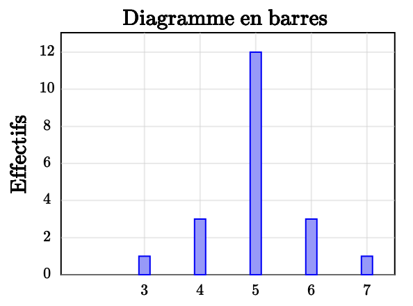
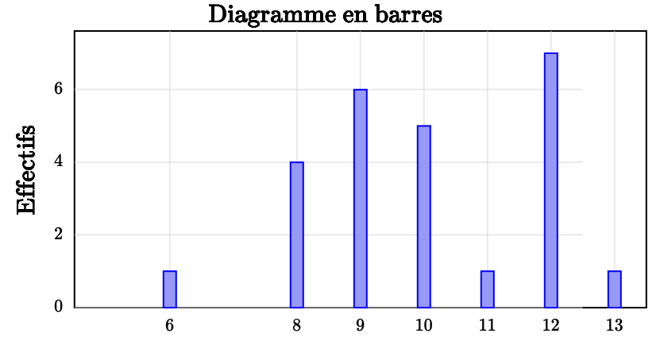

Séance 22 — Probabilités et calculs


---Q---
On dispose d'une urne A contenant $4$ boules numérotées : $2 ; 13 ; 26 ; 30$ et d'une urne B contenant $6$ boules numérotées : $6 ; 15 ; 17 ; 19 ; 20 ; 27$.  
Les boules sont indiscernables au toucher.
Parmi les affirmations suivantes, laquelle est vraie ?

- La probabilité d'obtenir une boule portant un numéro impair est plus grande en choisissant l'urne A plutôt que l'urne B.
- La probabilité d'obtenir une boule portant un nombre premier est plus grande en choisissant l'urne A plutôt que l'urne B.
- La probabilité d'obtenir une boule portant un multiple de $3$ est plus grande en choisissant l'urne A plutôt que l'urne B.
- La probabilité d'obtenir une boule portant un numéro supérieur ou égal à $15$ est plus grande en choisissant l'urne A plutôt que l'urne B.

---CORR---
En testant chacune des affirmations, on constate que seule l'affirmation correcte est :  
La probabilité d'obtenir une boule portant un nombre premier est plus grande en choisissant l'urne A. 
En effet : 
Dans l'urne A, les issues favorables sont : $2, 13$. 
$P_A = \dfrac24 = \dfrac12$ 
Dans l'urne B, les issues favorables sont : $17, 19$. 
$P_B = \dfrac26 = \dfrac13$ 
On a $\dfrac12 = \dfrac36$ et $\dfrac13 = \dfrac26$ et comme $\dfrac12 > \dfrac13$, donc : 
La probabilité d'obtenir une boule portant un nombre premier est plus grande en choisissant l'urne A. 
La bonne réponse est la réponse B.



---Q---
On lance un dé cubique quatre fois de suite. Le dé est truqué.  
La probabilité d'obtenir au moins une fois $6$ lors des quatre lancers est égale à $0,518$. 
On peut alors affirmer que la probabilité de n'obtenir aucun $6$ lors des quatre lancers est égale à :

- $0,83$
- On ne peut pas savoir
- $0,482$
- $0,518$

---CORR---
On note $A$ l'événement "obtenir au moins un 6" et $B$ l'événement "n'obtenir aucun 6". 
Les événements $A$ et $B$ sont contraires. 
Donc : $P(B) = 1 - P(A)$. 
$P(B) = 1 - 0,518 = 0,482$ 
La bonne réponse est la réponse C.



---Q---
Soit $n$ un entier non nul. 
À quelle expression est égale $4^n+4^n$ ?

- $4^2n$
- $2\times 4^n$
- $4^n+1$
- $8^n$

---CORR---
$4^n+4^n=2\times 4^n$ 
La bonne réponse est la réponse B.



---Q---
Combien de solutions réelles possède l'équation $4=-x^2+15$ ?

- $0$ solution
- $2$ solutions
- $1$ solution
- Une infinité de solutions

---CORR---
L'équation est équivalente à $-x^2=4-15$, soit $x^2=11$. 
$11$ étant strictement positif, cette équation a $2$ solutions : $\sqrt11$ et  $-\sqrt11$. 
La bonne réponse est la réponse B.



---Q---
L'aire en $\text{hm}^2$ d'un carré de côté $300$ $\text{m}$ est égale à :

- $900$ $\text{hm}^2$
- $90\,000$ $\text{hm}^2$
- $12$ $\text{hm}^2$
- $9$ $\text{hm}^2$

---CORR---
$300$ $\text {m}$ $= 3$ $\text{hm}$ 
L'aire du carré est : $3 \text { hm}\times 3 \text { hm} = 9 \text{ hm}^2$ . 
La bonne réponse est la réponse D.



---Q---
Voici la répartition des notes sur 10 d'une classe de première.

- $60$ %
- $75$ %
- $40$ %
- $50$ %

---CORR---
Le pourcentage d'élèves ayant obtenu la note 5 est calculé en divisant l'effectif de cette note par l'effectif total, puis en multipliant par 100. 
L'effectif total est le nombre de notes représentées dans l'histogramme. 
Ici, on trouve un effectif total de $20$ élèves. 
L'effectif des élèves ayant obtenu la note 5 est de $12$. 
$\dfrac1220 \times 100 = 60$ 
Donc le pourcentage est de $60$ %. 
La bonne réponse est la réponse A.


Devoirs — Séance 22 — Probabilités et calculs


---Q---
On dispose d'une urne A contenant $6$ boules numérotées : $6 ; 7 ; 9 ; 10 ; 15 ; 16$ et d'une urne B contenant $5$ boules numérotées : $5 ; 12 ; 23 ; 25 ; 29$. 
Les boules sont indiscernables au toucher. 
Parmi les affirmations suivantes, laquelle est vraie ?

- La probabilité d'obtenir une boule portant un numéro supérieur ou égal à $15$ est plus grande en choisissant l'urne A plutôt que l'urne B.
- La probabilité d'obtenir une boule portant un numéro impair est plus grande en choisissant l'urne A plutôt que l'urne B.
- La probabilité d'obtenir une boule portant un nombre premier est plus grande en choisissant l'urne A plutôt que l'urne B.
- La probabilité d'obtenir une boule portant un multiple de $3$ est plus grande en choisissant l'urne A plutôt que l'urne B.



---Q---
Dans une production, $10$ % des pièces sont défectueuses. On prélève quatre pièces au hasard. 
La probabilité qu'aucune pièce ne soit défectueuse est environ $0,656$. 
On peut alors affirmer que la probabilité qu'au moins une pièce soit défectueuse est égale à :

- $0,9$
- $0,344$
- On ne peut pas savoir
- $0,656$



---Q---
Soit $n$ un entier non nul.  
À quelle expression est égale $3^n+3^n$ ?

- $3^n+1$
- $3^2n$
- $2\times 3^n$
- $6^n$



---Q---
Combien de solutions réelles possède l'équation $19=-x^2+9$ ?

- Une infinité de solutions
- $1$ solution
- $2$ solutions
- $0$ solution



---Q---
L'aire en $\text{dam}^2$ d'un carré de côté $80$ $\text{m}$ est égale à :

- $8$ $\text{dam}^2$
- $0,8$ $\text{dam}^2$
- $6\,400$ $\text{dam}^2$
- $64$ $\text{dam}^2$



---Q---
Voici la répartition des notes sur 20 d'une classe de première.

- $4$ %
- $14$ %
- $24$ %
- $34$ %


