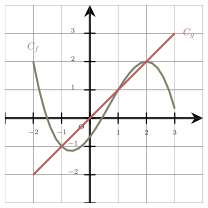
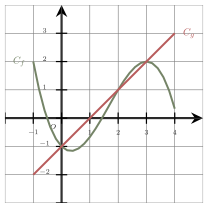

Séance 23 — Fonctions, équations et statistiques


---Q---
Parmi les quatre propositions, laquelle est un ordre de grandeur de la contenance d'une baignoire ?

- $2\,000\text{ mL}$
- $200\,000\text{ mL}$
- $2\,000\,000\text{ mL}$
- $20\,000\text{ mL}$

---CORR---
Une baignoire contient environ $200$ $\text{L}$, soit $200\,000\textbf{ mL}$.  
La bonne réponse est la réponse **B**.



---Q---
Soit $g$ la fonction affine définie sur $\mathbb{R}$ par : $g(x)=-3x+b$. 
 On note $\mathscr{D}$ sa courbe représentative dans un repère. 
 On sait que $A(2~;~-13)$ appartient à $\mathscr{D}$. 
 L'ordonnée du point de $\mathscr{D}$ dont l'abscisse est $1$ est :

- $-13$
- $-3$
- $-7$
- $-10$

---CORR---
On cherche d'abord la valeur de $b$ en utilisant la condition donnée dans l'énoncé. 
 $A(2~;~-13)$ appartient à $\mathscr{D}$ signifie que $g(2)=-13$.
 $$\begin{aligned}
    g(2)&=-13\\
    -3\times 2+b&=-13\\
    -6+b&=-13\\
    b&=-13+6\\
    b&=-7
    \end{aligned}$$
 On a donc $g(x)=-3x-7$.
 L'image de $1$ par cette fonction correspond à l'ordonnée du point de $\mathscr{D}$ dont l'abscisse est $1$ :
 $$\begin{aligned}
    g(1)&=-3\times 1-7\\
    &=-3-7\\
    &=-10
    \end{aligned}$$
 
La bonne réponse est la réponse **D**.



---Q---
Sur la figure ci-contre, $C_f$ et $C_g$ représentent respectivement les fonctions $f$ et $g$ définies sur $[-2\,;\,3]$.

L'ensemble des solutions de l'inéquation $f(x)< g(x)$ est :

- $[-1\,;\,1]$
- $]-1\,;\,1[\cup ]2\,;\,3]$
- $]-1\,;\,1[\cup ]2\,;\,3[$
- $[-2\,;\,-1[\cup]1\,;\,2[$

---CORR---
Les solutions de l'inéquation sont les abscisses des points de $C_f$ qui se situent en dessous de $C_g$, soit $]-1\,;\,1[\cup ]2\,;\,3]$. 
La bonne réponse est la réponse **B**.



---Q---
Une écriture simplifiée de $0{,}63a-2a$ est :

- $1{,}37a$
- $-1{,}37a$
- $0{,}63a$
- $2{,}63a$

---CORR---
À l'aide d'une factorisation, on obtient :
$$\begin{aligned}
          0{,}63a-2a  &=(0{,}63-2)a\\        
      &=-1{,}37a
      \end{aligned}$$
La bonne réponse est la réponse **B**.



---Q---
La solution de l'équation $7(6x-6)=-3x-9$ est :

- $-\dfrac{1}{3}$
- $\dfrac{11}{13}$
- $-\dfrac{17}{15}$
- $\dfrac{11}{15}$

---CORR---
On développe, puis on isole l'inconnue dans le membre de gauche :
 $$\begin{aligned}
 7(6x-6)&=-3x-9\\
 42x-42&=-3x-9\\
 42x-42+3x&=-3x-9+3x\\
 45x-42&=-9\\
 45x-42+42&=-9+42\\
 45x&=33\\
 x&=\dfrac{33}{45}
 \\x&=\dfrac{11}{15}\end{aligned}$$
 
 La solution est $\dfrac{11}{15}$. 
La bonne réponse est la réponse **D**.



---Q---
Voici les $4$ notes sur vingt obtenues par un élève en mathématiques :

$$\begin{array}{|c|c|c|c|c|}
\hline
\text{Devoir} & 1 & 2 & 3 & 4\\
\hline
\text{Note} & 10 & 13 & 14 & x\\
\hline
 \text{Coefficient} & 1 & 1 & 1 & 2\\
\hline
 \end{array}$$

On cherche ce que doit valoir $x$ pour que la moyenne de l'élève soit égale $15$.

- $x=17$
- $x=18$
- $x=16$
- $x=19$

---CORR---
Pour déterminer la moyenne de l'élève, on calcule : 
• La somme des produits de chaque note par son coefficient : 

$10 \times 1 + 13 \times 1 + 14 \times 1 + x \times 2 = 37 + 2x$. 
• La somme des coefficients : $1 + 1 + 1 + 2= 5$. 

Remarque : On fera bien attention à ne pas utiliser la ligne des numéros de devoirs du tableau, donnée qui n'intervient pas dans le calcul de la moyenne. 

La moyenne est donc égale à $\dfrac{37 + 2x}{5}$.  
 Comme elle doit être égale à $15$, on doit résoudre l'équation suivante :

$$\begin{aligned}
\dfrac{37 + 2x}{5} &= 15\\
37 + 2x &= 15 \times 5\\
    37 + 2x&= 75\\
2x &= 75 - 37\\
 2x &= 38\\
x &= \dfrac{38}{2}\\
x&= 19.
\end{aligned}$$

La bonne réponse est la réponse **D**.


Devoirs — Séance 23 — Fonctions, équations et statistiques


---Q---
Parmi les quatre propositions, laquelle est un ordre de grandeur de la longueur d'un stylo ?

- $1,5\text{ m}$
- $0,15\text{ m}$
- $0,015\text{ m}$
- $15\text{ m}$




---Q---
Soit $g$ la fonction affine définie sur $\mathbb{R}$ par : $g(x)=3x+b$. 
 On note $\mathscr{D}$ sa courbe représentative dans un repère. 
 On sait que $A(3~;~6)$ appartient à $\mathscr{D}$. 
 L'ordonnée du point de $\mathscr{D}$ dont l'abscisse est $4$ est :

- $-3$
- $12$
- $6$
- $9$




---Q---
Sur la figure ci-contre, $C_f$ et $C_g$ représentent respectivement les fonctions $f$ et $g$ définies sur $[-1\,;\,4]$.

L'ensemble des solutions de l'inéquation $f(x)\leqslant g(x)$ est :

- $[0\,;\,2]$
- $]0\,;\,2[\cup ]3\,;\,4[$
- $[0\,;\,2]\cup [3\,;\,4]$
- $[-1\,;\,0]\cup [2\,;\,3]$




---Q---
Une écriture simplifiée de $0{,}4a-a$ est :

- $0{,}6a$
- $1{,}4a$
- $0{,}4a$
- $-0{,}6a$




---Q---
La solution de l'équation $4-(x+5)=3x+8$ est :

- $-\dfrac{9}{4}$
- $-\dfrac{3}{2}$
- $-\dfrac{7}{4}$
- $\dfrac{9}{4}$




---Q---
Voici les $4$ notes sur vingt obtenues par un élève en mathématiques :

$$\begin{array}{|c|c|c|c|c|}
\hline
\text{Devoir} & 1 & 2 & 3 & 4\\
\hline
\text{Note} & 14 & 11 & 15 & x\\
\hline
 \text{Coefficient} & 1 & 1 & 1 & 2\\
\hline
 \end{array}$$

On cherche ce que doit valoir $x$ pour que la moyenne de l'élève soit égale $16$.

- $x=18$
- $x=19$
- $x=20$
- Impossible, il faudrait une note supérieure à 20.



