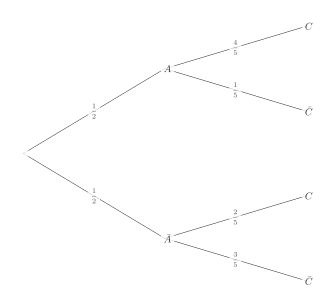
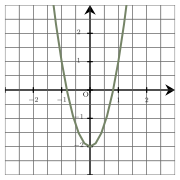
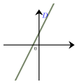
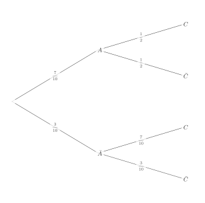
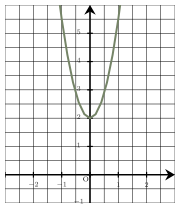
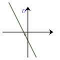

Séance 25 — Probabilités conditionnelles et algèbre


---Q---
On donne l'arbre de probabilités ci-dessous :

$P_C(A)=\ldots$

- $\dfrac{2}{5} $
- $\dfrac{1}{3}$
- $\dfrac{4}{5} $
- $\dfrac{2}{3} $

---CORR---
On sait que $ P_C(A)=\dfrac{P(A \cap C)}{P(C)}$

D'après la formule des probabilités totales :

$$\begin{aligned}
P(C)&=p(A\cap C)+p(\bar A \cap C)\\
&=P(A)\times P_A(C)+P(\bar A)\times P_{\bar A}(C)\\
&=\dfrac{1}{2}\times \dfrac{4}{5}+\dfrac{1}{2}\times \dfrac{2}{5}\\
&=\dfrac{2}{5}+\dfrac{1}{5}\\
&=\dfrac{3}{5}
\end{aligned}$$

 Et donc : 
$$\begin{aligned}
    P_C(A)&=\dfrac{P(A \cap C)}{P(C)}\\
    &=\dfrac{P(A)\times P_A(C)}{P(C)}\\
    &=\dfrac{\dfrac{2}{5}}{\dfrac{3}{5}}\\
    &=\dfrac{2}{3}
     \end{aligned}$$
La bonne réponse est la réponse D.



---Q---
Une augmentation de $10$ %  d'un article entraîne une augmentation du prix de $24$ €.

 Le prix de cet article avant l’augmentation est :

- $240$ €
- $21{,}6$ €
- $26{,}4$ €
- $34$ €

---CORR---
$10\,$ % du prix représente $24$ €, donc $100$ % du prix représente $10$ fois plus que $24$ € (car $10\times 10=100$).

Le prix de l'article était donc : $10\times24=240$ €.

La bonne réponse est la réponse A.



---Q---
Voici la représentation graphique d'une fonction $f$  définie sur $\mathbb{R}$ par $f(x)=ax^2+b$.
 
À partir de cette représentation graphique, on a :

- $a=-2$ et $b=-2$
- $a=3{,}5$ et $b=-2$
- $a=3$ et $b=2$
- $a=3$ et $b=-2$

---CORR---
La valeur de $b$ est donnée par l'image de $0$ par $f$ (ordonnée du point d'intersection entre la courbe et l'axe des ordonnées).

Ainsi, $b=-2$.

La valeur de $a$ s'obtient (par exemple) grâce à l'image de $1$ par la fonction $f$.

On lit $f(1)=1$. 

D'où, $a\times 1^2-2=1$, soit $a=3$.

Ainsi, $f(x)=3x^2-2$.

La bonne réponse est la réponse D.



---Q---
Soit $x$ un réel.

À quelle expression est égale $-4(x+4)^2+2$ ?

- $-4x^2 -32x-66$
- $-4x^2 -16x-62$
- $-4x^2 +32x-62$
- $-4x^2 -32x-62$

---CORR---
On développe l'expression de l'énoncé.

$$\begin{aligned}
    -4(x+4)^2+2&=-4\left(x^2 +8x+16\right)+2\\
    &=-4x^2 -32x-64 +2\\
        &=-4x^2 -32x-62\\
          \end{aligned}$$
          
La bonne réponse est la réponse D.



---Q---
On a représenté ci-contre une droite $D$.

Parmi les quatre équations ci-dessous, la seule susceptible d'être représentée par la droite $D$ est :

- $y=x^2-(x+1)^2+4$
- $y=3x+3$
- $y=-3x+3$
- $6x+2y-6=0$

---CORR---
On observe sur le graphique que le coefficient directeur est positif ($D$ représente une fonction affine croissante) et que l'ordonnée à l'origine est strictement positive ($D$ coupe l'axe des ordonnées au-dessus de l'origine).

On écrit les équations qui ne sont pas forme réduite, sous forme réduite :

• $y=3x+3$ est  sous forme réduite. 
• $y=-3x+3$ est  sous forme réduite. 
• $6x+2y-6=0$ s'écrit $y=-3x+3$. 
• $y=x^2-(x+1)^2+4$ s'écrit $y=-2x+3$. 

La seule équation ayant un coefficient directeur positif et une ordonnée à l'origine positive est : $y=3x+3$. 
La bonne réponse est la réponse B.



---Q---
Quelle est l'écriture décimale du nombre dont l'écriture scientifique est $2{,}14\times 10^{-3}$ ?

- $0{,}002\,14$
- $0{,}021\,4$
- $0{,}000\,214$
- $2\,140$

---CORR---
Multiplier par  $10^{-3}$ revient à multiplier par $0{,}001$,  donc l'écriture décimale de $2{,}14\times 10^{-3}$ est : $0{,}002\,14$.

La bonne réponse est la réponse A.


Devoirs — Séance 25 — Probabilités conditionnelles et algèbre


---Q---
On donne l'arbre de probabilités ci-dessous :

$P_C(A)=\ldots$

- $\dfrac{1}{2}$
- $\dfrac{5}{8} $
- $\dfrac{7}{20} $
- $\dfrac{1}{2} $




---Q---
Parmi les $2\,000$ logements que compte une ville, $10\,$ %   sont des maisons et $80\,$ %  de celles-ci sont des T2.

  Le nombre de maisons de type T2 dans cette ville est :

- $1\,600$
- $16$
- $1\,910$
- $160$




---Q---
Voici la représentation graphique d'une fonction $f$  définie sur $\mathbb{R}$ par $f(x)=ax^2+b$.

À partir de cette représentation graphique, on a :

- $a=2$ et $b=2$
- $a=3{,}5$ et $b=2$
- $a=3{,}5$ et $b=-2$
- $a=-3{,}5$ et $b=2$




---Q---
Soit $x$ un réel.

À quelle expression est égale $-4(x+2)^2-1$ ?

- $-4x^2 -8x-17$
- $-4x^2 -16x-15$
- $-4x^2 -16x-17$
- $-4x^2 +16x-17$




---Q---
On a représenté ci-contre une droite $D$.

Parmi les quatre équations ci-dessous, la seule susceptible d'être représentée par la droite $D$ est :

    

- $y=3x-2$
- $6x-2y-4=0$
- $y=x^2-(x-2)^2+2$
- $y=-3x-2$




---Q---
Quelle est l'écriture décimale du nombre dont l'écriture scientifique est $9{,}41\times 10^{-4}$ ?

- $0{,}000\,941$
- $0{,}000\,094\,1$
- $94\,100$
- $0{,}009\,41$



