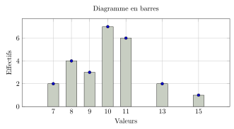
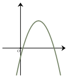
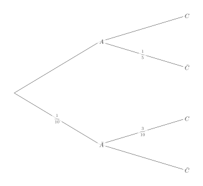
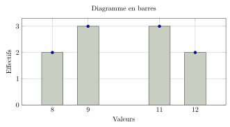
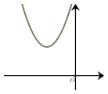
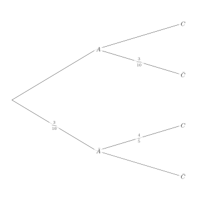

Séance 26 — Équations, statistiques et probabilités


---Q---
La solution de l'équation $\dfrac{x}{7}=126$ est :

- $x=-882$
- $x=\dfrac{7}{126}$
- $x=\dfrac{126}{7}$
- $x=7 \times 126$

---CORR---
L'équation $\dfrac{x}{7}=126$ est équivalente à $x=7\times 126$.

Ainsi, la solution de l'équation est $7\times 126$.

La bonne réponse est la réponse **D**.



---Q---
Voici la répartition des notes sur 20 d'une classe de première.

Quel est le pourcentage d'élèves ayant obtenu la moyenne ?

- $64~\%$
- $49~\%$
- $74~\%$
- $84~\%$

---CORR---
Le pourcentage d'élèves ayant obtenu la moyenne est calculé en divisant l'effectif des élèves ayant obtenu une note supérieure ou égale à 10 par l'effectif total, puis en multipliant par 100.

L'effectif total est : $2+4+3+7+6+2+1=25$ élèves.

L'effectif des élèves ayant obtenu au moins la moyenne (note $\geq 10$) est : $7+6+2+1=16$.

$$\dfrac{16}{25} \times 100 = 64$$

Donc le pourcentage est de $64~\%$.

La bonne réponse est la réponse **A**.



---Q---
On a représenté ci-dessous une parabole $\mathscr{P}$.

Une seule des quatre fonctions ci-dessous est susceptible d'être représentée par la parabole $\mathscr{P}$. Laquelle ?

- $x\longmapsto 1{,}4(x+5)^2+4$
- $x\longmapsto -1{,}4(x+5)^2+4$
- $x\longmapsto 1{,}4(x-5)^2+4$
- $x\longmapsto -1{,}4(x-5)^2+4$

---CORR---
Les paraboles proposées ont des équations de la forme $y=a(x-\alpha)^2+\beta$.

Le sommet de la parabole a pour coordonnées $(\alpha\,;\,\beta)$.

La parabole $\mathscr{P}$ a les bras tournés vers le bas, on en déduit que $a < 0$.

De plus, son sommet a une abscisse positive et une ordonnée positive, donc $\alpha > 0$ et $\beta > 0$.

On en déduit que la seule fonction susceptible de représenter $\mathscr{P}$ est : $x\longmapsto -1{,}4(x-5)^2+4$.

La bonne réponse est la réponse **D**.



---Q---
On donne ci-dessous le tableau de répartition des tailles de plants d'une serre, rangées en classes. 

$$\begin{array}{|c|c|c|}
\hline
\text{Taille (cm)} & [3\,;\,7[ & [7\,;\,11[ \\
\hline
\text{Effectifs} & 3 & 1 \\
\hline
\end{array}$$

Quelle est la taille moyenne en cm des plants de cette serre ?

- $7$
- $6$
- $5{,}5$
- $2$

---CORR---
Pour calculer la moyenne d'une série rangée en classes, on calcule d'abord le centre de chaque classe :

- Centre de $[3\,;\,7[$ : $\dfrac{3+7}{2}=5$ cm
- Centre de $[7\,;\,11[$ : $\dfrac{7+11}{2}=9$ cm

On calcule ensuite la moyenne pondérée :

$$\dfrac{3\times 5 + 1\times 9}{3+1} = \dfrac{15+9}{4} = \dfrac{24}{4} = 6$$

La taille moyenne des plants est donc de $6$ cm.

La bonne réponse est la réponse **B**.



---Q---
On donne l'arbre de probabilités ci-dessous :

$P(A \cap C)=\ldots$

- $\dfrac{7}{10}$
- $\dfrac{4}{5}$
- $\dfrac{18}{25}$
- $\dfrac{17}{10}$

---CORR---
On sait que :

$$\begin{aligned}
P(A \cap C) &= P(A) \times P_A(C)\\\\
&= \dfrac{9}{10} \times \dfrac{4}{5} \\\\
&= \dfrac{18}{25}
\end{aligned}$$

La bonne réponse est la réponse **C**.



---Q---
Soit $x$ un réel non nul. À quelle expression est égale $\dfrac{16x^{4}}{\dfrac{4}{x^4}}$ ?

- $4x^{8}$
- $16x^{0}$
- $16x^{8}$
- $4x^{0}$

---CORR---
On simplifie l'expression :

$$\begin{aligned}
\dfrac{16x^{4}}{\dfrac{4}{x^4}} &= 16x^{4} \times \dfrac{x^4}{4}\\\\
&= \dfrac{16x^{8}}{4}\\\\
&= 4x^{8}
\end{aligned}$$

La bonne réponse est la réponse **A**.


Devoirs — Séance 26 — Équations, statistiques et probabilités


---Q---
La solution de l'équation $\dfrac{x}{7}=105$ est :

- $x=\dfrac{7}{105}$
- $x=\dfrac{105}{7}$
- $x=7 \times 105$
- $x=-735$




---Q---
Voici la répartition des notes sur 20 d'une classe de première.

Quel est le pourcentage d'élèves ayant obtenu la moyenne ?

- $60~\%$
- $40~\%$
- $50~\%$
- $70~\%$




---Q---
On a représenté ci-dessous une parabole $\mathscr{P}$.

Une seule des quatre fonctions ci-dessous est susceptible d'être représentée par la parabole $\mathscr{P}$. Laquelle ?

- $x\longmapsto -1{,}6(x+3)^2+4$
- $x\longmapsto -1{,}6(x-3)^2+4$
- $x\longmapsto 1{,}6(x-3)^2+4$
- $x\longmapsto 1{,}6(x+3)^2+4$




---Q---
On donne ci-dessous le tableau de répartition des tailles de plants d'une serre, rangées en classes.

$$\begin{array}{|c|c|c|}
\hline
\text{Taille (cm)} & [2\,;\,6[ & [6\,;\,10[ \\
\hline
\text{Effectifs} & 3 & 1 \\
\hline
\end{array}$$

Quelle est la taille moyenne en cm des plants de cette serre ?

- $5{,}5$
- $2$
- $3$
- $5$




---Q---
On donne l'arbre de probabilités ci-dessous :

$P(A \cap C)=\ldots$

- $\dfrac{7}{10}$
- $\dfrac{1}{5}$
- $\dfrac{7}{5}$
- $\dfrac{49}{100}$




---Q---
Soit $x$ un réel non nul. À quelle expression est égale $\dfrac{10x^{3}}{\dfrac{2}{x^5}}$ ?

- $5x^{-2}$
- $5x^{8}$
- $10x^{8}$
- $10x^{-2}$



