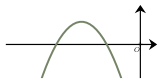

Séance 27 — Équations, fonctions et pourcentages


---Q---
La solution de l'équation $\dfrac{x}{9}=0$ est :

- $x=\dfrac{1}{9}$
- $x=-\dfrac{1}{9}$
- $x=-9$
- $x=0$

---CORR---
On multiplie par $9$ chacun des deux membres de l'équation pour obtenir $x=0$. 
C'est bien $0\div 9$ qui est égal à $0$. 
Ainsi, la solution de l'équation est **0**. 

La bonne réponse est la réponse **D**.



---Q---
Pour s'entraîner dans une salle de sport, on règle chaque mois un abonnement pour une carte d'adhérent. 
Cette carte donne droit à un tarif préférentiel pour chaque séance. 
Un client ne se souvient pas du montant du forfait mensuel ni du tarif préférentiel, mais il a retrouvé ses deux derniers tickets de caisse. 
Le premier ticket indique qu'il a payé $21$ euros pour $2$ séances d'entraînement. 
Le second ticket indique qu'il a payé $33$ euros pour $4$ séances d'entraînement. 
Quel est le montant de l'abonnement mensuel ?

- $4$ €
- $9$ €
- $10$ €
- $6$ €

---CORR---
On note $a$ le montant de l'abonnement mensuel et $p$ le prix d'une séance. 

D'après le premier ticket : $a + 2p = 21$. 

D'après le second ticket : $a + 4p = 33$. 

En faisant la différence entre ces deux montants, on obtient :
$4p - 2p = 12$ soit $2p=12$.  

Donc le montant pour $1$ séance est : $p = 6$ €. 

On peut alors calculer le montant de l'abonnement mensuel :
$a = 21 - 2 \times 6 = 21 - 12 = 9$ €. 

Le montant de l'abonnement mensuel est donc de **9 €**. 

La bonne réponse est la réponse **B**.



---Q---
On considère $A = 100 + 0{,}1 + \dfrac{1}{1\,000}$. On a :

- $A = \dfrac{100\,010}{1\,000}$
- $A = 101$
- $A = \dfrac{100\,101}{1\,000}$
- $A = 100{,}2$

---CORR---
On a :
$$\begin{aligned}
A &= 100 + 0{,}1 + \dfrac{1}{1\,000}\\
&= \dfrac{100\,000}{1\,000} + \dfrac{100}{1\,000} + \dfrac{1}{1\,000}\\
&= \dfrac{100\,101}{1\,000}
\end{aligned}$$

La bonne réponse est la réponse **C**.



---Q---
On a représenté ci-contre une parabole $\mathscr{P}$. 

Une seule des quatre fonctions ci-dessous est susceptible d'être représentée par la parabole $\mathscr{P}$. Laquelle ?

- $x\longmapsto -0{,}8(x+2)(x+4)$
- $x\longmapsto -0{,}8(x-2)(x+4)$
- $x\longmapsto 0{,}8(x+2)(x+4)$
- $x\longmapsto 0{,}8(x+2)(x-4)$

---CORR---
Les paraboles proposées ont des équations de la forme $y=a(x-x_1)(x-x_2)$ où $x_1$ et $x_2$ sont les racines. 

La parabole $\mathscr{P}$ a les bras tournés vers le bas, on en déduit que $a < 0$. 

Les racines de la parabole (intersections avec l'axe des abscisses) sont toutes les deux négatives. 

On en déduit que la seule fonction susceptible de représenter $\mathscr{P}$ est : $x\longmapsto -0{,}8(x+2)(x+4)$. 

La bonne réponse est la réponse **A**.



---Q---
Parmi les nombres suivants, lequel est le plus grand ?

- $10\,$ % de $190$
- $25\,$ % de $72$
- $5\,$ % de $390$
- $20\,$ % de $115$

---CORR---
Prendre $10\,$ % d'une valeur revient à la diviser par $10$, donc $10\,$ % de $190 = 19$. 

Prendre $25\,$ % d'une valeur revient à la diviser par $4$, donc $25\,$ % de $72 = 18$. 

Prendre $5\,$ % d'une valeur revient à en prendre la moitié de $10\,$ %, donc $5\,$ % de $390 = \dfrac{39}{2} = 19{,}5$. 

Prendre $20\,$ % d'une valeur revient à en prendre deux fois $10\,$ %, donc $20\,$ % de $115 = 2\times 11{,}5 = 23$. 

Le plus grand résultat est donc donné par **20 % de 115** $= 23$. 

La bonne réponse est la réponse **D**.



---Q---
Les valeurs de $y$ sont proportionnelles à celles de $x$.  Déterminer la valeur manquante (?) dans le tableau ci-dessous.

<table style="border-collapse:collapse;margin:0.7rem 0;text-align:center">
<tr><td style="border:1px solid #888;padding:4px 14px;background:#ccc;font-weight:bold">$x$</td><td style="border:1px solid #888;padding:4px 14px">$6$</td><td style="border:1px solid #888;padding:4px 14px">$50$</td></tr>
<tr><td style="border:1px solid #888;padding:4px 14px;background:#ccc;font-weight:bold">$y$</td><td style="border:1px solid #888;padding:4px 14px">$60$</td><td style="border:1px solid #888;padding:4px 14px">$?$</td></tr>
</table>

- $5$
- $7{,}2$
- $110$
- $500$

---CORR---
On a $y = k\times x$. 

*Méthode 1 – avec le coefficient de proportionnalité* : on calcule $k$ avec une colonne connue : $k = \dfrac{60}{6} = 10$. 
On a $? = 10\times 50 = \mathbf{500}$. 

*Méthode 2 – les produits en croix sont égaux* : $6 \times ? = 50\times 60$, donc $? = \dfrac{50\times 60}{6} = \mathbf{500}$. 

Vérification : $6\times 500 = 3\,000$ et $50\times 60 = 3\,000$. ✓ 

La bonne réponse est la réponse **D**.


Devoirs — Séance 27 — Équations, fonctions et pourcentages


---Q---
La solution de l'équation $\dfrac{-9}{x}=-9$ est :

- $x=9$
- $x=\dfrac{1}{9}$
- $x=1$
- $x=-9$




---Q---
Pour s'entraîner dans une salle de sport, on règle chaque mois un abonnement pour une carte d'adhérent. 
Cette carte donne droit à un tarif préférentiel pour chaque séance. 
Un client ne se souvient pas du montant du forfait mensuel ni du tarif préférentiel, mais il a retrouvé ses deux derniers tickets de caisse. 
Le premier ticket indique qu'il a payé $20$ euros pour $2$ séances d'entraînement. 
Le second ticket indique qu'il a payé $32$ euros pour $4$ séances d'entraînement. 
Quel est le montant de l'abonnement mensuel ?

- $9$ €
- $4$ €
- $6$ €
- $8$ €




---Q---
On considère $A = 100 + 0{,}001 + \dfrac{1}{1\,000}$. On a :

- $A = 100{,}002$
- $A = \dfrac{100\,001}{1\,000}$
- $A = 100{,}011$
- $A = \dfrac{100\,010}{1\,000}$




---Q---
On a représenté ci-contre une parabole $\mathscr{P}$. 

Une seule des quatre fonctions ci-dessous est susceptible d'être représentée par la parabole $\mathscr{P}$. Laquelle ?

- $x\longmapsto 0{,}6(x+2)(x+5)$
- $x\longmapsto -0{,}6(x-2)(x+5)$
- $x\longmapsto -0{,}6(x+2)(x+5)$
- $x\longmapsto 0{,}6(x+2)(x-5)$




---Q---
Parmi les nombres suivants, lequel est le plus grand ?

- $20\,$ % de $82$
- $5\,$ % de $330$
- $25\,$ % de $72$
- $10\,$ % de $160$




---Q---
Les valeurs de $y$ sont proportionnelles à celles de $x$.  
Déterminer la valeur manquante (?) dans le tableau ci-dessous.

<table style="border-collapse:collapse;margin:0.7rem 0;text-align:center">
<tr><td style="border:1px solid #888;padding:4px 14px;background:#ccc;font-weight:bold">$x$</td><td style="border:1px solid #888;padding:4px 14px">$8$</td><td style="border:1px solid #888;padding:4px 14px">$30$</td></tr>
<tr><td style="border:1px solid #888;padding:4px 14px;background:#ccc;font-weight:bold">$y$</td><td style="border:1px solid #888;padding:4px 14px">$40$</td><td style="border:1px solid #888;padding:4px 14px">$?$</td></tr>
</table>

- $10{,}7$
- $150$
- $6$
- $70$



