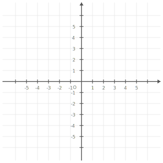
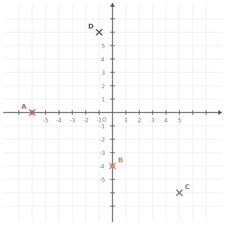
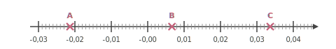
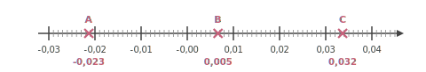
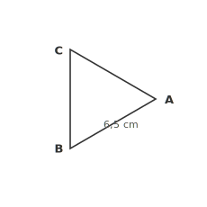
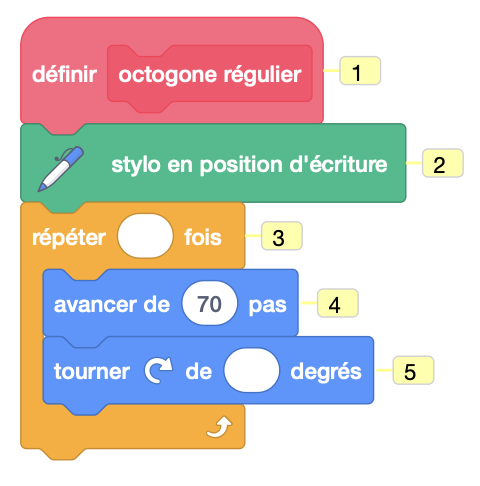




---Q---
Donner la valeur décimale de  $\dfrac{11}{10}$.
---CORR---
$\dfrac{11}{10}={\color{#F15929}\boldsymbol{1{,}1}}$ 
            Mentalement :  
          $\dfrac{11}{10}=11\times \dfrac{1}{10}=
          11\times 0,1=1{,}1$.


---Q---
Exprimer le triple de $m$  en fonction de $m$.
---CORR---
Le triple de $m$ peut s’écrire de plusieurs façons : ${\color{#F15929}\boldsymbol{3\times m}}$, ${\color{#F15929}\boldsymbol{m+2m}}$ ou encore ${\color{#F15929}\boldsymbol{3m}}$.


---Q---
Placer les points suivants : $A(-6\;;\;0)$ ; $B(0\;;\;-4)$ ; $C(5\;;\;-6)$ et $D(-1\;;\;6)$.

 

---CORR---
Les points sont placés aux coordonnées indiquées : 


---Q---
On tire une boule au hasard dans une urne contenant $4$ boules noires et $6$ boules blanches.              Quelle est la probabilité d'obtenir une boule noire ?               On donnera le résultat sous forme d'une fraction irréductible.
---CORR---
Dans une situation d'équiprobabilité,
        on calcule la probabilité d'un événement par le quotient :
        $\dfrac{\text{Nombre d'issues favorables}}{\text{Nombre total d'issue}}$.  
        La probabilité est donc donnée par : 
        $\dfrac{\text{Nombre de boules noires}}{\text{Nombre total de boules}}
             =\dfrac{4}{10}  =\dfrac{2{\color{#2563a5}\boldsymbol{\times2}} }{5{\color{#2563a5}\boldsymbol{\times2}}}={\color{#F15929}\boldsymbol{\dfrac{2}{5}}}$






---Q---
Compléter avec le signe < ou >.
$$-3{,}3 \quad \ldots \quad-3{,}4$$
---CORR---
$-3{,}3 \quad {\color{#F15929}\boldsymbol{>}} \quad -3{,}4$


---Q---
Pour résoudre l'équation $5x-1=18$, on effectue le calcul :

 
 
    
    	<strong>A</strong>. $\dfrac{18+1}{5}$&emsp;&emsp; <strong>B</strong>. $18\times 5+1$&emsp;&emsp; <strong>C</strong>. $(18-5)+1$&emsp;&emsp; <strong>D</strong>. $\dfrac{18}{5}+1$&emsp;&emsp;  
---CORR---
Pour résoudre l'équation $5x-1=18$, on commence par soustraire $-1$ des deux membres de l'équation, ce qui donne $5x=18+1$. 
    Ensuite, on divise les deux membres par $5$ pour obtenir $x=\dfrac{18+1}{5}$. La bonne réponse est la réponse A.


---Q---
À l'aide du schéma ci-dessous, déterminer : - deux segments de même longueur ; - le milieu d'un segment ; - un triangle rectangle ; - un triangle isocèle.   
---CORR---
- Deux segments de même mesure : [$YV$] et $[VW]$ ou $[YU]$ et $[UW]$ ou $[XT]$ et $[TW]$. - $V$ est le milieu du segment $[YW]$. - $YXW$ est un triangle rectangle en $Y$, $YVU$ est un triangle rectangle en $V$ et $WVU$ est un triangle rectangle en $V$. - $YUW$ est un triangle isocèle en $U$ et $XTW$ est un triangle isocèle en $T$. 


---Q---
Voici une série de 4 notes : $5, 9, 10, 8$. Quelle est la moyenne de cette série de notes ?

 
 
    
    	<strong>A</strong>. $6{,}5$&emsp;&emsp; <strong>B</strong>. $8$&emsp;&emsp; <strong>C</strong>. $5{,}5$&emsp;&emsp; <strong>D</strong>. $7$&emsp;&emsp;  
---CORR---
La moyenne de cette série de notes est : $\dfrac{5+9+10+8}{4}=\dfrac{32}{4}=8$. La bonne réponse est la réponse B.






---Q---
Déterminer la valeur de $10~\%$ de $138$.
---CORR---
Pour calculer $10~\%$ de $138$, on calcule $\dfrac{10 \times 138}{100} = \dfrac{10}{100} \times 138=0{,}1\times 138 = 13{,}8$. 
    Donc $10~\%$ de $138$ est égal à ${\color{#F15929}\boldsymbol{13{,}8}}$.


---Q---
Donner l'abscisse des points $A$, $B$ et $C$.

---CORR---
 $\ A $ $(-0{,}023)$ &emsp; $\ B $ $(0{,}005)$ &emsp; $\ C $ $(0{,}032)$


---Q---
Calculer le périmètre du triangle équilatéral $ABC$ représenté ci-dessous : 
  
---CORR---
Le polygone a $3$ côtés de longueur $6{,}5$ cm. 
Le périmètre est donc égal à : 
$3 \times 6{,}5 = {\color{#F15929}\boldsymbol{19{,}5}}$ cm.


---Q---
Une élève souhaite réaliser un programme avec un logiciel de
programmation pour dessiner un octogone régulier. Par quelles valeurs doit-il compléter les lignes 3 et 5 du bloc personnalisé ci-contre 
pour obtenir un octogone régulier ?
    
    
    
 
$\text{Ligne 3 : }\ldots\quad \text{Ligne 5 : }\ldots$ 

---CORR---
Pour obtenir un octogone régulier, il faut répéter ${\color{#F15929}\boldsymbol{8}}$ fois et tourner de $\dfrac{360}{8}={\color{#F15929}\boldsymbol{45}}$ degrés. 



