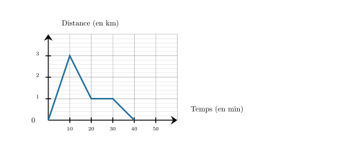
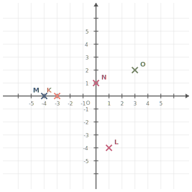




---Q---
Donner l'écriture scientifique de $38\,500$.
---CORR---
L'écriture scientifique de $38\,500$ est ${\color{#8B3C52}\boldsymbol{3{,}85 \times 10^{4}}}$.


---Q---
Un train parcourt en moyenne $405\text{ km}$ en $3$ heures.
    Quelle distance va-t-il parcourir, à la même vitesse, en $4$ heures ?
---CORR---
Commençons par trouver quelle est la distance parcourue en 1h.  
  $1$ h, c'est ${\color{#C5607A}\boldsymbol{3}}$ fois moins que $3$ h.
   En $1$ h, le train parcourt donc une distance ${\color{#C5607A}\boldsymbol{3}}$ fois moins grande qu'en $3$ h. $405\text{ km} \div {\color{#C5607A}\boldsymbol{3}} = 135 \text{ km}$   en 1h, le train parcourt ${\color{#C5607A}\boldsymbol{135}}\text{ km}$.   Cherchons maintenant la distance parcourue en $4$ h.   $4$ h, c'est ${\color{#C5607A}\boldsymbol{4}}$ fois $1$ h. Le train parcourt donc ${\color{#C5607A}\boldsymbol{4}}$ fois plus de distance qu'en $1$ h.  ${\color{#C5607A}\boldsymbol{135}}\text{ km} \times {\color{#C5607A}\boldsymbol{4}} = 540\text{ km}$   le train parcourra en moyenne ${\color{#8B3C52}\boldsymbol{540}}\text{ km}$ en $4$ h.


---Q---
Donner le nom de ce solide. 
---CORR---
Cube.


---Q---
Sur cette figure, calculer la valeur exacte de $AC$.  
---CORR---
On utilise le théorème de Pythagore dans le triangle $ABC$,  rectangle en $B$. 
            On obtient : 
            $\begin{aligned}
              AB^2+BC^2&=AC^2\\
              AC^2&=BC^2+AB^2\\
              AC^2&=3^2+4^2\\
              AC^2&=9+16\\
              AC^2&=25
                            \end{aligned}$  
             
             Donc $AC=\sqrt{25}={\color{#8B3C52}\boldsymbol{5}}$







---Q---
Quel est le carré de $3$ ?
---CORR---
Le carré d'un nombre est ce nombre multiplié par lui-même : $3\times3=9$


---Q---
Elsa fait du vélo avec son smartphone sur une voie-verte rectiligne qui part de chez elle. Une application lui permet de voir à quelle distance de chez elle, elle se trouve. 

À l'aide de ce graphique, répondre aux questions suivantes :

 
$\mathbf{a)}$ Que se passe-t-il après 20 minutes de vélo ?

 
$\mathbf{b)}$ Pendant combien de temps, Elsa, a-t-elle fait réellement du vélo ? 

 
$\mathbf{c)}$ Quelle distance a-t-elle parcourue au total ? 
---CORR---
$\mathbf{a)}$  Après 20 minutes de vélo, Elsa fait une pause car la courbe devient horizontale. 
$\mathbf{b)}$ Elsa est partie 40 min et a fait une pause de 10 min donc elle a fait réellement du vélo pendant ${\color{#8B3C52}\boldsymbol{30\,\textbf{min}}}$. 
$\mathbf{c)}$Le point le plus loin de sa maison est à 3 $\text{km}$ et ensuite elle revient chez elle, donc la distance totale est de ${\color{#8B3C52}\boldsymbol{6\,\textbf{km}}}$.



---Q---
Compléter. $100\text{ hm} = \ldots \text{ m}$
---CORR---
Un hectomètre est une centaine de mètres donc : $ 100\ \text{hm} =  100\times100\ \text{m} ={\color{#8B3C52}\boldsymbol{ 10\,000\ \mathbf{m}}}$$\ $.


---Q---
 
Sur la figure ci-dessus, dans le triangle $CHF$, les droites $(HF)$ et $(IL)$ sont parallèles. Déterminer la longueur $CH$. 
---CORR---
Dans le triangle $CHF$, les droites $(HF)$ et $(IL)$ sont parallèles. Et les droites $(HL)$ et $(FI)$ sont sécantes en $C$ 
    D'après le théorème de Thalès, on a :  
    $\dfrac{CH}{CL} =
    \dfrac{HF}{IL}$.  
    En remplaçant par les longueurs, on obtient :  
    $\dfrac{CH}{CL} = \dfrac{15}{6}=2{,}5$. 
    On en déduit que :  
    $CH = 2{,}5 \times 12 = {\color{#8B3C52}\boldsymbol{30}}$ cm.






---Q---
Simplifier le plus possible la fraction suivante : $\dfrac{1\,029}{21}$
---CORR---
$\dfrac{1\,029}{21}=\dfrac{\cancel{3}\times\cancel{7}\times7\times7}{\cancel{3}\times\cancel{7}}={\color{#8B3C52}\boldsymbol{49}}$


---Q---
Réduire l'expression, si cela est possible : $A=3-7x+5+9x$
---CORR---
$A=3-7x+5+9x={\color{#8B3C52}\boldsymbol{2x+8}}$


---Q---
Déterminer les coordonnées respectives des points $N$,  $K$,  $O$,  $M$, et $L$.

 
  
---CORR---
Les coordonnées respectives des points sont :  $N({\color{#8B3C52}\boldsymbol{0}};{\color{#8B3C52}\boldsymbol{1}})$, $K({\color{#8B3C52}\boldsymbol{-3}};{\color{#8B3C52}\boldsymbol{0}})$, $O({\color{#8B3C52}\boldsymbol{3}};{\color{#8B3C52}\boldsymbol{2}})$, $M({\color{#8B3C52}\boldsymbol{-4}};{\color{#8B3C52}\boldsymbol{0}})$ et $L({\color{#8B3C52}\boldsymbol{1}};{\color{#8B3C52}\boldsymbol{-4}})$.


---Q---
 
Dans le triangle $ISV$, rectangle en $S$, quel calcul doit-on effectuer pour déterminer le cosinus de l’angle $\widehat{SIV}$ ? 
---CORR---
La bonne formule est :  
    $\text{cosinus}(\widehat{SIV}) = 
    \dfrac{\text{longueur du côté adjacent à l’angle } \widehat{SIV}}{\text{longueur de l’hypoténuse }}=\dfrac{IS}{IV}$.



