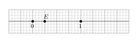



1
---Q---
Résoudre l'équation suivante : $\dfrac{t}{-13}=4$
---CORR---
$$\begin{aligned}
\dfrac{t}{-13} &= 4 \\
\dfrac{t}{-13}{\color{#C5607A}\boldsymbol{\times(-13)}} &= 4{\color{#C5607A}\boldsymbol{\times(-13)}} \\
t &= {\color{#EB7F73}\boldsymbol{-52}}
\end{aligned}$$


2
---Q---
$A = \dfrac{4}{6}+\dfrac{8}{24}$
---CORR---
$A = \dfrac{4}{6}+\dfrac{8}{24}=\dfrac{16}{24}+\dfrac{8}{24}=\dfrac{24}{24}={\color{#EB7F73}\boldsymbol{1}}$


3
---Q---
$40{,}6~\text{L} = \ldots~\text{m}^3$
---CORR---
$40{,}6~\text{L} = 40{,}6~\text{dm}^3 = 40{,}6\div1\,000~\text{m}^3 = {\color{#EB7F73}\boldsymbol{0{,}040\,6~\text{m}^3}}$


4
---Q---
Dans une école, $10\%$ des $1\,500$ étudiants participent à une collecte de fonds. Combien d'étudiants ne participent pas à cette collecte ?
---CORR---
Le nombre d'étudiants participant : $1\,500 \times \dfrac{10}{100} = 150$. Le nombre d'étudiants ne participant pas : $1\,500 - 150 = {\color{#EB7F73}\boldsymbol{1\,350}}$. Autre méthode : $100\%-10\%=90\%$, donc $1\,500 \times 0{,}9 = {\color{#EB7F73}\boldsymbol{1\,350}}$.


5
---Q---
Placer les points : $A(-6{,}1)$, $B(-3{,}8)$, $C(-0{,}8)$.
 

---CORR---








---Q---
$A = 4 - \dfrac{2}{5}$
---CORR---
$A = \dfrac{4}{1} - \dfrac{2}{5} =\dfrac{20}{5} - \dfrac{2}{5} = {\color{#EB7F73}\boldsymbol{\dfrac{18}{5}}}$



---Q---
Résoudre l'équation suivante : $\dfrac{-3a}{5}=-4$
---CORR---
$$\begin{aligned}
\dfrac{-3a}{5} &= -4 \\
\dfrac{-3a}{5}{\color{#C5607A}\boldsymbol{\times 5}} &= -4{\color{#C5607A}\boldsymbol{\times 5}} \\
-3a &= -20 \\
-3a{\color{#C5607A}\boldsymbol{\div(-3)}} &= -20{\color{#C5607A}\boldsymbol{\div(-3)}} \\
a &= {\color{#EB7F73}\boldsymbol{\dfrac{20}{3}}}
\end{aligned}$$



---Q---
Calculer : $-3 \times 9$
---CORR---
$-3 \times 9 = {\color{#EB7F73}\boldsymbol{-27}}$



---Q---
$66{,}2~\text{cm}^2 = \ldots~\text{m}^2$
---CORR---
$66{,}2~\text{cm}^2 = 66{,}2\div100\div100~\text{m}^2 = {\color{#EB7F73}\boldsymbol{0{,}006\,62~\text{m}^2}}$



---Q---
Un collège avait $900$ élèves en $2025$.  
Depuis, le nombre d'élèves a augmenté de $8~\%$. Calculer le nombre d'élèves dans ce collège cette année.
---CORR---
Une augmentation de $8~\%$ revient à multiplier par $1{,}08$. $900\times 1{,}08 = {\color{#EB7F73}\boldsymbol{972}}$ élèves.






1
---Q---
$A = \dfrac{4}{8} \times \dfrac{3}{6}$
---CORR---
$A = \dfrac{4}{8} \times \dfrac{3}{6} = \dfrac{12}{48} = \dfrac{1{\color{#C5607A}\boldsymbol{\times 12}}}{4{\color{#C5607A}\boldsymbol{\times 12}}} = {\color{#EB7F73}\boldsymbol{\dfrac{1}{4}}}$


2
---Q---
Résoudre : $8t-13=-6t-8$
---CORR---
$$\begin{aligned}
8t-13 &= -6t-8 \\
8t-13{\color{#C5607A}\boldsymbol{+6t}} &= -6t-8{\color{#C5607A}\boldsymbol{+6t}} \\
14t-13 &= -8 \\
14t-13{\color{#C5607A}\boldsymbol{+13}} &= -8{\color{#C5607A}\boldsymbol{+13}} \\
14t &= 5 \\
14t{\color{#C5607A}\boldsymbol{\div 14}} &= 5{\color{#C5607A}\boldsymbol{\div 14}} \\
t &= {\color{#EB7F73}\boldsymbol{\dfrac{5}{14}}}
\end{aligned}$$


3
---Q---
$0{,}04~\text{km}^2 = \ldots~\text{m}^2$
---CORR---
$0{,}04~\text{km}^2 = 0{,}04\times100\times100\times100~\text{m}^2 = {\color{#EB7F73}\boldsymbol{40\,000~\text{m}^2}}$


4
---Q---
En 2025, il y avait $600$ élèves dans un lycée. En 2026, ils sont $636$. Exprimer la variation du nombre d'élèves de cet établissement en pourcentage.
---CORR---
$636\div 600 = 1{,}06 = 106\% = 100\%+6\%$ Le nombre d'élèves a augmenté de ${\color{#EB7F73}\boldsymbol{6~\%}}$.


5
---Q---
Sur cette droite graduée, quelle est l'abscisse du point $E$ ? 
A. $\dfrac{5}{8}$ &emsp; B. $\dfrac{1}{4}$ &emsp; C. $0$ &emsp; D. $\dfrac{1}{8}$
 

---CORR---
Il y a 4 divisions entre $0$ et $1$, donc chaque division vaut $\dfrac{1}{4}$. Le point $E$ est à $1$ division de l'origine, donc l'abscisse de $E$ est $\dfrac{1}{4}$. La bonne réponse est la réponse B.



