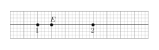



1
---Q---
$A = \dfrac{3}{9} \div \dfrac{3}{6}$
---CORR---
$A = \dfrac{3}{9} \times \dfrac{6}{3} = \dfrac{18}{27} = \dfrac{2{\color{#C5607A}\boldsymbol{\times 9}}}{3{\color{#C5607A}\boldsymbol{\times 9}}} = {\color{#EB7F73}\boldsymbol{\dfrac{2}{3}}}$


2
---Q---
Soldé à $-20~\%$ un article coûte maintenant $240$€.  
Calculer son prix avant les soldes.
---CORR---
Une diminution de $20~\%$ revient à multiplier par $0{,}8$. Pour retrouver le prix initial : $240\div 0{,}8 = {\color{#EB7F73}\boldsymbol{300}}$€.


3
---Q---
$0{,}5~\text{hm}^3 = \ldots~\text{m}^3$
---CORR---
$0{,}5~\text{hm}^3 = 0{,}5\times1\,000\times1\,000~\text{m}^3 = {\color{#EB7F73}\boldsymbol{500\,000~\text{m}^3}}$


4
---Q---
Pour résoudre l'équation $6+x-3=13$, on effectue le calcul :  A. $\dfrac{13}{6}-3$ &emsp; B. $(13-6)-3$ &emsp; C. $13+3-6$ &emsp; D. $\dfrac{13-3}{6}$
---CORR---
On ajoute $3$ aux deux membres : $6+x=13+3$, puis on soustrait $6$ : $x=13+3-6$. La bonne réponse est la réponse C.


5
---Q---
Sur cette droite graduée, quelle est l'abscisse du point $E$ ? 
A. $\dfrac{13}{8}$ &emsp; B. $\dfrac{9}{8}$ &emsp; C. $1$ &emsp; D. $\dfrac{5}{4}$
 

---CORR---
Il y a 4 divisions entre $1$ et $2$, donc chaque division vaut $\dfrac{1}{4}$. Le point $E$ est à la $5$e division à partir de l'origine, donc l'abscisse de $E$ est $\dfrac{5}{4}$. La bonne réponse est la réponse D.







---Q---
Combien valent les quatre cinquièmes de $40$ ?
---CORR---
$\dfrac{1}{5}$ de $40 = 40\div 5 = 8$. Les quatre cinquièmes de $40$ valent $4\times 8 = {\color{#EB7F73}\boldsymbol{32}}$.



---Q---
Réduire l'expression suivante, si cela est possible : $$A=-1-9x+9+10x$$
---CORR---
$A=-1-9x+9+10x={\color{#EB7F73}\boldsymbol{x+8}}$



---Q---
Comparer : $-8{,}4 \quad\ldots\quad -8{,}5$
---CORR---
$-8{,}4 \quad {\color{#EB7F73}\boldsymbol{>}} \quad -8{,}5$



---Q---
Déterminer la valeur de $10~\%$ de $170$.
---CORR---
$10~\%$ de $170 = 0{,}1\times 170 = {\color{#EB7F73}\boldsymbol{17}}$.



---Q---
Un concours dure $400$ minutes.  
Quelle est sa durée en heures et minutes ?
---CORR---
$400 = 6\times 60 + 40$ Le concours dure 6 h 40 min.







---Q---
Réduire et simplifier, si c'est possible : $$A=3c^2+8c+9+6c^2+c$$
---CORR---
$A=3c^2+8c+9+6c^2+c={\color{#EB7F73}\boldsymbol{9c^2+9c+9}}$



---Q---
Ranger ces nombres dans l'ordre décroissant :  
$4{,}81$ ; $3{,}1$ ; $-4{,}98$ ; $4{,}9$ ; $-5{,}4$ ; $-4{,}5$
---CORR---
${\color{#EB7F73}\boldsymbol{4{,}9 > 4{,}81 > 3{,}1 > -4{,}5 > -4{,}98 > -5{,}4}}$



---Q---
Convertir $942~\text{h}$ en semaines, jours et heures.
---CORR---
$942 = 39\times 24 + 6$, donc $942~\text{h} = 39~\text{j}~6~\text{h}$. $39 = 5\times 7 + 4$, donc $942~\text{h} = {\color{#EB7F73}\boldsymbol{5~\text{semaines}~4~\text{j}~6~\text{h}}}$.



---Q---
Le prix des gravures est-il proportionnel à la quantité achetée ? 

<table style="border-collapse:collapse;margin:0.8rem auto;font-size:0.9rem">
<tr><th style="background:#FDF2F4;color:#8B3C52;border:1px solid #ddb8c0;padding:6px 12px;font-weight:600">Gravures</th><td style="border:1px solid #ddb8c0;padding:6px 12px;text-align:center;color:#2D2226">$6$</td><td style="border:1px solid #ddb8c0;padding:6px 12px;text-align:center;color:#2D2226">$7$</td><td style="border:1px solid #ddb8c0;padding:6px 12px;text-align:center;color:#2D2226">$13$</td><td style="border:1px solid #ddb8c0;padding:6px 12px;text-align:center;color:#2D2226">$21$</td></tr>
<tr><th style="background:#FDF2F4;color:#8B3C52;border:1px solid #ddb8c0;padding:6px 12px;font-weight:600">Prix (en €)</th><td style="border:1px solid #ddb8c0;padding:6px 12px;text-align:center;color:#2D2226">$50{,}40$</td><td style="border:1px solid #ddb8c0;padding:6px 12px;text-align:center;color:#2D2226">$58{,}80$</td><td style="border:1px solid #ddb8c0;padding:6px 12px;text-align:center;color:#2D2226">$109{,}20$</td><td style="border:1px solid #ddb8c0;padding:6px 12px;text-align:center;color:#2D2226">$176{,}40$</td></tr>
</table>
---CORR---
$\dfrac{50{,}40}{6}=\dfrac{58{,}80}{7}=\dfrac{109{,}20}{13}=\dfrac{176{,}40}{21}=8{,}40~\text{€/gravure}$ Le prix est proportionnel à la quantité.



---Q---
Compléter ce tableau :

<table style="border-collapse:collapse;margin:0.8rem auto;font-size:0.9rem">
<tr><th style="background:#FDF2F4;color:#8B3C52;border:1px solid #ddb8c0;padding:6px 12px;font-weight:600">Nombre décimal</th><td style="border:1px solid #ddb8c0;padding:6px 12px;color:#2D2226">&nbsp;&nbsp;&nbsp;</td><td style="border:1px solid #ddb8c0;padding:6px 12px;color:#2D2226">&nbsp;&nbsp;&nbsp;</td><td style="border:1px solid #ddb8c0;padding:6px 12px;text-align:center;color:#2D2226">$0{,}67$</td><td style="border:1px solid #ddb8c0;padding:6px 12px;text-align:center;color:#2D2226">$0{,}76$</td><td style="border:1px solid #ddb8c0;padding:6px 12px;color:#2D2226">&nbsp;&nbsp;&nbsp;</td><td style="border:1px solid #ddb8c0;padding:6px 12px;color:#2D2226">&nbsp;&nbsp;&nbsp;</td></tr>
<tr><th style="background:#FDF2F4;color:#8B3C52;border:1px solid #ddb8c0;padding:6px 12px;font-weight:600">Fraction décimale</th><td style="border:1px solid #ddb8c0;padding:6px 12px;color:#2D2226">&nbsp;&nbsp;&nbsp;</td><td style="border:1px solid #ddb8c0;padding:6px 12px;text-align:center;color:#2D2226">$\dfrac{56}{100}$</td><td style="border:1px solid #ddb8c0;padding:6px 12px;color:#2D2226">&nbsp;&nbsp;&nbsp;</td><td style="border:1px solid #ddb8c0;padding:6px 12px;color:#2D2226">&nbsp;&nbsp;&nbsp;</td><td style="border:1px solid #ddb8c0;padding:6px 12px;text-align:center;color:#2D2226">$\dfrac{45}{100}$</td><td style="border:1px solid #ddb8c0;padding:6px 12px;color:#2D2226">&nbsp;&nbsp;&nbsp;</td></tr>
<tr><th style="background:#FDF2F4;color:#8B3C52;border:1px solid #ddb8c0;padding:6px 12px;font-weight:600">Pourcentage</th><td style="border:1px solid #ddb8c0;padding:6px 12px;text-align:center;color:#2D2226">$46\,\%$</td><td style="border:1px solid #ddb8c0;padding:6px 12px;text-align:center;color:#2D2226">&nbsp;%</td><td style="border:1px solid #ddb8c0;padding:6px 12px;text-align:center;color:#2D2226">&nbsp;%</td><td style="border:1px solid #ddb8c0;padding:6px 12px;text-align:center;color:#2D2226">&nbsp;%</td><td style="border:1px solid #ddb8c0;padding:6px 12px;text-align:center;color:#2D2226">&nbsp;%</td><td style="border:1px solid #ddb8c0;padding:6px 12px;text-align:center;color:#2D2226">$38\,\%$</td></tr>
</table>
---CORR---
<table style="border-collapse:collapse;margin:0.8rem auto;font-size:0.9rem">
<tr><th style="background:#FDF2F4;color:#8B3C52;border:1px solid #ddb8c0;padding:6px 12px;font-weight:600">Nombre décimal</th><td style="border:1px solid #ddb8c0;padding:6px 12px;text-align:center;color:#2D2226">${\color{#EB7F73}\boldsymbol{0{,}46}}$</td><td style="border:1px solid #ddb8c0;padding:6px 12px;text-align:center;color:#2D2226">${\color{#EB7F73}\boldsymbol{0{,}56}}$</td><td style="border:1px solid #ddb8c0;padding:6px 12px;text-align:center;color:#2D2226">$0{,}67$</td><td style="border:1px solid #ddb8c0;padding:6px 12px;text-align:center;color:#2D2226">$0{,}76$</td><td style="border:1px solid #ddb8c0;padding:6px 12px;text-align:center;color:#2D2226">${\color{#EB7F73}\boldsymbol{0{,}45}}$</td><td style="border:1px solid #ddb8c0;padding:6px 12px;text-align:center;color:#2D2226">${\color{#EB7F73}\boldsymbol{0{,}38}}$</td></tr>
<tr><th style="background:#FDF2F4;color:#8B3C52;border:1px solid #ddb8c0;padding:6px 12px;font-weight:600">Fraction décimale</th><td style="border:1px solid #ddb8c0;padding:6px 12px;text-align:center;color:#2D2226">${\color{#EB7F73}\boldsymbol{\dfrac{46}{100}}}$</td><td style="border:1px solid #ddb8c0;padding:6px 12px;text-align:center;color:#2D2226">$\dfrac{56}{100}$</td><td style="border:1px solid #ddb8c0;padding:6px 12px;text-align:center;color:#2D2226">${\color{#EB7F73}\boldsymbol{\dfrac{67}{100}}}$</td><td style="border:1px solid #ddb8c0;padding:6px 12px;text-align:center;color:#2D2226">${\color{#EB7F73}\boldsymbol{\dfrac{76}{100}}}$</td><td style="border:1px solid #ddb8c0;padding:6px 12px;text-align:center;color:#2D2226">$\dfrac{45}{100}$</td><td style="border:1px solid #ddb8c0;padding:6px 12px;text-align:center;color:#2D2226">${\color{#EB7F73}\boldsymbol{\dfrac{38}{100}}}$</td></tr>
<tr><th style="background:#FDF2F4;color:#8B3C52;border:1px solid #ddb8c0;padding:6px 12px;font-weight:600">Pourcentage</th><td style="border:1px solid #ddb8c0;padding:6px 12px;text-align:center;color:#2D2226">$46\,\%$</td><td style="border:1px solid #ddb8c0;padding:6px 12px;text-align:center;color:#2D2226">${\color{#EB7F73}\boldsymbol{56}}\,\%$</td><td style="border:1px solid #ddb8c0;padding:6px 12px;text-align:center;color:#2D2226">${\color{#EB7F73}\boldsymbol{67}}\,\%$</td><td style="border:1px solid #ddb8c0;padding:6px 12px;text-align:center;color:#2D2226">${\color{#EB7F73}\boldsymbol{76}}\,\%$</td><td style="border:1px solid #ddb8c0;padding:6px 12px;text-align:center;color:#2D2226">${\color{#EB7F73}\boldsymbol{45}}\,\%$</td><td style="border:1px solid #ddb8c0;padding:6px 12px;text-align:center;color:#2D2226">$38\,\%$</td></tr>
</table>



