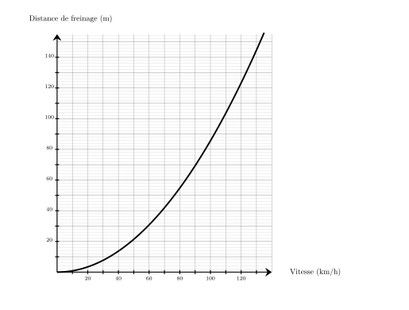
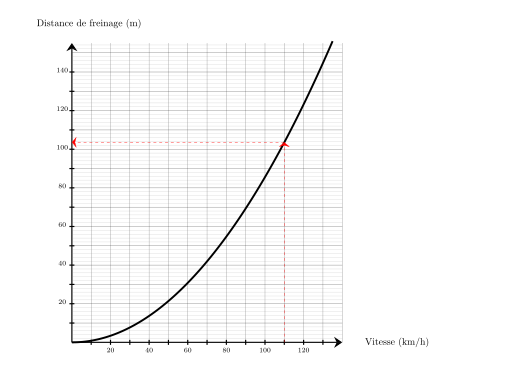
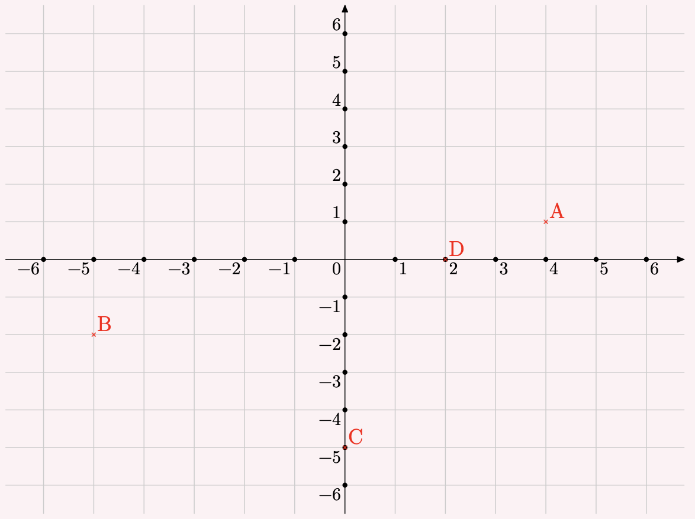




---Q---
Calculer le carré de $12$
---CORR---
$12^2={\color{#F15929}\boldsymbol{144}}$


---Q---
Une voiture roule à la vitesse de $110\text{ km/h}$ sur une route sèche. 
    En utilisant le graphique ci-dessous, quelle est la distance de freinage en mètres ? 
---CORR---
Pour une vitesse de $110\text{ km/h}$, la distance de freinage est d'environ ${\color{#F15929}\boldsymbol{104}}\text{ m}$. 


---Q---
Compléter. $8\,100\,\text{cm}^3=\ldots\,\text{L}$
---CORR---
$8\,100\,\text{cm}^3=8\,100\div 1\,000\,\text{dm}^3={\color{#F15929}\boldsymbol{8{,}1\,\mathbf{L}}}$


---Q---
Déterminer la valeur exacte de $UV$.   
---CORR---
On utilise le théorème de Pythagore dans le triangle $TUV$,  rectangle en $U$. 
      On obtient :

 

      $\begin{aligned}
        TU^2+UV^2&=TV^2\\
        UV^2&=TV^2-TU^2\\
        UV^2&=9^2-4^2\\
        UV^2&=81-16\\
        UV^2&=65\\
        UV&={\color{#F15929}\boldsymbol{\sqrt{65}}}
        \end{aligned}$

 
Mentalement :  
    La longueur $UV$ est donnée par la racine carrée de la différence des carrés de $9$ et de $4$. 
    Cette différence vaut $81-16=65$.  
    La valeur cherchée est donc : $\sqrt{65}$.






---Q---
Effectuer les calculs suivants en donnant le résultat sous forme d'une fraction. $A = 2 + \dfrac{6}{3} $
---CORR---
$A = 2 + \dfrac{6}{3} $  $A = \dfrac{6}{3} + \dfrac{6}{3}$  $A = \dfrac{12}{3}$  $A  ={\color{#F15929}\boldsymbol{4}}$ 


---Q---
Calculer $A = x \times x + 7$, pour $x = 10$.
---CORR---
$A = 10 \times 10 + 7$ $A = 100 + 7$ $A = {\color{#F15929}\boldsymbol{107}}$


---Q---
Placer les points suivants : $A(4\;;\;1)$ ; $B(-5\;;\;-2)$ ; $C(0\;;\;-5)$ et $D(2\;;\;0)$.

 

---CORR---
Les points sont placés aux coordonnées indiquées : 


---Q---
Sur la figure suivante : 
          $\leadsto U$ est sur $[TR]$,
          $\leadsto V$ est sur $[TS]$,  $\leadsto$ les droites $(RS)$ et $(UV)$ sont parallèles. Écrire la double égalité de Thalès. 
        
---CORR---
Dans le triangle $RST$ :
         $\leadsto$ $U\in[TR]$,
         $\leadsto$ $V\in[TS]$,
         $\leadsto$  $(RS)//(UV)$,
         donc d'après le théorème de Thalès, les triangles $RST$ et $UVT$ ont des longueurs proportionnelles.

 
$\dfrac{TU}{TR}=\dfrac{TV}{TS}=\dfrac{UV}{RS}$  <strong>Remarque</strong> On pourrait aussi écrire : $\dfrac{TR}{TU}=\dfrac{TS}{TV}=\dfrac{RS}{UV}$






---Q---
Compléter avec le signe < ou >. $0{,}7 \quad \ldots   \quad-0{,}9$
---CORR---
$0{,}7 \quad {\color{#F15929}\boldsymbol{>}} \quad -0{,}9$


---Q---
Pour résoudre l'équation $6x+3=12$, on effectue le calcul : 
        <strong>A.</strong>$ (12-6)-3\ \ \ \ \ \ \ \ \ \  $<strong>B.</strong>$ \dfrac{12-3}{6}\ \ \ \ \ \ \ \ \ \ $ <strong>C.</strong>$ \dfrac{12}{6}-3\ \ \ \ \ \ \ \ \ \  $<strong>D.</strong>$ 12\times 6-3$

---CORR---
Pour résoudre l'équation $6x+3=12$, on commence par soustraire $3$ des deux membres de l'équation, ce qui donne $6x=12-3$. 

    Ensuite, on divise les deux membres par $6$ pour obtenir $x=\dfrac{12-3}{6}$. 
    
    La bonne réponse est la réponse B.



---Q---
$CEJI$ est un parallélogramme tel que ses côtés $[CE]$ et $[EJ]$ sont perpendiculaires et ses diagonales $[CJ]$ et $[EI]$ aussi. Déterminer la nature de $CEJI$ en justifiant la réponse.
---CORR---
On sait que $[CE]\perp[EJ]$ et $[CJ]\perp[EI]$. Si un parallélogramme a deux côtés consécutifs perpendiculaires et des diagonales perpendiculaires, alors c'est un carré. $CEJI$ est donc un carré.


---Q---
Dans le triangle $WXY$ rectangle en $W$,  $WX=8\text{ cm}$ et $\widehat{WXY}=45^\circ$. Calculer $XY$ à $0,1\text{ cm}$ près.   
---CORR---
Dans le triangle $WXY$ rectangle en $W$,  le cosinus de l'angle $\widehat{WXY}$ est défini par : $\cos\left(\widehat{WXY}\right)=\dfrac{WX}{XY}$. Avec les données numériques : $\dfrac{\cos\left(45^\circ\right)}{\color{red}{1}}=\dfrac{8}{XY}$  $XY=\dfrac{8 \times\color{red}{1}}{\cos\left(45^\circ\right)}$ soit $XY\approx{\color{#F15929}\boldsymbol{11{,}3}}\text{ cm}$.



