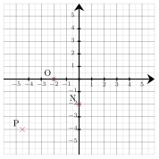
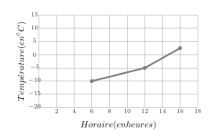
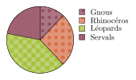



1
---Q---
Calculer $\dfrac{1}{6}$ de $540~\text{L}$.
---CORR---
Prendre $\dfrac{1}{6}$ d'une quantité revient à la diviser par $6$. $\dfrac{1}{6}$ de $540 = 540\div 6 = {\color{#EB7F73}\boldsymbol{90}}~\text{L}$.


2
---Q---
Justifier si les nombres proposés sont des solutions de l'équation donnée ou non $80x-320=-20x^2+80x$ pour $x=-4$, $x=4$ puis $x=-1$.
---CORR---
Pour $x=-4$ :  
$80(-4)-320=-640$ 
et $-20(-4)^2+80(-4)=0$ 
 Comme $-640\neq 0$ : non solution.  
Pour $x=4$ : $80(4)-320=0$ 
et $-20(4)^2+80(4)=-640$ 
 Comme $0\neq-640$ : non solution.  
Pour $x=-1$ :  
$80(-1)-320=-400$ 
et $-20(-1)^2+80(-1)=60$ 
 Comme $-400\neq 60$ : non solution.


3
---Q---
Placer les points suivants : $A(1\,;\,0)$ ; $B(3\,;\,1)$.
---CORR---


4
---Q---
$0{,}4~\text{dm}^3 = \ldots~\text{m}^3$
---CORR---
$0{,}4~\text{dm}^3 = 0{,}4\div 1\,000~\text{m}^3 = {\color{#EB7F73}\boldsymbol{0{,}000\,4~\text{m}^3}}$


5
---Q---
Dans une collection de $1\,000$ disques, on a noté leur style de musique.
 
a. Déterminer l'effectif manquant. b. Déterminer les fréquences pour chaque style (en pourcentage, arrondir au dixième si besoin).
 

---CORR---
a. $1\,000-(138+320+119+32+220)=1\,000-829={\color{#EB7F73}\boldsymbol{171}}$  b. Fréquences :

<table style="border-collapse:collapse;margin:0.8rem auto;font-size:0.9rem">
<tr><th style="background:#FDF2F4;color:#8B3C52;border:1px solid #ddb8c0;padding:6px 12px;font-weight:600">Style</th><th style="background:#FDF2F4;color:#8B3C52;border:1px solid #ddb8c0;padding:6px 12px;font-weight:600">Pop</th><th style="background:#FDF2F4;color:#8B3C52;border:1px solid #ddb8c0;padding:6px 12px;font-weight:600">Jazz</th><th style="background:#FDF2F4;color:#8B3C52;border:1px solid #ddb8c0;padding:6px 12px;font-weight:600">RnB</th><th style="background:#FDF2F4;color:#8B3C52;border:1px solid #ddb8c0;padding:6px 12px;font-weight:600">Folk</th><th style="background:#FDF2F4;color:#8B3C52;border:1px solid #ddb8c0;padding:6px 12px;font-weight:600">Rock</th><th style="background:#FDF2F4;color:#8B3C52;border:1px solid #ddb8c0;padding:6px 12px;font-weight:600">Rap</th></tr>
<tr><th style="background:#FDF2F4;color:#8B3C52;border:1px solid #ddb8c0;padding:6px 12px;font-weight:600">Effectif</th><td style="border:1px solid #ddb8c0;padding:6px 12px;text-align:center;color:#2D2226">$138$</td><td style="border:1px solid #ddb8c0;padding:6px 12px;text-align:center;color:#2D2226">$320$</td><td style="border:1px solid #ddb8c0;padding:6px 12px;text-align:center;color:#2D2226">$119$</td><td style="border:1px solid #ddb8c0;padding:6px 12px;text-align:center;color:#2D2226">$32$</td><td style="border:1px solid #ddb8c0;padding:6px 12px;text-align:center;color:#2D2226">$220$</td><td style="border:1px solid #ddb8c0;padding:6px 12px;text-align:center;color:#2D2226">$171$</td></tr>
<tr><th style="background:#FDF2F4;color:#8B3C52;border:1px solid #ddb8c0;padding:6px 12px;font-weight:600">Fréquence</th><td style="border:1px solid #ddb8c0;padding:6px 12px;text-align:center;color:#2D2226">${\color{#EB7F73}\boldsymbol{13{,}8\,\%}}$</td><td style="border:1px solid #ddb8c0;padding:6px 12px;text-align:center;color:#2D2226">${\color{#EB7F73}\boldsymbol{32\,\%}}$</td><td style="border:1px solid #ddb8c0;padding:6px 12px;text-align:center;color:#2D2226">${\color{#EB7F73}\boldsymbol{11{,}9\,\%}}$</td><td style="border:1px solid #ddb8c0;padding:6px 12px;text-align:center;color:#2D2226">${\color{#EB7F73}\boldsymbol{3{,}2\,\%}}$</td><td style="border:1px solid #ddb8c0;padding:6px 12px;text-align:center;color:#2D2226">${\color{#EB7F73}\boldsymbol{22\,\%}}$</td><td style="border:1px solid #ddb8c0;padding:6px 12px;text-align:center;color:#2D2226">${\color{#EB7F73}\boldsymbol{17{,}1\,\%}}$</td></tr>
</table>






1
---Q---
$A = \dfrac{1}{5} - \dfrac{4}{5} \times \dfrac{5}{2}$
---CORR---
$A = \dfrac{1}{5} - \dfrac{20}{10} = \dfrac{2}{10} - \dfrac{20}{10} = \dfrac{-18}{10} = {\color{#EB7F73}\boldsymbol{-\dfrac{9}{5}}}$


2
---Q---
Résoudre : $\dfrac{-4}{-2}=\dfrac{x}{-3}$
---CORR---
$$\begin{aligned}
\dfrac{-4}{-2} &= \dfrac{x}{-3} \\
-2 \times x &= -4 \times (-3) \\
-2x{\color{#C5607A}\boldsymbol{\div(-2)}} &= 12{\color{#C5607A}\boldsymbol{\div(-2)}} \\
x &= {\color{#EB7F73}\boldsymbol{-6}}
\end{aligned}$$


3
---Q---
Déterminer les coordonnées des points $N$, $O$ et $P$.
 

---CORR---
$N({\color{#EB7F73}\boldsymbol{0}}\,;\,{\color{#EB7F73}\boldsymbol{-2}})$, $O({\color{#EB7F73}\boldsymbol{-2}}\,;\,{\color{#EB7F73}\boldsymbol{0}})$, $P({\color{#EB7F73}\boldsymbol{-4{,}5}}\,;\,{\color{#EB7F73}\boldsymbol{-4}})$


4
---Q---
Convertir $33~\text{h}$ en jours et heures.
---CORR---
$33 = 1\times 24 + 9$ $33~\text{h} = {\color{#EB7F73}\boldsymbol{1~\text{j}~9~\text{h}}}$


5
---Q---
Le graphique donne l'évolution de la température (en °C) en fonction de l'horaire (en heures). Entre 6h et 16h, de combien de degrés la température a-t-elle augmenté ?
 

---CORR---
À 6h, la température est de $-10^\circ$C ; à 16h, elle est de $2{,}5^\circ$C. Augmentation : $2{,}5-(-10)=2{,}5+10={\color{#EB7F73}\boldsymbol{12{,}5}}^\circ$C.






1
---Q---
Convertir $1~\text{h}~08~\text{min}$ en secondes.
---CORR---
$1~\text{h}~08~\text{min} = (1\times 3\,600~\text{s}) + (8\times 60~\text{s}) = 3\,600+480 = {\color{#EB7F73}\boldsymbol{4\,080~\text{s}}}$


2
---Q---
Simplifier, au maximum, l'écriture, si possible : $x \times x \times 2 \times x$
---CORR---
$x \times x \times 2 \times x = {\color{#EB7F73}\boldsymbol{2x^3}}$


3
---Q---
Comparer : $1{,}2 \quad\ldots\quad -1{,}6$
---CORR---
$1{,}2 \quad {\color{#EB7F73}\boldsymbol{>}} \quad -1{,}6$


4
---Q---
Écrire sous la forme d'un entier et d'une fraction inférieure à 1, puis donner l'écriture décimale de $\dfrac{9}{8}$.
---CORR---
$\dfrac{9}{8} = {\color{#EB7F73}\boldsymbol{1}} + \dfrac{{\color{#EB7F73}\boldsymbol{1}}}{{\color{#EB7F73}\boldsymbol{8}}} = {\color{#EB7F73}\boldsymbol{1{,}125}}$


5
---Q---
Dans le parc naturel de Ruyron, voici le diagramme représentant les effectifs de quelques espèces.
 
L'espèce la plus nombreuse représente : A. Moins de la moitié des animaux &emsp; B. La moitié des animaux &emsp; C. Plus de la moitié des animaux
 

---CORR---
Les Léopards représentent le secteur le plus grand ($144°$ soit $40\%$). $40\% < 50\%$, donc les Léopards représentent moins de la moitié des animaux. La bonne réponse est la réponse A.



