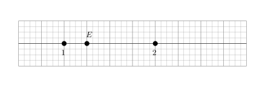
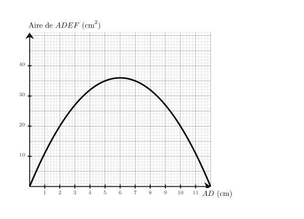
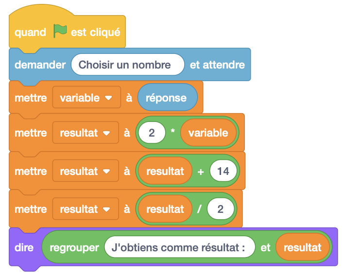




---Q---
Dans une école de 1500 étudiants, $40\%$ des étudiants aiment la musique pop. 
    Combien d'étudiants aiment la musique pop ?
---CORR---
Le nombre d'étudiants qui aiment la musique pop est égal à : 
    $1\,500 \times \dfrac{40}{100} = \dfrac{60\,000}{100}={\color{#F15929}\boldsymbol{600}}$.


---Q---
Sur cette droite graduée, quelle est l'abscisse du point $E$ ?

 
 
    
    	<strong>A</strong>. $\dfrac{5}{4}$&emsp;&emsp; <strong>B</strong>. $\dfrac{3}{4}$&emsp;&emsp; <strong>C</strong>. $2$&emsp;&emsp; <strong>D</strong>. $1$&emsp;&emsp;  
        
---CORR---
On remarque qu'il y a 4 divisions entre $1$ et $2$, donc chaque division vaut $\dfrac{1}{4}$. Le point $E$ est situé après $5$ divisions à partir de l'origine. Donc l'abscisse de $E$ est égale à $\dfrac{5}{4}$. La bonne réponse est la réponse A.


---Q---
Calculer l'aire exacte d'un triangle de base $5\text{ cm}$ et de hauteur $3\text{ cm}$
---CORR---
$\mathcal{A}_\text{triangle} = (b \times h) \div 2$ $\mathcal{A}_\text{triangle} = (5\text{ cm} \times 3\text{ cm}) \div 2$ $\mathcal{A}_\text{triangle} = 15\text{ cm}^2 \div 2$ $\mathcal{A}_\text{triangle} = {\color{#F15929}\boldsymbol{7{,}5}}\text{ cm}^2$


---Q---
On choisit un film au hasard parmi ceux à l'affiche proposant $9$ comédies et $81$ drames. Quelle est la probabilité de choisir une comédie ?
---CORR---
Il y a en tout : $9 + 81 = 90$ . La probabilité de choisir une comédie est de ${\color{#F15929}\boldsymbol{\dfrac{9}{90}}}$, soit ${\color{#F15929}\boldsymbol{\dfrac{1}{10}}}$.






---Q---
Donner l'écriture décimale de $1{,}26 \times 10^{4}$.
---CORR---
 L'écriture décimale de $1{,}26 \times 10^{4}$ est ${\color{#F15929}\boldsymbol{12\,600}}$.



---Q---
Il est indiqué sur la bouteille de sirop qu'il faut  $60$ cL de  sirop pour $3$ L d'eau.  On veut utiliser $7$ L d'eau.  Quel volume de sirop doit-on prévoir ?
---CORR---
Commençons par trouver combien est-ce qu'il faut de sirop pour $1$ L d'eau.   3 L d'eau, c'est ${\color{#216D9A}\boldsymbol{3}}$ fois $1$ L d'eau. Pour $1$ L d'eau, il faut donc ${\color{#216D9A}\boldsymbol{3}}$ fois moins que $60$ cL. $60$ cL $\div {\color{#216D9A}\boldsymbol{3}} = 20$ cL   il faut ${\color{#216D9A}\boldsymbol{20}}$ cL de sirop pour $1$ L d'eau.   Cherchons maintenant la quantité nécessaire pour $7$ L d'eau.   $7$ L d'eau, c'est ${\color{#216D9A}\boldsymbol{7}}$ fois $1$ L d'eau. Il faut donc ${\color{#216D9A}\boldsymbol{7}}$ fois plus de sirop que $20$ cL :  ${\color{#216D9A}\boldsymbol{20}}$ cL $\times {\color{#216D9A}\boldsymbol{7}} = 140$ cL  il faut prévoir ${\color{#F15929}\boldsymbol{140}}$ cL de  sirop.


---Q---
Donner le nom de chacun des solides. 

---CORR---
Pavé droit.


---Q---
Les notes obtenues par un élève sont : $18{,}5 ; 15{,}5 ; 13{,}5 ; 16{,}5 ; 14{,}5$. 
    Que vaut la médiane de cette série de notes ?
---CORR---
Rangeons les notes dans l'ordre croissant : $13{,}5 ; 14{,}5 ; 15{,}5 ; 16{,}5 ; 18{,}5$. 
    Comme il y a 5 notes (nombre impair), la médiane est la note du milieu, c'est-à-dire la 3e note : ${\color{#F15929}\boldsymbol{15{,}5}}$.






---Q---
Compléter le tableau en mettant oui ou non dans chaque case. $\begin{array}{|l|c|c|c|c|}
\hline
\text{... est divisible} & \text{par }2 & \text{par }3 & \text{par }5 & \text{par }9\\
\hline
1 \,698 & & & & \\
\hline
15 \,570 & & & & \\
\hline
1 \,130 & & & & \\
\hline
2 \,685 & & & & \\
\hline
1 \,422 & & & & \\
\hline
\end{array}
$
---CORR---
$\begin{array}{|l|c|c|c|c|}
\hline
\text{... est divisible} & \text{par }2 & \text{par }3 & \text{par }5 & \text{par }9\\
\hline
1 \,698 & \color{blue}{\text{oui}} & \color{blue}{\text{oui}} & \text{non} & \text{non} \\\hline
15 \,570 & \color{blue}{\text{oui}} & \color{blue}{\text{oui}} & \color{blue}{\text{oui}} & \color{blue}{\text{oui}} \\\hline
1 \,130 & \color{blue}{\text{oui}} & \text{non} & \color{blue}{\text{oui}} & \text{non} \\\hline
2 \,685 & \text{non} & \color{blue}{\text{oui}} & \color{blue}{\text{oui}} & \text{non} \\\hline
1 \,422 & \color{blue}{\text{oui}} & \color{blue}{\text{oui}} & \text{non} & \color{blue}{\text{oui}} \\\hline
\end{array}$


---Q---
Sur le graphique ci-dessus, on a représenté la relation entre la longueur $AD$ et l'aire du rectangle $ADEF$. Quelle est l'aire du rectangle $ADEF$ lorsque la longueur $AD$ vaut $11\text{ cm}$ ? 
---CORR---
On cherche $Aire_{ADEF}$ lorsque $AD = 11\text{ cm}$. On trouve $Aire_{ADEF}={\color{#F15929}\boldsymbol{11}}\text{ cm}^2$.


---Q---
Compléter. $ 9~\text{ cm}^2 = \ldots ~\text{m}^2$
---CORR---
$ 9~\text{ cm}^2 =  9\div100\div100~\text{m}^2 = 0{,}000\,9~\text{m}^2$ $\def\arraystretch{1.5}\begin{array}{|c|c|c|c|c|c|c|c|c|c|}\hline \hspace*{0.4cm}  &\text{km}^2  &\text{hm}^2  &\text{dam}^2  &\text{m}^2  &\text{dm}^2  &\text{cm}^2  &\text{mm}^2  &\hspace*{0.4cm}  \\\hline\begin{array}{c|c} &   \\  &   \\\end{array} & \begin{array}{c|c} &   \\  &   \\\end{array} & \begin{array}{c|c} &   \\  &   \\\end{array} & \begin{array}{c|c} &   \\  &   \\\end{array} & \begin{array}{c|c} &   \\  & \color{red}{0,}  \\\end{array} & \begin{array}{c|c} &   \\ 0 & 0  \\\end{array} & \begin{array}{c|c} & \color{red}{9}  \\ 0 & 9  \\\end{array} & \begin{array}{c|c} &   \\  &   \\\end{array} & \begin{array}{c|c} &   \\  &   \\\end{array}\\ \hline  \end{array}$


---Q---
On considère l'algorithme suivant :
 
        Qu'obtient-on si on choisit $3$ comme nombre de départ ? 
        
        
---CORR---
Si on choisit $3$ comme nombre de départ, alors variable prend la valeur $3$. 
   Ensuite, resultat prend la valeur $2 \times 3=6$. 
   Puis, resultat prend la valeur $6 + 14=20$. 
   Enfin, resultat prend la valeur $\dfrac{20}{2}=10$.




