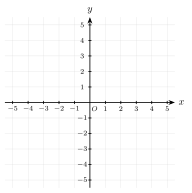
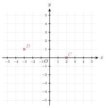
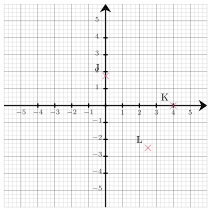
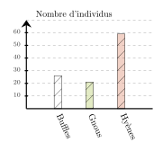




---Q---
$A = \dfrac{4}{3} \times 4$
---CORR---
$A = \dfrac{4}{3} \times 4$ $A = {\color{#EB7F73}\boldsymbol{\dfrac{16}{3}}}$



---Q---
$m$ étant un nombre entier, exprimer l'entier suivant en fonction de $m$.
---CORR---
Le successeur de $m$ peut se noter : ${\color{#EB7F73}\boldsymbol{m+1}}$ ou ${\color{#EB7F73}\boldsymbol{1+m}}$.



---Q---
$0{,}01~\text{dm}^2 = \ldots~\text{dam}^2$
---CORR---
$0{,}01~\text{dm}^2 = 0{,}01\div10\,000~\text{dam}^2 = {\color{#EB7F73}\boldsymbol{0{,}000\,001~\text{dam}^2}}$



---Q---
Le prix d'un article coûtant $10$ euros augmente de $1$ euros. Quel est le pourcentage d'augmentation de ce prix ?
---CORR---
L'augmentation est de $1$ euros sur un total de $10$ euros. Le pourcentage d'augmentation est donné par le quotient : $\dfrac{1}{10}=0{,}1= {\color{#EB7F73}\boldsymbol{10}}\,\%$. Mentalement : Calculez $10\,\%$ du prix. L'augmentation est un multiple de $10\,\%$.



---Q---
Compléter le tableau suivant.
<table style="border-collapse:collapse;margin:0.8rem auto;font-size:0.9rem">
<tr><td style="border:1px solid #ddb8c0;padding:6px 12px;color:#2D2226">Nombre</td><td style="border:1px solid #ddb8c0;padding:6px 12px;color:#2D2226">$-7{,}9$</td><td style="border:1px solid #ddb8c0;padding:6px 12px;color:#2D2226">&nbsp;&nbsp;&nbsp;&nbsp;&nbsp;</td><td style="border:1px solid #ddb8c0;padding:6px 12px;color:#2D2226">&nbsp;&nbsp;&nbsp;&nbsp;&nbsp;</td><td style="border:1px solid #ddb8c0;padding:6px 12px;color:#2D2226">&nbsp;&nbsp;&nbsp;&nbsp;&nbsp;</td><td style="border:1px solid #ddb8c0;padding:6px 12px;color:#2D2226">&nbsp;&nbsp;&nbsp;&nbsp;&nbsp;</td><td style="border:1px solid #ddb8c0;padding:6px 12px;color:#2D2226">$-8{,}7$</td></tr>
<tr><td style="border:1px solid #ddb8c0;padding:6px 12px;color:#2D2226">Opposé du nombre</td><td style="border:1px solid #ddb8c0;padding:6px 12px;color:#2D2226">&nbsp;&nbsp;&nbsp;&nbsp;&nbsp;</td><td style="border:1px solid #ddb8c0;padding:6px 12px;color:#2D2226">$-0{,}3$</td><td style="border:1px solid #ddb8c0;padding:6px 12px;color:#2D2226">$-6{,}2$</td><td style="border:1px solid #ddb8c0;padding:6px 12px;color:#2D2226">$1{,}3$</td><td style="border:1px solid #ddb8c0;padding:6px 12px;color:#2D2226">$-3{,}2$</td><td style="border:1px solid #ddb8c0;padding:6px 12px;color:#2D2226">&nbsp;&nbsp;&nbsp;&nbsp;&nbsp;</td></tr>
</table>
---CORR---
<table style="border-collapse:collapse;margin:0.8rem auto;font-size:0.9rem">
<tr><td style="border:1px solid #ddb8c0;padding:6px 12px;color:#2D2226">Nombre</td><td style="border:1px solid #ddb8c0;padding:6px 12px;color:#2D2226">$-7{,}9$</td><td style="border:1px solid #ddb8c0;padding:6px 12px;color:#2D2226">${\color{#EB7F73}\boldsymbol{0{,}3}}$</td><td style="border:1px solid #ddb8c0;padding:6px 12px;color:#2D2226">${\color{#EB7F73}\boldsymbol{6{,}2}}$</td><td style="border:1px solid #ddb8c0;padding:6px 12px;color:#2D2226">${\color{#EB7F73}\boldsymbol{-1{,}3}}$</td><td style="border:1px solid #ddb8c0;padding:6px 12px;color:#2D2226">${\color{#EB7F73}\boldsymbol{3{,}2}}$</td><td style="border:1px solid #ddb8c0;padding:6px 12px;color:#2D2226">$-8{,}7$</td></tr>
<tr><td style="border:1px solid #ddb8c0;padding:6px 12px;color:#2D2226">Opposé du nombre</td><td style="border:1px solid #ddb8c0;padding:6px 12px;color:#2D2226">${\color{#EB7F73}\boldsymbol{7{,}9}}$</td><td style="border:1px solid #ddb8c0;padding:6px 12px;color:#2D2226">$-0{,}3$</td><td style="border:1px solid #ddb8c0;padding:6px 12px;color:#2D2226">$-6{,}2$</td><td style="border:1px solid #ddb8c0;padding:6px 12px;color:#2D2226">$1{,}3$</td><td style="border:1px solid #ddb8c0;padding:6px 12px;color:#2D2226">$-3{,}2$</td><td style="border:1px solid #ddb8c0;padding:6px 12px;color:#2D2226">${\color{#EB7F73}\boldsymbol{8{,}7}}$</td></tr>
</table>







---Q---
Convertir $231$ minutes en heures et minutes.
---CORR---
Mentalement : On cherche le multiple de $60$ inférieur à $231$ le plus grand possible. C'est $3\times 60 = 180$. Ainsi $231 = 180 + 51$ donc $231~\text{min} = 3~\text{h}~51~\text{min}$. $231 = (3 \times 60) + 51$ donc $231$ minutes $= {\color{#EB7F73}\boldsymbol{3~\textbf{h}~51~\textbf{min}}}$.



---Q---
Donner la valeur décimale de $\dfrac{7}{10}$.
---CORR---
$\dfrac{7}{10}={\color{#EB7F73}\boldsymbol{0{,}7}}$ Mentalement : $\dfrac{7}{10}=7\times \dfrac{1}{10}=7\times 0{,}1=0{,}7$.



---Q---
Simplifier au maximum, si possible : $x \times x + 5$
---CORR---
$x \times x + 5 = {\color{#EB7F73}\boldsymbol{x^2+5}}$



---Q---
Placer les points suivants, dans le repère de la séance 10 : $C(2\,;\,0)$ et $D(-3\,;\,1)$.
 

---CORR---




---Q---
Wendy rapporte $1{,}5$ kg de coings, $0{,}7$ kg de kiwis et $2{,}7$ kg de melons. Karine rapporte $3{,}6$ kg de coings, $3{,}8$ kg de kiwis, $7{,}8$ kg de melons et $5{,}5$ kg de poires.  a. Quelle est la masse totale de fruits achetés par les amis ? b. Qui a rapporté le plus de fruits ? c. Quel fruit a été rapporté en la plus grosse quantité ?
<table style="border-collapse:collapse;margin:0.8rem auto;font-size:0.9rem">
<tr><th style="background:#FDF2F4;color:#8B3C52;border:1px solid #ddb8c0;padding:6px 12px;font-weight:600">Amis \ fruits</th><th style="background:#FDF2F4;color:#8B3C52;border:1px solid #ddb8c0;padding:6px 12px;font-weight:600">Kiwi</th><th style="background:#FDF2F4;color:#8B3C52;border:1px solid #ddb8c0;padding:6px 12px;font-weight:600">Poire</th><th style="background:#FDF2F4;color:#8B3C52;border:1px solid #ddb8c0;padding:6px 12px;font-weight:600">Melon</th><th style="background:#FDF2F4;color:#8B3C52;border:1px solid #ddb8c0;padding:6px 12px;font-weight:600">Coing</th><th style="background:#FDF2F4;color:#8B3C52;border:1px solid #ddb8c0;padding:6px 12px;font-weight:600">TOTAL</th></tr>
<tr><th style="background:#FDF2F4;color:#8B3C52;border:1px solid #ddb8c0;padding:6px 12px;font-weight:600">Wendy</th><td style="border:1px solid #ddb8c0;padding:6px 12px;color:#2D2226"></td><td style="border:1px solid #ddb8c0;padding:6px 12px;color:#2D2226"></td><td style="border:1px solid #ddb8c0;padding:6px 12px;color:#2D2226"></td><td style="border:1px solid #ddb8c0;padding:6px 12px;color:#2D2226"></td><td style="border:1px solid #ddb8c0;padding:6px 12px;color:#2D2226"></td></tr>
<tr><th style="background:#FDF2F4;color:#8B3C52;border:1px solid #ddb8c0;padding:6px 12px;font-weight:600">Karine</th><td style="border:1px solid #ddb8c0;padding:6px 12px;color:#2D2226"></td><td style="border:1px solid #ddb8c0;padding:6px 12px;color:#2D2226"></td><td style="border:1px solid #ddb8c0;padding:6px 12px;color:#2D2226"></td><td style="border:1px solid #ddb8c0;padding:6px 12px;color:#2D2226"></td><td style="border:1px solid #ddb8c0;padding:6px 12px;color:#2D2226"></td></tr>
<tr><th style="background:#FDF2F4;color:#8B3C52;border:1px solid #ddb8c0;padding:6px 12px;font-weight:600">TOTAL</th><td style="border:1px solid #ddb8c0;padding:6px 12px;color:#2D2226"></td><td style="border:1px solid #ddb8c0;padding:6px 12px;color:#2D2226"></td><td style="border:1px solid #ddb8c0;padding:6px 12px;color:#2D2226"></td><td style="border:1px solid #ddb8c0;padding:6px 12px;color:#2D2226"></td><td style="border:1px solid #ddb8c0;padding:6px 12px;color:#2D2226"></td></tr>
</table>
---CORR---
a. Voici le tableau complet.
<table style="border-collapse:collapse;margin:0.8rem auto;font-size:0.9rem">
<tr><th style="background:#FDF2F4;color:#8B3C52;border:1px solid #ddb8c0;padding:6px 12px;font-weight:600">Amis \ fruits</th><th style="background:#FDF2F4;color:#8B3C52;border:1px solid #ddb8c0;padding:6px 12px;font-weight:600">Kiwi</th><th style="background:#FDF2F4;color:#8B3C52;border:1px solid #ddb8c0;padding:6px 12px;font-weight:600">Poire</th><th style="background:#FDF2F4;color:#8B3C52;border:1px solid #ddb8c0;padding:6px 12px;font-weight:600">Melon</th><th style="background:#FDF2F4;color:#8B3C52;border:1px solid #ddb8c0;padding:6px 12px;font-weight:600">Coing</th><th style="background:#FDF2F4;color:#8B3C52;border:1px solid #ddb8c0;padding:6px 12px;font-weight:600">TOTAL</th></tr>
<tr><th style="background:#FDF2F4;color:#8B3C52;border:1px solid #ddb8c0;padding:6px 12px;font-weight:600">Wendy</th><td style="border:1px solid #ddb8c0;padding:6px 12px;text-align:center;color:#2D2226">$0{,}7$</td><td style="border:1px solid #ddb8c0;padding:6px 12px;text-align:center;color:#2D2226">$0$</td><td style="border:1px solid #ddb8c0;padding:6px 12px;text-align:center;color:#2D2226">$2{,}7$</td><td style="border:1px solid #ddb8c0;padding:6px 12px;text-align:center;color:#2D2226">$1{,}5$</td><td style="border:1px solid #ddb8c0;padding:6px 12px;text-align:center;color:#2D2226">$4{,}9$</td></tr>
<tr><th style="background:#FDF2F4;color:#8B3C52;border:1px solid #ddb8c0;padding:6px 12px;font-weight:600">Karine</th><td style="border:1px solid #ddb8c0;padding:6px 12px;text-align:center;color:#2D2226">$3{,}8$</td><td style="border:1px solid #ddb8c0;padding:6px 12px;text-align:center;color:#2D2226">$5{,}5$</td><td style="border:1px solid #ddb8c0;padding:6px 12px;text-align:center;color:#2D2226">$7{,}8$</td><td style="border:1px solid #ddb8c0;padding:6px 12px;text-align:center;color:#2D2226">$3{,}6$</td><td style="border:1px solid #ddb8c0;padding:6px 12px;text-align:center;color:#2D2226">$20{,}7$</td></tr>
<tr><th style="background:#FDF2F4;color:#8B3C52;border:1px solid #ddb8c0;padding:6px 12px;font-weight:600">TOTAL</th><td style="border:1px solid #ddb8c0;padding:6px 12px;text-align:center;color:#2D2226">$4{,}5$</td><td style="border:1px solid #ddb8c0;padding:6px 12px;text-align:center;color:#2D2226">$5{,}5$</td><td style="border:1px solid #ddb8c0;padding:6px 12px;text-align:center;color:#2D2226">$10{,}5$</td><td style="border:1px solid #ddb8c0;padding:6px 12px;text-align:center;color:#2D2226">$5{,}1$</td><td style="border:1px solid #ddb8c0;padding:6px 12px;text-align:center;color:#2D2226">$25{,}6$</td></tr>
</table>
b. La masse totale de fruits est : $25{,}6$ kg. c. On regarde la dernière colonne du tableau. La personne qui a rapporté le plus de fruits est Karine. Cette masse maximale est de $20{,}7$ kg. d. On regarde la dernière ligne du tableau. Il y a plus de melons que d'autres fruits. Il y en a $10{,}5$ kg.






1
---Q---
Calculer $\dfrac{1}{4}$ de $320~\text{L}$.
---CORR---
$\dfrac{1}{4}$ de $320~\text{L}$ $= {\color{#EB7F73}\boldsymbol{80}}~\text{L}$ Mentalement : Prendre $\dfrac{1}{4}$ d'une quantité revient à la diviser par $4$. Ainsi, $\dfrac{1}{4}$ de $320=320\div 4=80$.


2
---Q---
Pour résoudre l'équation $\dfrac{x+6}{8}=12$ :
  A. $12\times 8+6$ &emsp; B. $(12-8)-6$ &emsp; C. $\dfrac{12}{8}-6$ &emsp; D. $12\times 8-6$
---CORR---
Pour résoudre l'équation $\dfrac{x+6}{8}=12$, on commence par multiplier les deux membres par $8$, ce qui donne $x+6=12\times 8$. Ensuite, on soustrait $6$ des deux membres pour obtenir $x=12\times 8-6$. La bonne réponse est la réponse D.


3
---Q---
Déterminer les coordonnées respectives des points $L$, $K$ et $J$.
 

---CORR---
Les coordonnées respectives des points sont : $L({\color{#EB7F73}\boldsymbol{2{,}5}}\,;\,{\color{#EB7F73}\boldsymbol{-2{,}5}})$, $K({\color{#EB7F73}\boldsymbol{4}}\,;\,{\color{#EB7F73}\boldsymbol{0}})$ et $J({\color{#EB7F73}\boldsymbol{0}}\,;\,{\color{#EB7F73}\boldsymbol{1{,}75}})$


4
---Q---
Un show dure $230$ minutes. Quelle est sa durée en heures et minutes ?
---CORR---
Une heure contient 60 minutes. $230=180+50=3\times 60+50$, donc dans $230$ minutes il y a 3 h 50 min.


5
---Q---
Dans le parc naturel de Loshull, il y a beaucoup d'animaux. Voici un diagramme qui représente les effectifs de quelques espèces.
 
L'espèce la plus nombreuse représente ...  A. Plus de la moitié des animaux &emsp; B. La moitié des animaux &emsp; C. Moins de la moitié des animaux
 

---CORR---
Les Hyènes sont les plus nombreuses (≈ 59 individus). Le total des animaux est $26+21+59=106$. $59 > \dfrac{106}{2} = 53$, donc les Hyènes représentent plus de la moitié des animaux. Réponse A.



