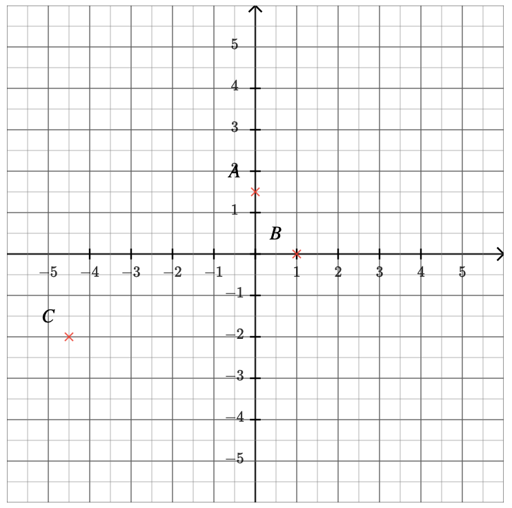
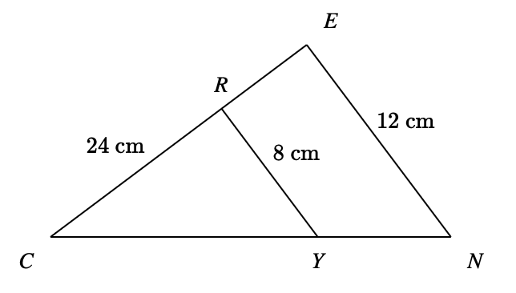
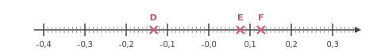
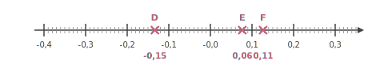
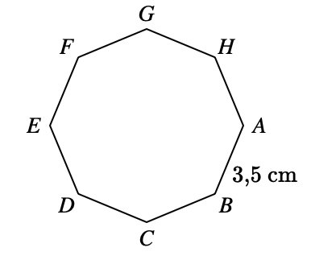




---Q---
Combien valent les trois quarts de $16$ ?
---CORR---
$\dfrac{3}{4}$ de $16 = \dfrac{3}{4} \times 16 = \dfrac{3 \times 16 }{4}= \dfrac{3 \times 4 \times 4 }{4}=3 \times 4=12$


---Q---
Développer et réduire $A=-7+6(-8c-2)$
---CORR---
$A=-7+6(-8c-2)$ $A=-7+6\times (-8c)+6\times (-2)$ En réduisant l'expression, on obtient :   $A=$ ${\color{#8B3C52}\boldsymbol{-48c-19}}$.


---Q---
Déterminer les coordonnées respectives des points $A$,  $B$ et $C$.

 
  
---CORR---
Les coordonnées respectives des points sont :  $A({\color{#8B3C52}\boldsymbol{0}};{\color{F15929}\boldsymbol{1{,}5}})$, $C({\color{#8B3C52}\boldsymbol{-4{,}5}};{\color{F15929}\boldsymbol{-2}})$ et $B({\color{#8B3C52}\boldsymbol{1}};{\color{F15929}\boldsymbol{0}})$.



---Q---
 $STU$ est un triangle rectangle en $S$ dans lequel
      $ST=9$ et $SU=\sqrt{3}$. 
       Calculer la valeur exacte de $TU$ .
---CORR---
 On utilise le théorème de Pythagore dans le triangle $STU$,  rectangle en $S$. 
On obtient : 
$\begin{aligned}
ST^2+SU^2&=TU^2\\
TU^2&=ST^2+SU^2\\
TU^2&=\sqrt{3}^2+9^2\\
TU^2&=3+81\\
TU^2&=84\\
TU&={\color{#8B3C52}\boldsymbol{\sqrt{84}}}
\end{aligned}$ 
En simplifiant, on obtient : $TU = 2\sqrt{21}$






---Q---
Calculer. $ (+7) - (-8) $
---CORR---
$  {\color{blue}\boldsymbol{(+7)}} - {\color{#A4485F}\boldsymbol{(-8)}} = 7+8 = {\color{#8B3C52}\boldsymbol{15}} $


---Q---
Résoudre les équations suivantes. $\dfrac{4x}{5}=-3$
---CORR---
$\dfrac{4x}{5}=-3$   
$\dfrac{4x}{5}{\color{blue}\boldsymbol{\,\times\,\dfrac{5}{4}}}=-3{\color{blue}\boldsymbol{\,\times\,\dfrac{5}{4}}}$   
$x=\dfrac{-15}{4}$   
 La solution de l'équation $\dfrac{4x}{5}=-3$ est ${\color{#8B3C52}\boldsymbol{-\dfrac{15}{4}}}$.


---Q---
Dans le triangle $ABC$ rectangle en $B$, on sait que $\widehat{A} = 26^\circ$.  
      Calculer $\widehat{C}$. 
---CORR---
On sait que la somme des angles d'un triangle est égale à $180^\circ$.  
    Donc, dans le triangle $ABC$, on a :  
    $\widehat{A} + \widehat{B} + \widehat{C} = 180^\circ$.  
    Or, comme le triangle est rectangle en $B$, on a $\widehat{B} = 90^\circ$.  
    Donc, $26^\circ + 90^\circ + \widehat{C} = 180^\circ$.  
    D'où $\widehat{C} = 180^\circ - 90^\circ - 26^\circ = 90^\circ - 26^\circ = {\color{#8B3C52}\boldsymbol{64}}^\circ$.


---Q---
Sur la figure ci-dessus, dans le triangle $CEN$, les droites $(EN)$ et $(YR)$ sont parallèles. Déterminer la longueur $CE$. 
---CORR---
Dans le triangle $CEN$, les droites $(EN)$ et $(YR)$ sont parallèles.  
    D'après le théorème de Thalès, on a :  
    $\dfrac{CE}{CR} =
    \dfrac{EN}{YR}$.  
    En remplaçant par les longueurs, on obtient :  
    $\dfrac{CE}{CR} = \dfrac{12}{8}=1{,}5$. 
    On en déduit que :  
    $CE = 1{,}5 \times 24 = {\color{#8B3C52}\boldsymbol{36}}$ cm.






---Q---
Après une augmentation de $2~\%$ le prix de mon ordinateur est maintenant $1\,238{,}28$ €. Calculer son prix avant l'augmentation.
---CORR---
Une augmentation de $2$ % revient à multiplier par $100~\% + 2~\%=102~\% = 1{,}02$. Pour retrouver le prix initial, on va donc diviser le prix final par $1{,}02$. $1\,238{,}28\div1{,}02 = 1\,214$ Avant l'augmentation le prix de mon ordinateur était de ${\color{#8B3C52}\boldsymbol{1\,214}}$€.


---Q---
Donner l'abscisse des pour $D$, $E$ et $F$.

---CORR---
 $\ D $ $(-0{,}15)$ &emsp; $\ E $ $(0{,}06)$ &emsp; $\ F $ $(0{,}11)$


---Q---
Calculer le périmètre du octogone régulier $ABCDEFGH$ représenté ci-dessous :  
---CORR---
Le polygone a $8$ côtés de longueur $3{,}5$ cm. 
Le périmètre est donc égal à : 
$8 \times 3{,}5 = {\color{#8B3C52}\boldsymbol{28}}$ cm.


---Q---
Compléter à l'aide des longueurs $WV$, $WX$ et $VX$ :  $\cos\left(\widehat{WVX}\right)=$$\dfrac{\ldots}{\ldots}$ 
---CORR---
$WVX$ est rectangle en $W$ donc : $\cos\left(\widehat{WVX}\right)={\color{#8B3C52}\boldsymbol{\dfrac{WV}{VX}}}$



