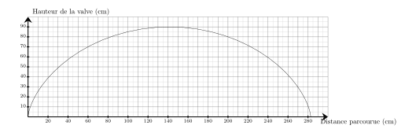
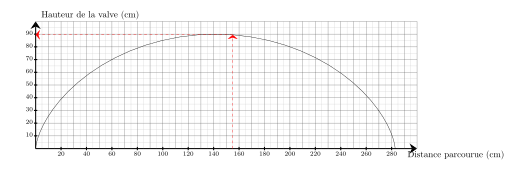
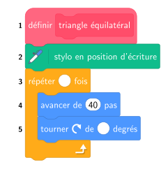




---Q---
Donner l'écriture scientifique de $2\,300$
---CORR---
$2\,300 = {\color{#F15929}\boldsymbol{2{,}3\times 10^{3}}}$


---Q---
Béatrice a repéré, à l'épicerie, des melons qui l'intéressent. 
  Elle lit que $6$ melons coûtent $12{,}60$ €. Elle veut en acheter $13$. 
  Combien va-t-elle dépenser ?
---CORR---
Commençons par trouver le prix d'un seul melon.  Si $6$ melons coûtent $12{,}60$ €, alors un seul melon coûte ${\color{#216D9A}\boldsymbol{6}}$ fois moins cher. $12{,}60$ € $ \div {\color{#216D9A}\boldsymbol{6}} = 2{,}10 $ €  un seul melon coûte ${\color{#216D9A}\boldsymbol{2{,}10}}$ €. Cherchons maintenant le prix de $13$ melons.  $13$ melons, c'est ${\color{#216D9A}\boldsymbol{13}}$ fois plus qu'un seul melon.  $13$ melons coûtent donc ${\color{#216D9A}\boldsymbol{13}}$ fois plus que ${\color{blue}\boldsymbol{2{,}10}}$ €, le prix d'un seul melon.  ${\color{#216D9A}\boldsymbol{2{,}10}}$ € $\times {\color{#216D9A}\boldsymbol{13}} = 27{,}30$ €   $13$ melons coûtent ${\color{#F15929}\boldsymbol{27{,}30}}$ €.


---Q---
Calculer le volume d'une pyramide de hauteur $6\text{ m}$ et dont la base est un triangle. La base du triangle mesure $3\text{ m}$ et la hauteur associée à cette base mesure $2\text{ m}$.
---CORR---
$\mathcal{V}=\dfrac{1}{3} \times \mathcal{B} \times h=\dfrac{1}{3}\times\dfrac{3\text{ m} \times 2\text{ m}}{2}\times6\text{ m}=\dfrac{3 \times 2 \times 6}{6}\text{ m}^3={\color{#F15929}\boldsymbol{6\mathbf{ m}^3}}$


---Q---
On a réalisé $1000$ lancers d’un dé à $4$ faces.  
    Les résultats sont inscrits dans le tableau ci‑dessous.

    

$$
    \def\arraystretch{1.5}
    \begin{array}{|c|c|c|c|c|}
    \hline
    \text{Scores} & 1 & 2 & 3 & 4 \\
    \hline
    \text{Nombre d'apparitions} & 238 & 245 & 261 & 256 \\
    \hline
    \end{array}
    $$

    Calculer la fréquence de la valeur $4$.
---CORR---
La valeur $4$ apparaît $256$ fois. 
    Le nombre total de lancers est $1\,000$. 
    La fréquence de la valeur $4$ est ${\color{#F15929}\boldsymbol{\dfrac{256}{1\,000}}}={\color{#F15929}\boldsymbol{0{,}256}}$, soit $25{,}6\thickspace\%$.






---Q---
Quel est le carré de $14$ ?
---CORR---
Le carré d'un nombre est ce nombre multiplié par lui-même : $14\times14=196$


---Q---
Sur le graphique ci-dessus, on a représenté la hauteur de la valve d'une roue de vélo en fonction de la distance parcourue en $\text{cm}$ lors d'un tour complet. Quelle est la hauteur de la valve lorsque la distance parcourue est de $155\text{ cm}$ ? 
---CORR---
La hauteur de la valve lorsque la distance parcourue est de $155\text{ cm}$ est de $89\text{ cm}$. 


---Q---
Compléter. $ 70\,\text{ dam}^3 = \ldots \,\text{m}^3$
---CORR---
$ 70\,\text{ dam}^3 =  70\times1000\,\text{m}^3 = 70\,000\,\text{m}^3$ 
$$\def\arraystretch{1.5}
\begin{array}{|c|c|c|c|c|c|c|}
\hline
\text{km}^3 & \text{hm}^3 & \text{dam}^3 & \text{m}^3 & \text{dm}^3 & \text{cm}^3 & \text{mm}^3 \\
\hline
\begin{array}{c|c|c}
\hspace*{0.2cm} & \hspace*{0.4cm} & \hspace*{0.2cm} \\
\hspace*{0.2cm} & \hspace*{0.4cm} & \hspace*{0.2cm}
\end{array}
&
\begin{array}{c|c|c}
\hspace*{0.2cm} & \hspace*{0.4cm} & \hspace*{0.2cm} \\
\hspace*{0.2cm} & \hspace*{0.4cm} & \hspace*{0.2cm}
\end{array}
&
\begin{array}{c|c|c}
\hspace*{0.2cm} & \hspace*{0.1cm}7\hspace*{0.1cm} & \color{red}{0} \\
\hspace*{0.2cm} & \hspace*{0.1cm}7\hspace*{0.1cm} & 0
\end{array}
&
\begin{array}{c|c|c}
 &  & \\
0 & \hspace*{0.1cm}0\hspace*{0.1cm} & \color{red}{0} 
\end{array}
&
\begin{array}{c|c|c}
\hspace*{0.2cm} & \hspace*{0.4cm} & \hspace*{0.2cm} \\
\hspace*{0.2cm} & \hspace*{0.4cm} & \hspace*{0.2cm}
\end{array}
&
\begin{array}{c|c|c}
\hspace*{0.2cm} & \hspace*{0.4cm} & \hspace*{0.2cm} \\
\hspace*{0.2cm} & \hspace*{0.4cm} & \hspace*{0.2cm}
\end{array}
&
\begin{array}{c|c|c}
\hspace*{0.2cm} & \hspace*{0.4cm} & \hspace*{0.2cm} \\
\hspace*{0.2cm} & \hspace*{0.4cm} & \hspace*{0.2cm}
\end{array}
\\
\hline
\end{array}$$


---Q---
On donne la série statistique suivante : 
    $20$ ; $16$ ; $10$ ; $4$ ; $19$. 
    Parmi ces propositions, laquelle peut être la médiane de la série ?

     
      <strong>A</strong>. $10$&emsp;&emsp; <strong>B</strong>. $11$&emsp;&emsp; <strong>C</strong>. $19$&emsp;&emsp; <strong>D</strong>. $16$
---CORR---
La série triée dans l'ordre croissant est : $4$ ; $10$ ; $16$ ; $19$ ; $20$. 
    La série comporte $5$ valeurs, qui est un nombre impair, donc la médiane est le terme de rang $3$. 
    La médiane est donc $16$. 
    La bonne réponse est la réponse D.






---Q---
Calculer $\dfrac{1}{2} \text{ de } 140 \text{ L}$.
---CORR---
$\dfrac{1}{2}$ de $140$ L = ${\color{#F15929}\boldsymbol{70}}$ L 
      Mentalement :  
    Prendre $\dfrac{1}{2}$ d'une quantité revient à la diviser par $2$. 
    Ainsi, $\dfrac{1}{2}$ de $140=140\div 2=70$.


---Q---
Factoriser :  $A=-3b+9c$
---CORR---
$A=-3b+9c$ $\phantom{A}=-3b+3\times3c$ $\phantom{A}=$ ${\color{#F15929}\boldsymbol{3(-b+3c)}}$


---Q---
Placer les points suivants : $A(0\;;\;-2)$ ; $B(-3\;;\;0)$ ; $C(6\;;\;2)$ et $D(4\;;\;-3)$.

      
---CORR---
Les points sont placés aux coordonnées indiquées : 


---Q---
Une élève souhaite réaliser un programme pour dessiner un triangle équilatéral.  
    Par quelles valeurs doit-elle compléter les lignes 3 et 5 ? 
---CORR---
Pour obtenir un triangle équilatéral, il faut répéter ${\color{#F15929}\mathbf{3}}$ fois  
    et tourner de $\dfrac{360}{3} = {\color{#F15929}\mathbf{120}}$ degrés.



