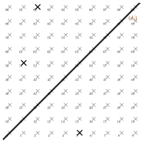
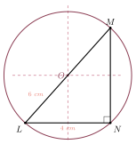



1
---Q---
Quel est le carré de $12$ ?
---CORR---
Le carré d'un nombre est ce nombre multiplié par lui-même : $12\times12={\color{#EB7F73}\boldsymbol{144}}$


2
---Q---
On tire une boule au hasard dans une urne contenant $5$ boules noires et $13$ boules blanches. Quelle est la probabilité d'obtenir une boule blanche ? On donnera le résultat sous forme d'une fraction irréductible.
---CORR---
Dans une situation d'équiprobabilité, on calcule la probabilité d'un événement par le quotient : $\dfrac{\text{Nombre d'issues favorables}}{\text{Nombre total d'issues}}$. La probabilité est donc donnée par : $\dfrac{\text{Nombre de boules blanches}}{\text{Nombre total de boules}} = {\color{#EB7F73}\boldsymbol{\dfrac{13}{18}}}$


3
---Q---
$c$ étant un nombre entier, exprimer l'entier précédent en fonction de $c$.
---CORR---
Le prédécesseur de $c$ peut se noter : ${\color{#EB7F73}\boldsymbol{c-1}}$ ou ${\color{#EB7F73}\boldsymbol{c+(-1)}}$.


4
---Q---
Donner l'égalité de Pythagore.
 

---CORR---
Le triangle $VWX$ est rectangle en $V$. D'après le théorème de Pythagore, on a : ${\color{#EB7F73}\boldsymbol{WX^2=VW^2+VX^2}}$


5
---Q---
Donner le numéro du symétrique des points $51$, $5$ et $92$ par rapport à la droite $(d_1)$.
 

---CORR---
a. Le symétrique du point $51$ par rapport à $(d_1)$ est le point ${\color{#EB7F73}\boldsymbol{15}}$. b. Le symétrique du point $5$ par rapport à $(d_1)$ est le point ${\color{#EB7F73}\boldsymbol{50}}$. c. Le symétrique du point $92$ par rapport à $(d_1)$ est le point ${\color{#EB7F73}\boldsymbol{29}}$.







---Q---
Calculer $A = (x + 12)(x + 14)$, pour $x = -12$.
---CORR---
$A = (-12 + 12) \times (-12 + 14)$ $A = 0 \times 2$ $A = {\color{#EB7F73}\boldsymbol{0}}$



---Q---
Dans l'égalité « $9 \times 2 = 18$ », comment s'appelle le nombre $18$ ?
---CORR---
Dans l'égalité « $9 \times 2 = 18$ », $18$ s'appelle le produit de $9$ et $2$.



---Q---
Calculer de tête $\sqrt{1}$.
---CORR---
$\sqrt{1}={\color{#EB7F73}\boldsymbol{1}}$



---Q---
$YJIK$ est un parallélogramme tel que ses diagonales $[YI]$ et $[JK]$ ont la même longueur et sont perpendiculaires. Déterminer la nature de $YJIK$ en justifiant la réponse.
---CORR---
On sait que $[YI]\perp[JK]$ et $YI=JK$. Si un parallélogramme a des diagonales perpendiculaires et de même longueur, alors c'est un carré. $YJIK$ est donc un carré.



---Q---
On choisit au hasard un plat dans la vitrine d'un fast-food.
 
a. Compléter le tableau des effectifs suivants :
<table style="border-collapse:collapse;margin:0.8rem auto;font-size:0.9rem">
<tr><th style="background:#FDF2F4;color:#8B3C52;border:1px solid #ddb8c0;padding:6px 12px;font-weight:600">&nbsp;</th><th style="background:#FDF2F4;color:#8B3C52;border:1px solid #ddb8c0;padding:6px 12px;font-weight:600">Pizzas</th><th style="background:#FDF2F4;color:#8B3C52;border:1px solid #ddb8c0;padding:6px 12px;font-weight:600">Tourtes</th><th style="background:#FDF2F4;color:#8B3C52;border:1px solid #ddb8c0;padding:6px 12px;font-weight:600">Total</th></tr>
<tr><th style="background:#FDF2F4;color:#8B3C52;border:1px solid #ddb8c0;padding:6px 12px;font-weight:600">Végétariennes</th><td style="border:1px solid #ddb8c0;padding:6px 12px;text-align:center;color:#2D2226">$5$</td><td style="border:1px solid #ddb8c0;padding:6px 12px;color:#2D2226"></td><td style="border:1px solid #ddb8c0;padding:6px 12px;text-align:center;color:#2D2226">$12$</td></tr>
<tr><th style="background:#FDF2F4;color:#8B3C52;border:1px solid #ddb8c0;padding:6px 12px;font-weight:600">Carnées</th><td style="border:1px solid #ddb8c0;padding:6px 12px;text-align:center;color:#2D2226">$9$</td><td style="border:1px solid #ddb8c0;padding:6px 12px;color:#2D2226"></td><td style="border:1px solid #ddb8c0;padding:6px 12px;color:#2D2226"></td></tr>
<tr><th style="background:#FDF2F4;color:#8B3C52;border:1px solid #ddb8c0;padding:6px 12px;font-weight:600">Total</th><td style="border:1px solid #ddb8c0;padding:6px 12px;color:#2D2226"></td><td style="border:1px solid #ddb8c0;padding:6px 12px;text-align:center;color:#2D2226">$13$</td><td style="border:1px solid #ddb8c0;padding:6px 12px;color:#2D2226"></td></tr>
</table>
 
b. Quelle est la probabilité que le plat choisi soit une pizza végétarienne ou une tourte végétarienne ? c. Quelle est la probabilité que le plat choisi soit une tourte ? d. On sait que le plat choisi est une pizza. Quelle est la probabilité que ce soit une pizza végétarienne ?
---CORR---
a. Voici le tableau des effectifs :
<table style="border-collapse:collapse;margin:0.8rem auto;font-size:0.9rem">
<tr><th style="background:#FDF2F4;color:#8B3C52;border:1px solid #ddb8c0;padding:6px 12px;font-weight:600">&nbsp;</th><th style="background:#FDF2F4;color:#8B3C52;border:1px solid #ddb8c0;padding:6px 12px;font-weight:600">Pizzas</th><th style="background:#FDF2F4;color:#8B3C52;border:1px solid #ddb8c0;padding:6px 12px;font-weight:600">Tourtes</th><th style="background:#FDF2F4;color:#8B3C52;border:1px solid #ddb8c0;padding:6px 12px;font-weight:600">Total</th></tr>
<tr><th style="background:#FDF2F4;color:#8B3C52;border:1px solid #ddb8c0;padding:6px 12px;font-weight:600">Végétariennes</th><td style="border:1px solid #ddb8c0;padding:6px 12px;text-align:center;color:#2D2226">$5$</td><td style="border:1px solid #ddb8c0;padding:6px 12px;text-align:center;color:#2D2226">${\color{#EB7F73}\boldsymbol{7}}$</td><td style="border:1px solid #ddb8c0;padding:6px 12px;text-align:center;color:#2D2226">$12$</td></tr>
<tr><th style="background:#FDF2F4;color:#8B3C52;border:1px solid #ddb8c0;padding:6px 12px;font-weight:600">Carnées</th><td style="border:1px solid #ddb8c0;padding:6px 12px;text-align:center;color:#2D2226">$9$</td><td style="border:1px solid #ddb8c0;padding:6px 12px;text-align:center;color:#2D2226">${\color{#EB7F73}\boldsymbol{6}}$</td><td style="border:1px solid #ddb8c0;padding:6px 12px;text-align:center;color:#2D2226">${\color{#EB7F73}\boldsymbol{15}}$</td></tr>
<tr><th style="background:#FDF2F4;color:#8B3C52;border:1px solid #ddb8c0;padding:6px 12px;font-weight:600">Total</th><td style="border:1px solid #ddb8c0;padding:6px 12px;text-align:center;color:#2D2226">${\color{#EB7F73}\boldsymbol{14}}$</td><td style="border:1px solid #ddb8c0;padding:6px 12px;text-align:center;color:#2D2226">$13$</td><td style="border:1px solid #ddb8c0;padding:6px 12px;text-align:center;color:#2D2226">${\color{#EB7F73}\boldsymbol{27}}$</td></tr>
</table>
b. Il y a $12$ plats végétariens et $27$ plats donc la probabilité que le plat choisi soit une pizza végétarienne ou une tourte végétarienne est de : ${\color{#EB7F73}\boldsymbol{\dfrac{12}{27}}}$. c. Il y a $13$ tourtes et $27$ plats donc la probabilité que le plat choisi soit une tourte est de : ${\color{#EB7F73}\boldsymbol{\dfrac{13}{27}}}$. d. Il y a $5$ pizzas végétariennes et $14$ pizzas donc la probabilité que le plat choisi soit une pizza végétarienne est de : ${\color{#EB7F73}\boldsymbol{\dfrac{5}{14}}}$.






1
---Q---
Développer et réduire : $A=(7c-5)\times (-8)$
---CORR---
$A=(7c-5)\times (-8)$ $A={\color{#C5607A}\boldsymbol{-8\times 7c+(-8)\times (-5)}}$ En réduisant l'expression, on obtient : $A= {\color{#EB7F73}\boldsymbol{-56c+40}}$


2
---Q---
Comparer : $\dfrac{4}{32}\quad\quad\ldots\quad\quad\dfrac{1}{4}$
---CORR---
$\dfrac{1}{4}= \dfrac{1{\color{#C5607A}\boldsymbol{\times 8}}}{4{\color{#C5607A}\boldsymbol{\times 8}}}=\dfrac{8}{32}\quad$ et $\quad\dfrac{4}{32} < \dfrac{8}{32} \quad$ donc $\quad \dfrac{4}{32} {\color{#EB7F73}\boldsymbol{<}} \dfrac{1}{4}$


3
---Q---
$3{,}1~\text{h} =$ ..... h ..... min
---CORR---
$3{,}1~\text{h} = 3~\text{h} + 0{,}1 \times 60~\text{min} = {\color{#EB7F73}\boldsymbol{3}}~\text{h}~{\color{#EB7F73}\boldsymbol{6}}~\text{min}$


4
---Q---
Construire le cercle circonscrit au triangle suivant.
 

---CORR---
Le triangle $LMN$ est rectangle en $N$ : son cercle circonscrit a donc pour diamètre l'hypoténuse $[LM]$. Le centre $O$ du cercle circonscrit est donc le milieu de $[LM]$, et son rayon est $OL=OM=ON=\dfrac{LM}{2}={\color{#EB7F73}\boldsymbol{3~cm}}$.
 



5
---Q---
Les points $P$, $Z$ et $F$ sont les symétriques respectifs de $Y$, $H$ et $O$ par rapport à $(d)$. Les points $Y$, $H$ et $O$ sont alignés. Les points $P$, $Z$ et $F$ le sont-ils ? Justifier.
 

---CORR---
Les points $P$, $Z$ et $F$ sont les symétriques respectifs de $Y$, $H$ et $O$ par rapport à $(d)$ et sont alignés. Or, la symétrie axiale conserve l'alignement. Donc les points ${\color{#EB7F73}\boldsymbol{P}}$, ${\color{#EB7F73}\boldsymbol{Z}}$ et ${\color{#EB7F73}\boldsymbol{F}}$ sont alignés également.




