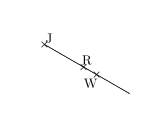
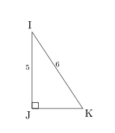
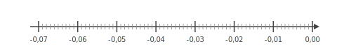
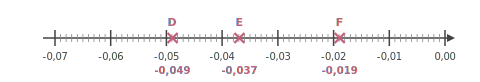
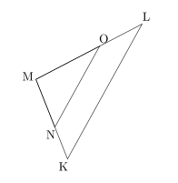




---Q---
Compléter avec le signe < ou >. $$-0{,}3 \quad \ldots   \quad-0{,}8$$
---CORR---
$-0{,}3 \quad {\color{#8B3C52}\boldsymbol{>}} \quad -0{,}8$


---Q---
Choisis le calcul qui permet de résoudre l'équation suivante : $4x+9=15$

      <strong>A</strong>. $\dfrac{15-9}{4}$&emsp;&emsp; 
    <strong>B</strong>. $\dfrac{15}{4}-9$&emsp;&emsp; 
    <strong>C</strong>. $(15-4)-9$&emsp;&emsp; 
    <strong>D</strong>. $15\times 4-9$
---CORR---
$4x+9=15$   
    On enlève $9$ : $4x=15-9$.   
    Puis on divise par $4$ : $x=\dfrac{15-9}{4}$.   
    Bonne réponse : <strong>A</strong>.


---Q---
Dans la figure ci-dessous : 
$\widehat{RJW}$ est un angle :  
    
    	$\square\;$ nul&emsp;&emsp; $\square\;$ aigu&emsp;&emsp; $\square\;$ droit&emsp;&emsp; $\square\;$ obtus&emsp;&emsp; $\square\;$ plat&emsp;&emsp;   
---CORR---
Dans la figure ci-dessous : 
$\widehat{RJW}$ est un angle :  
    
    	$\blacksquare\;$ nul&emsp;&emsp; $\square\;$ aigu&emsp;&emsp; $\square\;$ droit&emsp;&emsp; $\square\;$ obtus&emsp;&emsp; $\square\;$ plat&emsp;&emsp;  
Un angle nul est un angle dont la mesure est égale à 0.  


---Q---
Déterminer la valeur exacte de $JK$.  
---CORR---
On utilise le théorème de Pythagore dans le triangle $IJK$,  rectangle en $J$. 
      On obtient :

 

      $\begin{aligned}
        IJ^2+JK^2&=IK^2\\
        JK^2&=IK^2-IJ^2\\
        JK^2&=6^2-5^2\\
        JK^2&=36-25\\
        JK^2&=11\\
        JK&={\color{#8B3C52}\boldsymbol{\sqrt{11}}}
        \end{aligned}$

 
Mentalement :  
    La longueur $JK$ est donnée par la racine carrée de la différence des carrés de $6$ et de $5$. 
    Cette différence vaut $36-25=11$.  
    La valeur cherchée est donc : $\sqrt{11}$.






---Q---
Déterminer la valeur de $25\,\%$ de $158$.
---CORR---
$25\,\%$ de $158$ :  
    $\dfrac{25 \times 158}{100} = 0{,}25 \times 158 = 39{,}5$.  
    Donc la valeur est <strong>39</strong>.


---Q---
Placer les points : $D(-0{,}049), E(-0{,}037), F(-0{,}019)$.

  
---CORR---



---Q---
Calculer le périmètre exact d'un cercle de rayon $3\text{ cm}$
---CORR---
$\mathcal{P}_\text{cercle} = 2 \times r \times \pi$ $\mathcal{P}_\text{cercle} = 2 \times 3\text{ cm} \times \pi$ $\mathcal{P}_\text{cercle} = {\color{#8B3C52}\boldsymbol{6\pi}}\text{ cm}$


---Q---
Sur la figure suivante : 
          $\leadsto N$ est sur $[MK]$,
          $\leadsto O$ est sur $[ML]$,  $\leadsto$ les droites $(KL)$ et $(NO)$ sont parallèles. Écrire la double égalité de Thalès.  
---CORR---
Dans le triangle $KLM$ :
         $\leadsto$ $N\in[MK]$,
         $\leadsto$ $O\in[ML]$,
         $\leadsto$  $(KL)//(NO)$,
         donc d'après le théorème de Thalès, les triangles $KLM$ et $NOM$ ont des longueurs proportionnelles.

 
$\dfrac{MN}{MK}=\dfrac{MO}{ML}=\dfrac{NO}{KL}$ <strong>Remarque</strong> On pourrait aussi écrire : $\dfrac{MK}{MN}=\dfrac{ML}{MO}=\dfrac{KL}{NO}$






---Q---
Donner l'écriture décimale de $8{,}67 \times 10^{-1}$.
---CORR---
$8{,}67 \times 10^{-1} = {\color{#8B3C52}\mathbf{0{,}867}}$.


---Q---
Sur une carte sur laquelle $6\text{ cm}$ représente $15{,}6\text{ km}$ dans la réalité,  
  Béatrice mesure son trajet et elle trouve une distance de $7\text{ cm}$.  À quelle distance cela correspond dans la réalité ?
---CORR---
Commençons par trouver à combien de $\text{km}$ dans la réalité, $1\text{ cm}$ sur la carte correspond.  
  $1\text{ cm}$, c'est ${\color{#C5607A}\boldsymbol{6}}$ fois moins que $6\text{ cm}$. $15{,}6\text{ km}\div {\color{#C5607A}\boldsymbol{6}} = 2{,}6\text{ km}$   $1\text{ cm}$ sur la carte correspond donc à ${\color{#C5607A}\boldsymbol{2{,}6}}\text{ km}$ dans la réalité.   Cherchons maintenant la distance réelle de son trajet.   $7\text{ cm}$, c'est ${\color{#C5607A}\boldsymbol{7}}$ fois $1\text{ cm}$.  ${\color{#C5607A}\boldsymbol{2{,}6}}\text{ km}\times {\color{#C5607A}\boldsymbol{7}} = 18{,}2\text{ km}$  son trajet correspond en réalité à une distance de ${\color{#8B3C52}\boldsymbol{18{,}2}}\text{ km}$.


---Q---
Donner le nom du solide suivant : 
---CORR---
Cône de révolution


---Q---
Dans le triangle $SBY$, rectangle en $B$, quel calcul doit-on effectuer pour déterminer le cosinus de l’angle $\widehat{BSY}$ ? 
---CORR---
La bonne formule est :  
    $\text{cosinus}(\widehat{BSY}) = \dfrac{\text{longueur du côté adjacent à l’angle } \widehat{BSY}}{\text{longueur de l’hypoténuse }}=\dfrac{SB}{SY}$.



