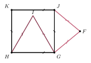
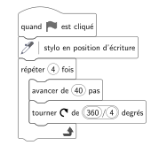
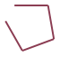
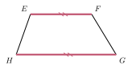



1
---Q---
Calculer : $A = x^2 + 4x$, pour $x = -2$.
---CORR---
$A = -2 \times (-2) + 4 \times (-2)$ $A = 4 + (-8)$ $A = {\color{#EB7F73}\boldsymbol{-4}}$


2
---Q---
Calculer : $A = (10+1)(5+2)$
---CORR---
$A = (10+1)(5+2)$ $A = 11 \times 7$ $A = {\color{#EB7F73}\boldsymbol{77}}$


3
---Q---
Un angle obtus mesure entre $\ldots^\circ$ et $\ldots^\circ$.
---CORR---
Un angle obtus mesure entre ${\color{#EB7F73}\boldsymbol{90}}^\circ$ et ${\color{#EB7F73}\boldsymbol{180}}^\circ$.


4
---Q---
$KJGH$ est un carré et $HGI$ est un triangle équilatéral ($I$ est à l'intérieur du carré $KJGH$). $JGF$ est un triangle isocèle en $F$ ($F$ est à l'extérieur du carré $KJGH$). Représenter cette configuration par un schéma à main levée et ajouter les codages nécessaires.
---CORR---
Voilà ci-dessous un schéma qui pourrait convenir à la situation : le carré $KJGH$, le triangle équilatéral $HGI$ avec $I$ à l'intérieur du carré (ses trois côtés sont codés comme égaux), et le triangle isocèle en $F$, $JGF$, à l'extérieur du carré (ses côtés $FJ$ et $FG$ sont codés comme égaux).
 



5
---Q---
Laquelle des 4 figures ci-dessous va être tracée avec le script fourni ?
  

 

  
  
  
  

---CORR---
Le script répète $4$ fois : avancer + tourner de $360\div4=90°$. Cela trace un carré.






1
---Q---
Développer et réduire : $A=(7y-3)\times (-5y)$
---CORR---
$A=(7y-3)\times (-5y)$ $A={\color{#C5607A}\boldsymbol{-5y\times 7y+(-5y)\times (-3)}}$ En réduisant l'expression, on obtient : $A= {\color{#EB7F73}\boldsymbol{-35y^2+15y}}$


2
---Q---
Traduire la phrase par un calcul : Le quotient de la somme de 8 et 20 par 2.
---CORR---
Le quotient de la somme de 8 et 20 par 2 s'écrit : ${\color{#EB7F73}\boldsymbol{(8+20) \div 2}}$ ou ${\color{#EB7F73}\boldsymbol{\dfrac{8+20}{2}}}$.


3
---Q---
Un angle saillant mesure entre $\ldots^\circ$ et $\ldots^\circ$.
---CORR---
Un angle saillant mesure entre ${\color{#EB7F73}\boldsymbol{0}}^\circ$ et ${\color{#EB7F73}\boldsymbol{180}}^\circ$.


4
---Q---
$1~\text{dm}^2 = \dfrac{1}{\ldots}~\text{m}^2$
---CORR---
$1~\text{dm}^2$ est égal à un centième de $1~\text{m}^2$. $1~\text{dm}^2 = \dfrac{1}{{\color{#EB7F73}\boldsymbol{100}}}~\text{m}^2$


5
---Q---
Vrai ou faux, $EFGH$ est un parallélogramme.
 $(EF) \parallel (GH)$ et :
 

---CORR---
$EFGH$ a deux côtés opposés parallèles, ${\color{#EB7F73}\boldsymbol{EFGH}}$ n'est donc pas forcément un parallélogramme comme le montre le contre-exemple suivant (il s'agit d'un trapèze).
 







1
---Q---
Développer et réduire : $A=-4(-9b-1)$
---CORR---
$A=-4(-9b-1)$ $A={\color{#C5607A}\boldsymbol{-4\times (-9b)+(-4)\times (-1)}}$ En réduisant l'expression, on obtient : $A= {\color{#EB7F73}\boldsymbol{36b+4}}$


2
---Q---
Quel est l'inverse de $5$ ?
---CORR---
L'inverse de $5$ est ${\color{#EB7F73}\boldsymbol{0{,}2}}$ car $5 \times 0{,}2 = 1$.


3
---Q---
$PMXU$ est un parallélogramme tel que ses diagonales $[PX]$ et $[MU]$ ont la même longueur. Déterminer la nature de $PMXU$ en justifiant la réponse.
---CORR---
On sait que $PX=MU$. Si un parallélogramme a des diagonales de même longueur, alors c'est un rectangle. $PMXU$ est donc un rectangle.


4
---Q---
$FD^2= \,\,\ldots$
 

---CORR---
Le triangle $EDF$ est rectangle en $E$. D'après le théorème de Pythagore, on a : ${\color{#EB7F73}\boldsymbol{FD^2=FE^2+ED^2}}$


5
---Q---
Le joueur d'un jeu télévisé doit lancer un dé à 6 faces numérotées de 1 à 6. Ensuite, il tire une boule dans une urne contenant 6 boules indiscernables au toucher. Ces boules sont numérotées de 1 à 6 et sont rouges ou bleues. Il gagne s'il tire une boule bleue dont le numéro est supérieur ou égal au numéro obtenu avec le dé. Voici l'urne utilisée : La boule 1 est bleue ; la boule 2 est rouge ; la boule 3 est rouge ; la boule 4 est rouge ; la boule 5 est bleue ; la boule 6 est rouge. Calculer la probabilité de gagner à ce jeu.
---CORR---
Pour gagner, le joueur doit tirer une boule bleue dont le numéro est supérieur ou égal au numéro obtenu avec le dé. On remplit le tableau à double entrée des issues possibles :
<table style="border-collapse:collapse;margin:0.8rem auto;font-size:0.9rem">
<tr><th style="background:#FDF2F4;color:#8B3C52;border:1px solid #ddb8c0;padding:6px 12px;font-weight:600">Dé \ Boule</th><th style="background:#FDF2F4;color:#8B3C52;border:1px solid #ddb8c0;padding:6px 12px;font-weight:600">1 (bleue)</th><th style="background:#FDF2F4;color:#8B3C52;border:1px solid #ddb8c0;padding:6px 12px;font-weight:600">2 (rouge)</th><th style="background:#FDF2F4;color:#8B3C52;border:1px solid #ddb8c0;padding:6px 12px;font-weight:600">3 (rouge)</th><th style="background:#FDF2F4;color:#8B3C52;border:1px solid #ddb8c0;padding:6px 12px;font-weight:600">4 (rouge)</th><th style="background:#FDF2F4;color:#8B3C52;border:1px solid #ddb8c0;padding:6px 12px;font-weight:600">5 (bleue)</th><th style="background:#FDF2F4;color:#8B3C52;border:1px solid #ddb8c0;padding:6px 12px;font-weight:600">6 (rouge)</th></tr>
<tr><th style="background:#FDF2F4;color:#8B3C52;border:1px solid #ddb8c0;padding:6px 12px;font-weight:600">1</th><td style="border:1px solid #ddb8c0;padding:6px 12px;text-align:center;color:#2D2226"><strong>gagné</strong></td><td style="border:1px solid #ddb8c0;padding:6px 12px;text-align:center;color:#2D2226">perdu</td><td style="border:1px solid #ddb8c0;padding:6px 12px;text-align:center;color:#2D2226">perdu</td><td style="border:1px solid #ddb8c0;padding:6px 12px;text-align:center;color:#2D2226">perdu</td><td style="border:1px solid #ddb8c0;padding:6px 12px;text-align:center;color:#2D2226"><strong>gagné</strong></td><td style="border:1px solid #ddb8c0;padding:6px 12px;text-align:center;color:#2D2226">perdu</td></tr>
<tr><th style="background:#FDF2F4;color:#8B3C52;border:1px solid #ddb8c0;padding:6px 12px;font-weight:600">2</th><td style="border:1px solid #ddb8c0;padding:6px 12px;text-align:center;color:#2D2226">perdu</td><td style="border:1px solid #ddb8c0;padding:6px 12px;text-align:center;color:#2D2226">perdu</td><td style="border:1px solid #ddb8c0;padding:6px 12px;text-align:center;color:#2D2226">perdu</td><td style="border:1px solid #ddb8c0;padding:6px 12px;text-align:center;color:#2D2226">perdu</td><td style="border:1px solid #ddb8c0;padding:6px 12px;text-align:center;color:#2D2226"><strong>gagné</strong></td><td style="border:1px solid #ddb8c0;padding:6px 12px;text-align:center;color:#2D2226">perdu</td></tr>
<tr><th style="background:#FDF2F4;color:#8B3C52;border:1px solid #ddb8c0;padding:6px 12px;font-weight:600">3</th><td style="border:1px solid #ddb8c0;padding:6px 12px;text-align:center;color:#2D2226">perdu</td><td style="border:1px solid #ddb8c0;padding:6px 12px;text-align:center;color:#2D2226">perdu</td><td style="border:1px solid #ddb8c0;padding:6px 12px;text-align:center;color:#2D2226">perdu</td><td style="border:1px solid #ddb8c0;padding:6px 12px;text-align:center;color:#2D2226">perdu</td><td style="border:1px solid #ddb8c0;padding:6px 12px;text-align:center;color:#2D2226"><strong>gagné</strong></td><td style="border:1px solid #ddb8c0;padding:6px 12px;text-align:center;color:#2D2226">perdu</td></tr>
<tr><th style="background:#FDF2F4;color:#8B3C52;border:1px solid #ddb8c0;padding:6px 12px;font-weight:600">4</th><td style="border:1px solid #ddb8c0;padding:6px 12px;text-align:center;color:#2D2226">perdu</td><td style="border:1px solid #ddb8c0;padding:6px 12px;text-align:center;color:#2D2226">perdu</td><td style="border:1px solid #ddb8c0;padding:6px 12px;text-align:center;color:#2D2226">perdu</td><td style="border:1px solid #ddb8c0;padding:6px 12px;text-align:center;color:#2D2226">perdu</td><td style="border:1px solid #ddb8c0;padding:6px 12px;text-align:center;color:#2D2226"><strong>gagné</strong></td><td style="border:1px solid #ddb8c0;padding:6px 12px;text-align:center;color:#2D2226">perdu</td></tr>
<tr><th style="background:#FDF2F4;color:#8B3C52;border:1px solid #ddb8c0;padding:6px 12px;font-weight:600">5</th><td style="border:1px solid #ddb8c0;padding:6px 12px;text-align:center;color:#2D2226">perdu</td><td style="border:1px solid #ddb8c0;padding:6px 12px;text-align:center;color:#2D2226">perdu</td><td style="border:1px solid #ddb8c0;padding:6px 12px;text-align:center;color:#2D2226">perdu</td><td style="border:1px solid #ddb8c0;padding:6px 12px;text-align:center;color:#2D2226">perdu</td><td style="border:1px solid #ddb8c0;padding:6px 12px;text-align:center;color:#2D2226"><strong>gagné</strong></td><td style="border:1px solid #ddb8c0;padding:6px 12px;text-align:center;color:#2D2226">perdu</td></tr>
<tr><th style="background:#FDF2F4;color:#8B3C52;border:1px solid #ddb8c0;padding:6px 12px;font-weight:600">6</th><td style="border:1px solid #ddb8c0;padding:6px 12px;text-align:center;color:#2D2226">perdu</td><td style="border:1px solid #ddb8c0;padding:6px 12px;text-align:center;color:#2D2226">perdu</td><td style="border:1px solid #ddb8c0;padding:6px 12px;text-align:center;color:#2D2226">perdu</td><td style="border:1px solid #ddb8c0;padding:6px 12px;text-align:center;color:#2D2226">perdu</td><td style="border:1px solid #ddb8c0;padding:6px 12px;text-align:center;color:#2D2226">perdu</td><td style="border:1px solid #ddb8c0;padding:6px 12px;text-align:center;color:#2D2226">perdu</td></tr>
</table>
Il y a $6$ issues gagnantes parmi $36$ issues possibles. La probabilité de gagner à ce jeu est donc de $\dfrac{6}{36}={\color{#EB7F73}\boldsymbol{\dfrac{1}{6}}}$.



