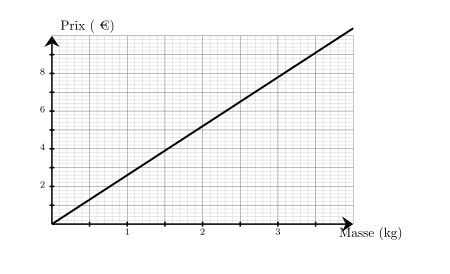
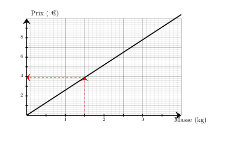
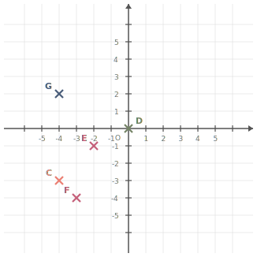
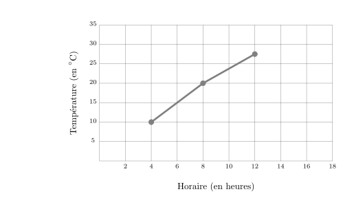
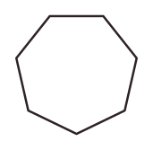
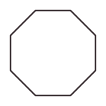
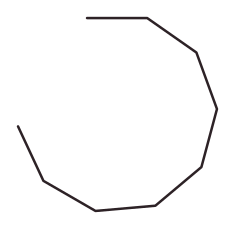
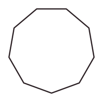
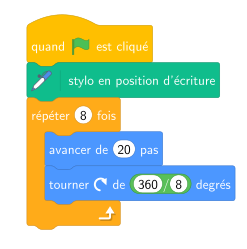




---Q---
Calculer le carré de $8$
---CORR---
$8^2={\color{#8B3C52}\boldsymbol{64}}$


---Q---
Sur le graphique ci-dessus, on a représenté le prix en euros en fonction de la masse en kilogrammes d'ananas achetés. Quel est le prix à payer pour l'achat de $1{,}5$ kg d'ananas ? 
---CORR---
Le prix à payer pour l'achat de $1{,}5$ kg d'ananas est de ${\color{#8B3C52}\boldsymbol{3{,}90}}$ €. 


---Q---
Convertir $1\,472\,\text{h}$  en semaines, jours et heures.
---CORR---
$1\,472\,\text{h} = (61\times24\,\text{h}) + 8\,\text{h} = 61\,\text{j}\,8\,\text{h} = (8\times7\,\text{j}) + 5\,\text{j} + 8\,\text{h} = {\color{#8B3C52}\boldsymbol{8\,\mathbf{semaines}\,5\,\mathbf{j}\,8\,\mathbf{h}}}$


---Q---
Dans une collection comptant 250 disques, on a noté leur style de musique. On a consigné les résultats dans le tableau suivant : 
 
$$\begin{array}{|c|c|c|c|c|c|c|c|c|c|c|}
\hline
  \text{Styles} &   \text{RnB} &   \text{Rap} &   \text{Pop} &   \text{Jazz} &   \text{Folk} &   \text{Reggae} &   \text{Électro} &   \text{Soul} &   \text{Rock} &   \text{TOTAL}\\
\hline
  \text{Effectifs} & 18 & 7 & 16 & 5 & 42 & 56 & 34 &  & 38 & 250\\
\hline
   \text{Fréquences} &  &  &  &  &  &  &  &  &  & \\
\hline
 \end{array}$$
 
<strong>a.</strong> Déterminer l'effectif manquant. 
<strong>b.</strong> Déterminer les fréquences pour chaque style de musique (en pourcentage, arrondir au dixième si besoin). 
---CORR---
<strong>a.</strong> L'effectif manquant est celui du soul. Soit $e$ cet effectif. $e=250-( 18 + 7 + 16 + 5 + 42 + 56 + 34 + 38 )$ $e=250-216$ $e={\color{#8B3C52}\boldsymbol{34}}$ 
<strong>b.</strong> Calculs des fréquences. On rappelle que pour la fréquence relative à une valeur est donnée par le quotient : $\dfrac{\text{effectif de la valeur}}{\text{effectif total}}$ 

 
On en déduit donc les calculs suivants : 

 
$$ \def\arraystretch{2}
\begin{array}{|c|c|c|c|c|c|c|c|c|c|}
\hline
   &   \text{RnB} &   \text{Rap} &   \text{Pop} &   \text{Jazz} &   \text{Folk} &   \text{Reggae} &   \text{Électro} &   \text{Soul} &   \text{Rock}\\
\hline
  \mathbf{Fréquences} & \dfrac{18}{250} & \dfrac{7}{250} & \dfrac{16}{250} & \dfrac{5}{250} & \dfrac{42}{250} & \dfrac{56}{250} & \dfrac{34}{250} & \dfrac{34}{250} & \dfrac{38}{250}\\
\hline
   \mathbf{Fréquences\, en\, pourcentages} & {\color{#8B3C52}\boldsymbol{7{,}2 \,\%}} & {\color{#8B3C52}\boldsymbol{2{,}8 \,\%}} & {\color{#8B3C52}\boldsymbol{6{,}4 \,\%}} & {\color{#8B3C52}\boldsymbol{2 \,\%}} & {\color{#8B3C52}\boldsymbol{16{,}8 \,\%}} & {\color{#8B3C52}\boldsymbol{22{,}4 \,\%}} & {\color{#8B3C52}\boldsymbol{13{,}6 \,\%}} & {\color{#8B3C52}\boldsymbol{13{,}6 \,\%}} & {\color{#8B3C52}\boldsymbol{15{,}2 \,\%}}\\
\hline
 \end{array}
 $$
 






---Q---
Dans chaque colonne de ce tableau, il y a un unique nombre exprimé sous 3 formes différentes. Compléter ce tableau. 
$$\def\arraystretch{2}
    \begin{array}{|c|c|c|c|c|c|c|}
    \hline
      \text{Nombre décimal} & \phantom{rrr} & 0{,}13 & \phantom{rrr} & \phantom{rrr} & 0{,}22 & \phantom{rrr}\\
    \hline
      \text{Fraction décimale} & \phantom{rrr} & \phantom{rrr} & \dfrac{64}{100} & \phantom{rrr} & \phantom{rrr} & \dfrac{50}{100}\\
    \hline
      \text{Pourcentage} & 90\,\% & \phantom{rrr}\% & \phantom{rrr}\% & 40\,\% & \phantom{rrr}\% & \phantom{rrr}\%\\
    \hline
    \end{array}
    $$
---CORR---
$$\def\arraystretch{2}
    \begin{array}{|c|c|c|c|c|c|c|}
    \hline
      \text{Nombre décimal} & \color{F15929}{\mathbf{0{,}9}} & 0{,}13 & \color{F15929}{\mathbf{0{,}64}} & \color{F15929}{\mathbf{0{,}4}} & 0{,}22 & \color{F15929}{\mathbf{0{,}5}}\\
    \hline
      \text{Fraction décimale} &
    \color{F15929}{\mathbf{\frac{90}{100}}} &
    \color{F15929}{\mathbf{\frac{13}{100}}} &
    \frac{64}{100} &
    \color{F15929}{\mathbf{\frac{40}{100}}} &
    \color{F15929}{\mathbf{\frac{22}{100}}} &
    \frac{50}{100}\\
    \hline
      \text{Pourcentage} &
    90\,\% &
    \color{F15929}{\mathbf{13}}\,\% &
    \color{F15929}{\mathbf{64}}\,\% &
    40\,\% &
    \color{F15929}{\mathbf{22}}\,\% &
    \color{F15929}{\mathbf{50}}\,\%\\
    \hline
    \end{array}
    $$


---Q---
$c$ étant un nombre entier, exprimer l'entier précédent en fonction de $c$.
---CORR---
Le prédécesseur de $c$ peut se noter : ${\color{#8B3C52}\boldsymbol{c-1}}$ ou ${\color{#8B3C52}\boldsymbol{c+(-1)}}$.


---Q---
Déterminer les coordonnées respectives des points $F$, $C$, $D$, $G$ et $E$  
---CORR---
Les coordonnées respectives des points sont :  $F({\color{#8B3C52}\boldsymbol{-3}};{\color{#8B3C52}\boldsymbol{-4}})$, $C({\color{#8B3C52}\boldsymbol{-4}};{\color{#8B3C52}\boldsymbol{-3}})$, $D({\color{#8B3C52}\boldsymbol{0}};{\color{#8B3C52}\boldsymbol{0}})$, $G({\color{#8B3C52}\boldsymbol{-4}};{\color{#8B3C52}\boldsymbol{2}})$ et $E({\color{#8B3C52}\boldsymbol{-2}};{\color{#8B3C52}\boldsymbol{-1}})$


---Q---
Le graphique ci-dessous donne l’évolution de la température (en degrés Celsius) en
fonction de l’horaire (en heures). 
Entre $4$h et $12$h, de combien de degrés la température a-t-elle augmenté ? 
  
---CORR---
D’après le graphique, à $4$h, la température est de $10$$^\circ$ C et à $12$h, elle est de $27{,}5$$^\circ$ C. 
    L’augmentation de la température entre $4$h et $12$h est donc de : $27{,}5-10={\color{#8B3C52}\boldsymbol{17{,}5}}$$^\circ$ C.






---Q---
Calculer. $ (+3)  \times (-10)$
---CORR---
$ {\color{blue}\boldsymbol{(+3)}} \times {\color{#A4485F}\boldsymbol{(-10)}}  = {\color{#8B3C52}\boldsymbol{(-30)}} $


---Q---
Résoudre l'équation suivante : $\dfrac{x}{10}=13$
---CORR---
$\dfrac{x}{10}=13$ $\dfrac{x}{10}{\color{blue}\boldsymbol{\times\,10}}=13{\color{blue}\boldsymbol{\times\,10}}$ $x=130$  La solution de l'équation $\dfrac{x}{10}=13$ est ${\color{#8B3C52}\boldsymbol{130}}$.


---Q---
Les angles $\widehat{xOy}$ et $\widehat{yOz}$ sont adjacents. 
            L'angle $\widehat{xOy}$ mesure $76^\circ$ et l'angle $\widehat{yOz}$ mesure $104^\circ$. 
            Que sont-ils l'un pour l'autre ?  
    
    	$\square\;$ complémentaires&emsp;&emsp; $\square\;$ supplémentaires&emsp;&emsp; $\square\;$ ni l'un, ni l'autre&emsp;&emsp;  
---CORR---
$\widehat{xOy}+\widehat{yOz}=76^\circ+104^\circ=180^\circ$. Les deux angles sont supplémentaires car leurs côtés non communs forment un angle plat.


---Q---
Laquelle des 4 figures ci-dessous va être tracée avec le script fourni ?

  

    
    
Figure 1

  

  

    
    
Figure 2

  

  

    
    
Figure 3

  

  

    
    
Figure 4

  

 
---CORR---
    Figure 2



