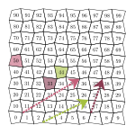
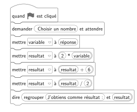
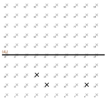



1
---Q---
Développer et réduire : $A=-9(-5z+7)+6$
---CORR---
$A=-9(-5z+7)+6$ $A={\color{#C5607A}\boldsymbol{-9\times (-5z)+(-9)\times 7+6}}$ En réduisant l'expression, on obtient : $A= {\color{#EB7F73}\boldsymbol{45z-57}}$


2
---Q---
Quel est le carré de $9$ ?
---CORR---
Le carré d'un nombre est ce nombre multiplié par lui-même : $9\times9={\color{#EB7F73}\boldsymbol{81}}$


3
---Q---
Calculer de tête $\sqrt{144}$.
---CORR---
$\sqrt{144}={\color{#EB7F73}\boldsymbol{12}}$


4
---Q---
On tire une carte au hasard dans un paquet contenant $8$ cartes rouges et $6$ cartes vertes. Quelle est la probabilité d'obtenir une carte verte ? On donnera le résultat sous forme d'une fraction irréductible.
---CORR---
Dans une situation d'équiprobabilité, on calcule la probabilité d'un événement par le quotient : $\dfrac{\text{Nombre d'issues favorables}}{\text{Nombre total d'issues}}$. La probabilité est donc donnée par : $\dfrac{\text{Nombre de cartes vertes}}{\text{Nombre total de cartes}} =\dfrac{6}{14} =\dfrac{3{\color{#C5607A}\boldsymbol{\times2}}}{7{\color{#C5607A}\boldsymbol{\times2}}}={\color{#EB7F73}\boldsymbol{\dfrac{3}{7}}}$


5
---Q---
a. Dans la translation qui transforme la figure 3 en la figure 27, quel est le numéro de l'image de la figure 44 ? b. Dans la translation qui transforme la figure 11 en la figure 46, quel est le numéro de l'image de la figure 50 ? c. Dans la translation qui transforme la figure 17 en la figure 48, quel est le numéro de l'image de la figure 33 ?
 

---CORR---
a. La figure image de la figure $44$ dans la translation qui transforme la figure 3 en la figure 27 porte le numéro ${\color{#EB7F73}\boldsymbol{68}}$. b. La figure image de la figure $50$ dans la translation qui transforme la figure 11 en la figure 46 porte le numéro ${\color{#EB7F73}\boldsymbol{85}}$. c. La figure image de la figure $33$ dans la translation qui transforme la figure 17 en la figure 48 porte le numéro ${\color{#EB7F73}\boldsymbol{64}}$.







---Q---
Factoriser l'expression suivante : $A=-2n+10x$
---CORR---
$A=-2n+10x$ $A=-2n+2\times5x$ $A= {\color{#EB7F73}\boldsymbol{2(-n+5x)}}$



---Q---
Calculer : $A = 3(2+7)-2(4+5)$
---CORR---
$A = 3(2+7)-2(4+5)$ $A = 3 \times 9 - 2 \times 9$ $A = 27 - 18$ $A = {\color{#EB7F73}\boldsymbol{9}}$



---Q---
$WRUS$ est un rectangle.  
Ses diagonales se coupent en $T$.  
$TRVU$ est un losange. 
Fais une figure à main levée, puis la coder.
---CORR---
Voilà ci-dessous un schéma qui pourrait convenir à la situation.



---Q---
Soit $UVW$ un triangle rectangle en $W$ tel que $VW=3~\text{cm}$ et $VU=7~\text{cm}$. Fais une figure à main levée, la coder puis placer le centre du cercle circonscrit.
---CORR---
Voici la construction qu'il fallait réaliser. Pour cette construction, nous avons utilisé la règle graduée, le compas et l'équerre.



---Q---
On choisit au hasard un fruit dans un panier contenant des pommes et des poires.
 
a. Compléter le tableau :
<table style="border-collapse:collapse;margin:0.8rem auto;font-size:0.9rem">
<tr><th style="background:#FDF2F4;color:#8B3C52;border:1px solid #ddb8c0;padding:6px 12px;font-weight:600">&nbsp;</th><th style="background:#FDF2F4;color:#8B3C52;border:1px solid #ddb8c0;padding:6px 12px;font-weight:600">Pommes</th><th style="background:#FDF2F4;color:#8B3C52;border:1px solid #ddb8c0;padding:6px 12px;font-weight:600">Poires</th><th style="background:#FDF2F4;color:#8B3C52;border:1px solid #ddb8c0;padding:6px 12px;font-weight:600">Total</th></tr>
<tr><th style="background:#FDF2F4;color:#8B3C52;border:1px solid #ddb8c0;padding:6px 12px;font-weight:600">Vertes</th><td style="border:1px solid #ddb8c0;padding:6px 12px;text-align:center;color:#2D2226">$5$</td><td style="border:1px solid #ddb8c0;padding:6px 12px;color:#2D2226"></td><td style="border:1px solid #ddb8c0;padding:6px 12px;text-align:center;color:#2D2226">$12$</td></tr>
<tr><th style="background:#FDF2F4;color:#8B3C52;border:1px solid #ddb8c0;padding:6px 12px;font-weight:600">Mûres</th><td style="border:1px solid #ddb8c0;padding:6px 12px;text-align:center;color:#2D2226">$8$</td><td style="border:1px solid #ddb8c0;padding:6px 12px;color:#2D2226"></td><td style="border:1px solid #ddb8c0;padding:6px 12px;color:#2D2226"></td></tr>
<tr><th style="background:#FDF2F4;color:#8B3C52;border:1px solid #ddb8c0;padding:6px 12px;font-weight:600">Total</th><td style="border:1px solid #ddb8c0;padding:6px 12px;color:#2D2226"></td><td style="border:1px solid #ddb8c0;padding:6px 12px;text-align:center;color:#2D2226">$12$</td><td style="border:1px solid #ddb8c0;padding:6px 12px;color:#2D2226"></td></tr>
</table>
 
b. Il y a 12 fruits verts et 25 fruits donc la probabilité que le fruit choisi soit une pomme verte ou une poire verte est de ....
---CORR---
a. Tout d'abord, on a $12$ fruits verts et $5$ pommes vertes soit $12-5={\color{#EB7F73}\boldsymbol{7}}$ poires vertes. Il y a $5$ pommes vertes et $8$ pommes mûres soit $5+8={\color{#EB7F73}\boldsymbol{13}}$ pommes au total. Il y a $13$ pommes et $12$ poires soit $13+12={\color{#EB7F73}\boldsymbol{25}}$ fruits au total. Il y a $12$ vertes et $25$ fruits soit $25-12={\color{#EB7F73}\boldsymbol{13}}$ mûres au total. Enfin, il y a $8$ pommes mûres et $13$ mûres soit $13-8={\color{#EB7F73}\boldsymbol{5}}$ poires mûres. Voici le tableau des effectifs :
<table style="border-collapse:collapse;margin:0.8rem auto;font-size:0.9rem">
<tr><th style="background:#FDF2F4;color:#8B3C52;border:1px solid #ddb8c0;padding:6px 12px;font-weight:600">&nbsp;</th><th style="background:#FDF2F4;color:#8B3C52;border:1px solid #ddb8c0;padding:6px 12px;font-weight:600">Pommes</th><th style="background:#FDF2F4;color:#8B3C52;border:1px solid #ddb8c0;padding:6px 12px;font-weight:600">Poires</th><th style="background:#FDF2F4;color:#8B3C52;border:1px solid #ddb8c0;padding:6px 12px;font-weight:600">Total</th></tr>
<tr><th style="background:#FDF2F4;color:#8B3C52;border:1px solid #ddb8c0;padding:6px 12px;font-weight:600">Vertes</th><td style="border:1px solid #ddb8c0;padding:6px 12px;text-align:center;color:#2D2226">$5$</td><td style="border:1px solid #ddb8c0;padding:6px 12px;text-align:center;color:#2D2226">${\color{#EB7F73}\boldsymbol{7}}$</td><td style="border:1px solid #ddb8c0;padding:6px 12px;text-align:center;color:#2D2226">$12$</td></tr>
<tr><th style="background:#FDF2F4;color:#8B3C52;border:1px solid #ddb8c0;padding:6px 12px;font-weight:600">Mûres</th><td style="border:1px solid #ddb8c0;padding:6px 12px;text-align:center;color:#2D2226">$8$</td><td style="border:1px solid #ddb8c0;padding:6px 12px;text-align:center;color:#2D2226">${\color{#EB7F73}\boldsymbol{5}}$</td><td style="border:1px solid #ddb8c0;padding:6px 12px;text-align:center;color:#2D2226">${\color{#EB7F73}\boldsymbol{13}}$</td></tr>
<tr><th style="background:#FDF2F4;color:#8B3C52;border:1px solid #ddb8c0;padding:6px 12px;font-weight:600">Total</th><td style="border:1px solid #ddb8c0;padding:6px 12px;text-align:center;color:#2D2226">${\color{#EB7F73}\boldsymbol{13}}$</td><td style="border:1px solid #ddb8c0;padding:6px 12px;text-align:center;color:#2D2226">$12$</td><td style="border:1px solid #ddb8c0;padding:6px 12px;text-align:center;color:#2D2226">${\color{#EB7F73}\boldsymbol{25}}$</td></tr>
</table>
b. Il y a $12$ fruits verts et $25$ fruits donc la probabilité que le fruit choisi soit une pomme verte ou une poire verte est de : ${\color{#EB7F73}\boldsymbol{\dfrac{12}{25}}}$.






1
---Q---
Développer et réduire : $A=7+9(3y-5)$
---CORR---
$A=7+9(3y-5)$ $A={\color{#C5607A}\boldsymbol{7+9\times 3y+9\times (-5)}}$ En réduisant l'expression, on obtient : $A= {\color{#EB7F73}\boldsymbol{27y-38}}$


2
---Q---
Dans l'opération « $14 \div 2$ », comment s'appelle le nombre $2$ ?
---CORR---
Dans l'opération « $14 \div 2$ », $2$ s'appelle le diviseur.


3
---Q---
On considère l'algorithme suivant : 
 
Qu'obtient-on si on choisit $4$ comme nombre de départ ?
---CORR---
Si on choisit $4$ comme nombre de départ, alors variable prend la valeur $4$. Ensuite, résultat prend la valeur $2 \times 4=8$. Puis, résultat prend la valeur $8 + 6=14$. Enfin, résultat prend la valeur $\dfrac{14}{2}=7$. On obtient donc comme résultat final : ${\color{#EB7F73}\boldsymbol{7}}$.


4
---Q---
Soit $TUV$ un triangle rectangle en $U$ tel que $TV=6~\text{cm}$ et $TU=5~\text{cm}$. Quel est le rayon du cercle circonscrit à $TUV$ ?
---CORR---
Voici la construction qu'il fallait réaliser. Pour cette construction, nous avons utilisé la règle graduée, le compas et l'équerre.


5
---Q---
Donner le numéro du symétrique des points $18$, $23$ et $14$ par rapport à la droite $(d_3)$.
 

---CORR---
a. Le symétrique du point $18$ par rapport à $(d_3)$ est le point ${\color{#EB7F73}\boldsymbol{78}}$. b. Le symétrique du point $23$ par rapport à $(d_3)$ est le point ${\color{#EB7F73}\boldsymbol{63}}$. c. Le symétrique du point $14$ par rapport à $(d_3)$ est le point ${\color{#EB7F73}\boldsymbol{74}}$.



