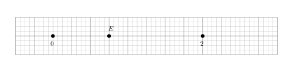
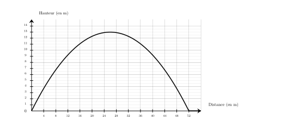




---Q---
Dans une association, $40\%$ des 400 membres participent à une campagne de vaccination. 
    Combien de membres ne participent pas à cette campagne ?
---CORR---
Le nombre de membres participant à cette campagne est égal à : 
    $400 \times \dfrac{40}{100} = 160$. 
    Le nombre de membres ne participant pas à cette campagne est donc égal à : 
    $400 - 160 = {\color{#8B3C52}\boldsymbol{240}}$. 

 
Une autre méthode consiste à calculer le pourcentage de membres ne participant pas à cette campagne, qui est égal à $100\% - 40\% = 60\%$. 
    Le nombre de membres ne participant pas à cette campagne est donc égal à : 
    $400 \times \dfrac{60}{100} = {\color{#8B3C52}\boldsymbol{240}}$.


---Q---
Sur chaque droite graduée, déterminer l’abscisse du point $E$.  <strong>A</strong>. $\dfrac{1}{4}$ &emsp;
    <strong>B</strong>. $\dfrac{3}{2}$ &emsp;
    <strong>C</strong>. $\dfrac{3}{4}$ &emsp;
    <strong>D</strong>. $\dfrac{1}{2}$ 
---CORR---
On remarque qu'il y a 8 divisions entre $0$ et $2$, donc chaque division vaut $\dfrac{1}{4}$. 
    Le point $E$ est situé après $3$ divisions à partir de l'origine. 
    Donc l'abscisse de $E$ est $\dfrac{3}{4}$. 
    Bonne réponse : C.


---Q---
Calculer l'aire d'un carré de côté $2\text{ cm}$
---CORR---
$\mathcal{A}_\text{carré} = c \times c$ $\mathcal{A}_\text{carré} = 2\text{ cm}  \times 2\text{ cm}$ $\mathcal{A}_\text{carré} = {\color{#8B3C52}\boldsymbol{4}}\text{ cm}^2$


---Q---
Sur cette figure, calculer la valeur exacte de $FH$. 
---CORR---
On utilise le théorème de Pythagore dans le triangle $FGH$,  rectangle en $G$. 
      On obtient : 
      $\begin{aligned}
        FG^2+GH^2&=FH^2\\
        FH^2&=GH^2+FG^2\\
        FH^2&=4^2+5^2\\
        FH^2&=16+25\\
        FH^2&=41\\
        FH&={\color{#8B3C52}\boldsymbol{\sqrt{41}}}
        \end{aligned}$
          Mentalement :  
La longueur $FH$ est donnée par la racine carrée de la somme des carrés de $4$ et de $5$. 
Cette somme vaut $16+25=41$.  
La valeur cherchée est donc : $\sqrt{41}$.






---Q---
Donner l'écriture scientifique de $570\,000$
---CORR---
$570\,000 = {\color{#8B3C52}\boldsymbol{5{,}7\times 10^{5}}}$


---Q---
Teresa doit acheter du gazon.  Sur la notice, il est indiqué de prévoir $10$ kg pour $50\text{ m}^2$.   Combien doit-elle en acheter pour une surface de $250\text{ m}^2$ ?
---CORR---
Commençons par trouver combien de kg il faut prévoir pour $1\text{ m}^2$.  
 $1\text{ m}^2$, c'est ${\color{#C5607A}\boldsymbol{50}}$ fois moins que 50$\text{ m}^2$. $10$ kg $\div {\color{#C5607A}\boldsymbol{50}} = 0{,}2$ kg   on a donc besoin de ${\color{#C5607A}\boldsymbol{0{,}2}}$ kg pour recouvrir $1\text{ m}^2$.  Cherchons maintenant la quantité de kg nécessaire pour recouvrir $250\text{ m}^2$.  $250\text{ m}^2$, c'est ${\color{#C5607A}\boldsymbol{250}}$ fois plus que $1\text{ m}^2$.  ${\color{#C5607A}\boldsymbol{0{,}2}}$ kg $\times {\color{#C5607A}\boldsymbol{250}} = 50$ kg  Teresa aura besoin de ${\color{#8B3C52}\boldsymbol{50}}$ kg pour recouvrir $250\text{ m}^2$.


---Q---
Calculer le volume d'une pyramide de hauteur $6\text{ m}$ et dont la base est un triangle. La base du triangle mesure $6\text{ m}$ et la hauteur associée à cette base mesure $4\text{ m}$.
---CORR---
$\mathcal{V}=\dfrac{1}{3} \times \mathcal{B} \times h=\dfrac{1}{3}\times\dfrac{6\text{ m} \times 4\text{ m}}{2}\times6\text{ m}=\dfrac{6 \times 4 \times 6}{6}\text{ m}^3={\color{#8B3C52}\boldsymbol{24\mathbf{ m}^3}}$


---Q---
 
Sur la figure ci-dessus, dans le triangle $TMV$, les droites $(MV)$ et $(KO)$ sont parallèles. Déterminer la longueur $TM$. 
---CORR---
Dans le triangle $TMV$, les droites $(MV)$ et $(KO)$ sont parallèles.  
    D'après le théorème de Thalès, on a :  
    $\dfrac{TM}{TO} =
    \dfrac{MV}{KO}$.  
    En remplaçant par les longueurs, on obtient :  
    $\dfrac{TM}{TO} = \dfrac{21}{10}=2{,}1$. 
    On en déduit que :  
    $TM = 2{,}1 \times 30 = {\color{#8B3C52}\boldsymbol{63}}$ cm.






---Q---
Compléter le tableau en mettant oui ou non dans chaque case. $$\begin{array}{|l|c|c|c|c|}
    \hline
    \text{... est divisible} & \text{par }2 & \text{par }3 & \text{par }5 & \text{par }9\\
    \hline
    65 & & & & \\
    \hline
    \end{array}$$
---CORR---
$$\begin{array}{|l|c|c|c|c|}
    \hline
    \text{... est divisible} & \text{par }2 & \text{par }3 & \text{par }5 & \text{par }9\\
    \hline
    65 & \text{non} & \text{non} & \color{blue}{\text{oui}} & \text{non} \\
    \hline
    \end{array}$$


---Q---
On a représenté ci-dessous la trajectoire d'un projectile lancé depuis le sol.  
             À l'aide de ce graphique, répondre aux questions suivantes :

 
$\mathbf{a)}$ À quelle distance le projectile est-il retombé au sol ? 

 
          $\mathbf{b)}$ Quelle est la hauteur maximale atteinte par le projectile ?
          
           
          
          
---CORR---
T
$\mathbf{a)}$ Le projectile retombe au sol à une distance de ${\color{#8B3C52}\boldsymbol{52\,\mathbf{m}}}$, car la courbe passe par le point de coordonnées $(52 ;0)$. 
$\mathbf{b)}$ Le point le plus haut de la courbe a pour abscisse $26$ et pour ordonnée $13$ donc la hauteur maximale est de ${\color{#8B3C52}\boldsymbol{13\,\mathbf{m}}}$.


---Q---
$1$ $\ldots$ = $60$ secondes
---CORR---
$1$ minute = $60$ secondes


---Q---
Dans le triangle $MNO$ rectangle en $M$,  $NO=15\text{ m}$ et $\widehat{MNO}=50^\circ$. Calculer $MN$ à $0,1\text{ m}$ près. 
---CORR---
Dans le triangle $MNO$ rectangle en $M$,  le cosinus de l'angle $\widehat{MNO}$ est défini par : $\cos\left(\widehat{MNO}\right)=\dfrac{MN}{NO}$. Avec les données numériques : $\dfrac{\cos\left(50^\circ\right)}{\color{red}{1}}=\dfrac{MN}{15}$ $MN=15 \times \cos\left(50^\circ\right)$ soit $MN\approx{\color{#8B3C52}\boldsymbol{9{,}6}}\text{ m}$.



