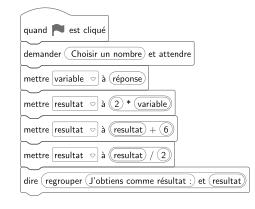
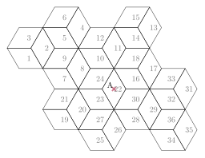
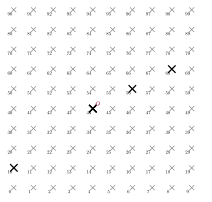



1
---Q---
Factoriser : $A=14c+35x$
---CORR---
$A=14c+35x$ $A=7\times2c+7\times5x$ $A= {\color{#EB7F73}\boldsymbol{7(2c+5x)}}$


2
---Q---
Quel est le carré de $7$ ?
---CORR---
Le carré d'un nombre est ce nombre multiplié par lui-même : $7\times7={\color{#EB7F73}\boldsymbol{49}}$


3
---Q---
Un joueur tire une boule d'une urne, note sa couleur, la remet dans l'urne, puis tire une deuxième boule. L'urne contient 6 boules indiscernables au toucher : 2 boules rouges ; 1 boule bleue ; 3 boules vertes. Il gagne s'il tire deux boules de couleurs différentes. Calculer la probabilité de gagner à ce jeu.
---CORR---
Pour gagner, le joueur doit tirer deux boules de couleurs différentes (avec remise). On remplit le tableau à double entrée des issues possibles :
<table style="border-collapse:collapse;margin:0.8rem auto;font-size:0.9rem">
<tr><th style="background:#FDF2F4;color:#8B3C52;border:1px solid #ddb8c0;padding:6px 12px;font-weight:600">1er tirage \ 2e tirage</th><th style="background:#FDF2F4;color:#8B3C52;border:1px solid #ddb8c0;padding:6px 12px;font-weight:600">R</th><th style="background:#FDF2F4;color:#8B3C52;border:1px solid #ddb8c0;padding:6px 12px;font-weight:600">R</th><th style="background:#FDF2F4;color:#8B3C52;border:1px solid #ddb8c0;padding:6px 12px;font-weight:600">B</th><th style="background:#FDF2F4;color:#8B3C52;border:1px solid #ddb8c0;padding:6px 12px;font-weight:600">V</th><th style="background:#FDF2F4;color:#8B3C52;border:1px solid #ddb8c0;padding:6px 12px;font-weight:600">V</th><th style="background:#FDF2F4;color:#8B3C52;border:1px solid #ddb8c0;padding:6px 12px;font-weight:600">V</th></tr>
<tr><th style="background:#FDF2F4;color:#8B3C52;border:1px solid #ddb8c0;padding:6px 12px;font-weight:600">R</th><td style="border:1px solid #ddb8c0;padding:6px 12px;text-align:center;color:#2D2226">perdu</td><td style="border:1px solid #ddb8c0;padding:6px 12px;text-align:center;color:#2D2226">perdu</td><td style="border:1px solid #ddb8c0;padding:6px 12px;text-align:center;color:#2D2226"><strong>gagné</strong></td><td style="border:1px solid #ddb8c0;padding:6px 12px;text-align:center;color:#2D2226"><strong>gagné</strong></td><td style="border:1px solid #ddb8c0;padding:6px 12px;text-align:center;color:#2D2226"><strong>gagné</strong></td><td style="border:1px solid #ddb8c0;padding:6px 12px;text-align:center;color:#2D2226"><strong>gagné</strong></td></tr>
<tr><th style="background:#FDF2F4;color:#8B3C52;border:1px solid #ddb8c0;padding:6px 12px;font-weight:600">R</th><td style="border:1px solid #ddb8c0;padding:6px 12px;text-align:center;color:#2D2226">perdu</td><td style="border:1px solid #ddb8c0;padding:6px 12px;text-align:center;color:#2D2226">perdu</td><td style="border:1px solid #ddb8c0;padding:6px 12px;text-align:center;color:#2D2226"><strong>gagné</strong></td><td style="border:1px solid #ddb8c0;padding:6px 12px;text-align:center;color:#2D2226"><strong>gagné</strong></td><td style="border:1px solid #ddb8c0;padding:6px 12px;text-align:center;color:#2D2226"><strong>gagné</strong></td><td style="border:1px solid #ddb8c0;padding:6px 12px;text-align:center;color:#2D2226"><strong>gagné</strong></td></tr>
<tr><th style="background:#FDF2F4;color:#8B3C52;border:1px solid #ddb8c0;padding:6px 12px;font-weight:600">B</th><td style="border:1px solid #ddb8c0;padding:6px 12px;text-align:center;color:#2D2226"><strong>gagné</strong></td><td style="border:1px solid #ddb8c0;padding:6px 12px;text-align:center;color:#2D2226"><strong>gagné</strong></td><td style="border:1px solid #ddb8c0;padding:6px 12px;text-align:center;color:#2D2226">perdu</td><td style="border:1px solid #ddb8c0;padding:6px 12px;text-align:center;color:#2D2226"><strong>gagné</strong></td><td style="border:1px solid #ddb8c0;padding:6px 12px;text-align:center;color:#2D2226"><strong>gagné</strong></td><td style="border:1px solid #ddb8c0;padding:6px 12px;text-align:center;color:#2D2226"><strong>gagné</strong></td></tr>
<tr><th style="background:#FDF2F4;color:#8B3C52;border:1px solid #ddb8c0;padding:6px 12px;font-weight:600">V</th><td style="border:1px solid #ddb8c0;padding:6px 12px;text-align:center;color:#2D2226"><strong>gagné</strong></td><td style="border:1px solid #ddb8c0;padding:6px 12px;text-align:center;color:#2D2226"><strong>gagné</strong></td><td style="border:1px solid #ddb8c0;padding:6px 12px;text-align:center;color:#2D2226"><strong>gagné</strong></td><td style="border:1px solid #ddb8c0;padding:6px 12px;text-align:center;color:#2D2226">perdu</td><td style="border:1px solid #ddb8c0;padding:6px 12px;text-align:center;color:#2D2226">perdu</td><td style="border:1px solid #ddb8c0;padding:6px 12px;text-align:center;color:#2D2226">perdu</td></tr>
<tr><th style="background:#FDF2F4;color:#8B3C52;border:1px solid #ddb8c0;padding:6px 12px;font-weight:600">V</th><td style="border:1px solid #ddb8c0;padding:6px 12px;text-align:center;color:#2D2226"><strong>gagné</strong></td><td style="border:1px solid #ddb8c0;padding:6px 12px;text-align:center;color:#2D2226"><strong>gagné</strong></td><td style="border:1px solid #ddb8c0;padding:6px 12px;text-align:center;color:#2D2226"><strong>gagné</strong></td><td style="border:1px solid #ddb8c0;padding:6px 12px;text-align:center;color:#2D2226">perdu</td><td style="border:1px solid #ddb8c0;padding:6px 12px;text-align:center;color:#2D2226">perdu</td><td style="border:1px solid #ddb8c0;padding:6px 12px;text-align:center;color:#2D2226">perdu</td></tr>
<tr><th style="background:#FDF2F4;color:#8B3C52;border:1px solid #ddb8c0;padding:6px 12px;font-weight:600">V</th><td style="border:1px solid #ddb8c0;padding:6px 12px;text-align:center;color:#2D2226"><strong>gagné</strong></td><td style="border:1px solid #ddb8c0;padding:6px 12px;text-align:center;color:#2D2226"><strong>gagné</strong></td><td style="border:1px solid #ddb8c0;padding:6px 12px;text-align:center;color:#2D2226"><strong>gagné</strong></td><td style="border:1px solid #ddb8c0;padding:6px 12px;text-align:center;color:#2D2226">perdu</td><td style="border:1px solid #ddb8c0;padding:6px 12px;text-align:center;color:#2D2226">perdu</td><td style="border:1px solid #ddb8c0;padding:6px 12px;text-align:center;color:#2D2226">perdu</td></tr>
</table>
Il y a $22$ issues gagnantes parmi $36$ issues possibles. La probabilité de gagner à ce jeu est donc de $\dfrac{22}{36}={\color{#EB7F73}\boldsymbol{\dfrac{11}{18}}}$.


4
---Q---
$MO^2= \,\,\ldots$
 

---CORR---
Le triangle $MNO$ est rectangle en $M$. D'après le théorème de Pythagore, on a : ${\color{#C5607A}\boldsymbol{NO^2=MN^2+MO^2}}$ d'où ${\color{#EB7F73}\boldsymbol{MO^2=NO^2-MN^2}}$


5
---Q---
Les points $R$, $O$ et $D$ sont les symétriques respectifs de $S$, $V$ et $Z$ par rapport à $O$. Les points $S$, $V$ et $Z$ sont alignés. Les points $R$, $O$ et $D$ le sont-ils ? Justifier.
 

---CORR---
Les points $R$, $O$ et $D$ sont les symétriques respectifs de $S$, $V$ et $Z$ par rapport à $O$ et sont alignés. Or, la symétrie axiale conserve l'alignement. Donc les points ${\color{#EB7F73}\boldsymbol{R}}$, ${\color{#EB7F73}\boldsymbol{O}}$ et ${\color{#EB7F73}\boldsymbol{D}}$ sont alignés également.






1
---Q---
Qu'obtient-on si on choisit $4$ comme nombre de départ ?
 

---CORR---
Si on choisit $4$ comme nombre de départ, alors variable prend la valeur $4$. Ensuite, résultat prend la valeur $2 \times 4=8$. Puis, résultat prend la valeur $8 + 6=14$. Enfin, résultat prend la valeur $\dfrac{14}{2}=7$. On obtient donc comme résultat final : ${\color{#EB7F73}\boldsymbol{7}}$.


2
---Q---
Factoriser : $A=-4b^2+9b$
---CORR---
$A=-4b^2+9b$ $A=b\times (-4)b+b\times 9$ $A= {\color{#EB7F73}\boldsymbol{b(-4b+9)}}$


3
---Q---
Traduire la phrase par un calcul : La différence entre 8 et le quotient de 42 par 7.
---CORR---
La différence entre 8 et le quotient de 42 par 7 s'écrit : ${\color{#EB7F73}\boldsymbol{8-42 \div 7}}$ ou ${\color{#EB7F73}\boldsymbol{8-\dfrac{42}{7}}}$.


4
---Q---
Sur cette figure, calculer la valeur exacte de $HJ$.
 

---CORR---
On utilise le théorème de Pythagore dans le triangle $HIJ$, rectangle en $I$. On obtient : $HI^2+IJ^2=HJ^2$ $HJ^2=IJ^2+HI^2$ $HJ^2=3^2+7^2$ $HJ^2=9+49$ $HJ^2=58$ $HJ={\color{#EB7F73}\boldsymbol{\sqrt{58}}}$ Mentalement : La longueur $HJ$ est donnée par la racine carrée de la somme des carrés de $3$ et de $7$. Cette somme vaut $9+49=58$. La valeur cherchée est donc : $\sqrt{58}$.


5
---Q---
Donner les numéros des images des figures $2$, $10$ et $16$ dans la symétrie de centre $A$.
 

---CORR---
L'image de la figure $2$ dans la symétrie de centre $A$ est la figure ${\color{#EB7F73}\boldsymbol{35}}$. L'image de la figure $10$ dans la symétrie de centre $A$ est la figure ${\color{#EB7F73}\boldsymbol{28}}$. L'image de la figure $16$ dans la symétrie de centre $A$ est la figure ${\color{#EB7F73}\boldsymbol{23}}$.






1
---Q---
Développer et réduire : $A = (9c+9)(-3c-7)$
---CORR---
$A = (9c+9)(-3c-7)$ $A = 9c\times (-3c) + 9c\times (-7) + 9 \times (-3c) + 9 \times (-7)$ $A = -27c^2 + (-63c) + (-27c) + (-63)$ $A = {\color{#EB7F73}\boldsymbol{-27c^2-90c-63}}$


2
---Q---
Dans l'égalité « $8 + 2 = 10$ », comment s'appelle le nombre $10$ ?
---CORR---
Dans l'égalité « $8 + 2 = 10$ », $10$ s'appelle la somme de $8$ et $2$.


3
---Q---
Un angle aigu mesure entre $\ldots^\circ$ et $\ldots^\circ$.
---CORR---
Un angle aigu mesure entre ${\color{#EB7F73}\boldsymbol{0}}^\circ$ et ${\color{#EB7F73}\boldsymbol{90}}^\circ$.


4
---Q---
On choisit un livre au hasard sur un étal présentant $3$ romans d'anticipation et $27$ romans historiques. Quelle est la probabilité de choisir un roman d'anticipation ?
---CORR---
Il y a en tout : $3 + 27 = 30$ romans. La probabilité de choisir un roman d'anticipation est de ${\color{#EB7F73}\boldsymbol{\dfrac{3}{30}}}$, soit ${\color{#EB7F73}\boldsymbol{\dfrac{1}{10}}}$.


5
---Q---
Donner les numéros des images des points $68$, $56$ et $10$ par la symétrie de centre $O$.
 

---CORR---
a. L'image du point $68$ par la symétrie de centre $O$ est le point ${\color{#EB7F73}\boldsymbol{20}}$. b. L'image du point $56$ par la symétrie de centre $O$ est le point ${\color{#EB7F73}\boldsymbol{32}}$. c. L'image du point $10$ par la symétrie de centre $O$ est le point ${\color{#EB7F73}\boldsymbol{78}}$.



