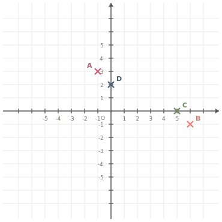
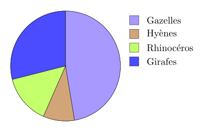
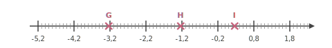
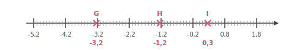
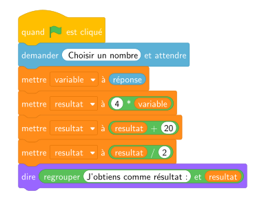




---Q---
Écrire sous la forme de la somme d'un nombre entier et d'une fraction inférieure à 1 puis donner l'écriture décimale. $ \dfrac{11}{10} = \phantom{00}\text{........}\phantom{00} + \dfrac{\phantom{00}\text{........}\phantom{00}}{\phantom{00}\text{........}\phantom{00}} = \phantom{00}\text{........}\phantom{00}  $
---CORR---
$ \dfrac{11}{10} = {\color{#F15929}\boldsymbol{1}}+\dfrac{{\color{#F15929}\boldsymbol{1}}}{{\color{#F15929}\boldsymbol{10}}} = {\color{#F15929}\boldsymbol{1,1}} $


---Q---
Réduire cette expression, si cela est possible : $B=2x+2+x$
---CORR---
$B = 2x+2+x$ $B = {\color{#F15929}\boldsymbol{3x+2}}$ 


---Q---
Placer les points suivants : $A(-1\;;\;3)$ ; $B(6\;;\;-1)$ ; $C(5\;;\;0)$ et $D(0\;;\;2)$.

      
---CORR---
Les points sont placés aux coordonnées indiquées : 


---Q---
Parmi les 4 réponses ci-dessous, une seule est correcte. 
Donner la lettre correspondante. Une voiture roule à $60$ km/h. Combien de temps met-elle pour parcourir $75$ km ?

     
      <strong>A</strong>. 37 min 30 s&emsp;&emsp; 
    <strong>B</strong>. 1 h 52 min 30 s&emsp;&emsp; 
    <strong>C</strong>. 1 h 15 min&emsp;&emsp; 
    <strong>D</strong>. 2 h 30 min
---CORR---
Pour parcourir $75$ km à $60$ km/h, il faut : 
    $\dfrac{75}{60}\text{h}=\dfrac{5}{4}\text{h}=1+\dfrac{1}{4}\text{h}={\color{#F15929}\boldsymbol{1\mathbf{h }15\mathbf{min}}}$. 
    La bonne réponse est la réponse C.






---Q---
Compléter avec le signe < ou >. $$3{,}4 \quad \ldots   \quad3{,}2$$
---CORR---
$3{,}4 \quad {\color{#F15929}\boldsymbol{>}} \quad 3{,}2$


---Q---
Choisis le calcul qui permet de résoudre l'équation suivante :  
Pour résoudre $4x-8=14$ :

      <strong>A</strong>. $(14-4)+8$&emsp;&emsp; 
    <strong>B</strong>. $\dfrac{14+8}{4}$&emsp;&emsp; 
    <strong>C</strong>. $\dfrac{14}{4}+8$&emsp;&emsp; 
    <strong>D</strong>. $14\times 4+8$
---CORR---
$4x-8=14$   
    On ajoute $8$ : $4x=14+8$.   
    Puis on divise par $4$ : $x=\dfrac{14+8}{4}$.   
    Bonne réponse : <strong>B</strong>.


---Q---
Compléter. Un angle plein mesure … $^\circ$.
---CORR---
Un angle plein mesure ${\color{#F15929}\boldsymbol{360}}^\circ$.


---Q---
Dans le parc naturel de Secai, il y a beaucoup d'animaux.  Voici un diagramme qui représente les effectifs de quelques espèces.

 

<strong>a.</strong>  Quelle est l'espèce la moins nombreuse ? 
    
    	$\square\;$ Gazelles&emsp;&emsp; $\square\;$ Girafes&emsp;&emsp; $\square\;$ Hyènes&emsp;&emsp; $\square\;$ Rhinocéros&emsp;&emsp;  
 <strong>b.</strong>  Quelle est l'espèce la plus nombreuse ? 
    
    	$\square\;$ Girafes&emsp;&emsp; $\square\;$ Rhinocéros&emsp;&emsp; $\square\;$ Hyènes&emsp;&emsp; $\square\;$ Gazelles&emsp;&emsp;  
 <strong>c.</strong>  L'espèce la plus nombreuse représente ... 
    
    	$\square\;$ Plus de la moitié des animaux&emsp;&emsp; $\square\;$ Moins de la moitié des animaux&emsp;&emsp; $\square\;$ La moitié des animaux&emsp;&emsp;   
---CORR---
<strong>a.</strong>  L'animal le moins nombreux parmi ces espèces est :  
    
    	$\square\;$ Gazelles&emsp;&emsp; $\square\;$ Girafes&emsp;&emsp; $\blacksquare\;$ Hyènes&emsp;&emsp; $\square\;$ Rhinocéros&emsp;&emsp;  
 <strong>b.</strong>  L'animal le plus nombreux parmi ces espèces est :  
    
    	$\square\;$ Girafes&emsp;&emsp; $\square\;$ Rhinocéros&emsp;&emsp; $\square\;$ Hyènes&emsp;&emsp; $\blacksquare\;$ Gazelles&emsp;&emsp;  
 <strong>c.</strong>  L'animal le plus nombreux parmi ces espèces représente :  
    
    	$\square\;$ Plus de la moitié des animaux&emsp;&emsp; $\blacksquare\;$ Moins de la moitié des animaux&emsp;&emsp; $\square\;$ La moitié des animaux&emsp;&emsp;  






---Q---
Dans une ville de 10000 habitants, $30\%$ des habitants consomment plus de 2 litres d'eau par jour. 
    Combien d'habitants consomment plus de 2 litres d'eau par jour ?
---CORR---
Le nombre d'habitants qui consomment plus de 2 litres d'eau par jour est égal à : 
    $10\,000 \times \dfrac{30}{100} = \dfrac{300\,000}{100}={\color{#F15929}\boldsymbol{3\,000}}$.


---Q---
Lire l'abscisse de chacun des points suivants. 
---CORR---
 $\ G $ $(-3{,}2)$ &emsp; $\ H $ $(-1{,}2)$ &emsp; $\ I $ $(0{,}3)$


---Q---
Calculer le périmètre du décagone régulier $ABCDEFGHIJ$ représenté ci-dessous : 

---CORR---

	Le polygone a $10$ côtés de longueur $6{,}5$ cm. 
Le périmètre est donc égal à : 
$10 \times 6{,}5 = {\color{#F15929}\boldsymbol{65}}$ cm.



---Q---
On considère l’algorithme suivant :

    

    Qu’obtient‑on si on choisit $3$ comme nombre de départ ? 
---CORR---
Si on choisit $3$ comme nombre de départ, alors variable prend la valeur $3$. 
    Ensuite, resultat prend la valeur $4 \times 3 = 12$. 
    Puis, resultat prend la valeur $12 + 20 = 32$. 
    Enfin, resultat prend la valeur $\dfrac{32}{2} = 16$. 
    Résultat final : ${\color{#F15929}\mathbf{16}}$.



