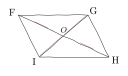
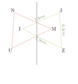
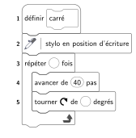



1
---Q---
Factoriser : $A = x(3x-5)+2(3x-5)$
---CORR---
$A = x(3x-5)+2(3x-5)$&emsp;On remarque que $(3x-5)$ est un facteur commun. $\phantom{A}={\color{#C5607A}\boldsymbol{x}}{\color{#EB7F73}\boldsymbol{(3x-5)}}+{\color{#C5607A}\boldsymbol{2}}{\color{#EB7F73}\boldsymbol{(3x-5)}}$ $\phantom{A}={\color{#EB7F73}\boldsymbol{(3x-5)}}{\color{#C5607A}\boldsymbol{(x+2)}}$


2
---Q---
Traduire le calcul par une phrase en français. $10 \times(4+6)$
---CORR---
$10 \times(4+6)$ s'écrit : le produit de 10 par la somme de 4 et 6.


3
---Q---
Soit $LNM$ un triangle rectangle en $L$, complète : $LN^2= \,\,\ldots$
---CORR---
Le triangle $LMN$ est rectangle en $L$. D'après le théorème de Pythagore, on a : ${\color{#C5607A}\boldsymbol{MN^2=LM^2+LN^2}}$ d'où ${\color{#EB7F73}\boldsymbol{LN^2=MN^2-LM^2}}$


4
---Q---
Pour la figure suivante, tracée à main levée, préciser s'il s'agit d'un parallélogramme.
 

---CORR---
On sait que $FO = OH$ et $GO = OI$. Or, « si un quadrilatère a ses diagonales qui se coupent en leur milieu, alors c'est un parallélogramme ». Donc ${\color{#EB7F73}\boldsymbol{FGHI}}$ est un parallélogramme.


5
---Q---
On choisit au hasard un appareil sur le présentoir d'un magasin.  1. Compléter le tableau des effectifs suivants :
<table style="border-collapse:collapse;margin:0.8rem auto;font-size:0.9rem">
<tr><th style="background:#FDF2F4;color:#8B3C52;border:1px solid #ddb8c0;padding:6px 12px;font-weight:600">&nbsp;</th><th style="background:#FDF2F4;color:#8B3C52;border:1px solid #ddb8c0;padding:6px 12px;font-weight:600">Smartphones</th><th style="background:#FDF2F4;color:#8B3C52;border:1px solid #ddb8c0;padding:6px 12px;font-weight:600">Tablettes</th><th style="background:#FDF2F4;color:#8B3C52;border:1px solid #ddb8c0;padding:6px 12px;font-weight:600">Total</th></tr>
<tr><th style="background:#FDF2F4;color:#8B3C52;border:1px solid #ddb8c0;padding:6px 12px;font-weight:600">Androïds</th><td style="border:1px solid #ddb8c0;padding:6px 12px;text-align:center;color:#2D2226">$7$</td><td style="border:1px solid #ddb8c0;padding:6px 12px;text-align:center;color:#2D2226">$4$</td><td style="border:1px solid #ddb8c0;padding:6px 12px;color:#2D2226"></td></tr>
<tr><th style="background:#FDF2F4;color:#8B3C52;border:1px solid #ddb8c0;padding:6px 12px;font-weight:600">IOSs</th><td style="border:1px solid #ddb8c0;padding:6px 12px;color:#2D2226"></td><td style="border:1px solid #ddb8c0;padding:6px 12px;color:#2D2226"></td><td style="border:1px solid #ddb8c0;padding:6px 12px;text-align:center;color:#2D2226">$14$</td></tr>
<tr><th style="background:#FDF2F4;color:#8B3C52;border:1px solid #ddb8c0;padding:6px 12px;font-weight:600">Total</th><td style="border:1px solid #ddb8c0;padding:6px 12px;text-align:center;color:#2D2226">$13$</td><td style="border:1px solid #ddb8c0;padding:6px 12px;color:#2D2226"></td><td style="border:1px solid #ddb8c0;padding:6px 12px;color:#2D2226"></td></tr>
</table>
2. Quelle est la probabilité que l'appareil choisi soit une tablette ? 3. On sait que l'appareil choisi est un smartphone. Quelle est la probabilité que ce soit un smartphone Androïd ?

---CORR---
1. Il y a $7+4={\color{#EB7F73}\boldsymbol{11}}$ appareils Androïd. Il y a $13-7={\color{#EB7F73}\boldsymbol{6}}$ smartphones iOS. Il y a $14-6={\color{#EB7F73}\boldsymbol{8}}$ tablettes iOS. Il y a $4+8={\color{#EB7F73}\boldsymbol{12}}$ tablettes. Il y a $13+12={\color{#EB7F73}\boldsymbol{25}}$ appareils au total.
<table style="border-collapse:collapse;margin:0.8rem auto;font-size:0.9rem">
<tr><th style="background:#FDF2F4;color:#8B3C52;border:1px solid #ddb8c0;padding:6px 12px;font-weight:600">&nbsp;</th><th style="background:#FDF2F4;color:#8B3C52;border:1px solid #ddb8c0;padding:6px 12px;font-weight:600">Smartphones</th><th style="background:#FDF2F4;color:#8B3C52;border:1px solid #ddb8c0;padding:6px 12px;font-weight:600">Tablettes</th><th style="background:#FDF2F4;color:#8B3C52;border:1px solid #ddb8c0;padding:6px 12px;font-weight:600">Total</th></tr>
<tr><th style="background:#FDF2F4;color:#8B3C52;border:1px solid #ddb8c0;padding:6px 12px;font-weight:600">Androïd</th><td style="border:1px solid #ddb8c0;padding:6px 12px;text-align:center;color:#2D2226">$7$</td><td style="border:1px solid #ddb8c0;padding:6px 12px;text-align:center;color:#2D2226">$4$</td><td style="border:1px solid #ddb8c0;padding:6px 12px;text-align:center;color:#2D2226">${\color{#EB7F73}\boldsymbol{11}}$</td></tr>
<tr><th style="background:#FDF2F4;color:#8B3C52;border:1px solid #ddb8c0;padding:6px 12px;font-weight:600">iOS</th><td style="border:1px solid #ddb8c0;padding:6px 12px;text-align:center;color:#2D2226">${\color{#EB7F73}\boldsymbol{6}}$</td><td style="border:1px solid #ddb8c0;padding:6px 12px;text-align:center;color:#2D2226">${\color{#EB7F73}\boldsymbol{8}}$</td><td style="border:1px solid #ddb8c0;padding:6px 12px;text-align:center;color:#2D2226">$14$</td></tr>
<tr><th style="background:#FDF2F4;color:#8B3C52;border:1px solid #ddb8c0;padding:6px 12px;font-weight:600">Total</th><td style="border:1px solid #ddb8c0;padding:6px 12px;text-align:center;color:#2D2226">$13$</td><td style="border:1px solid #ddb8c0;padding:6px 12px;text-align:center;color:#2D2226">${\color{#EB7F73}\boldsymbol{12}}$</td><td style="border:1px solid #ddb8c0;padding:6px 12px;text-align:center;color:#2D2226">${\color{#EB7F73}\boldsymbol{25}}$</td></tr>
</table>
2. Il y a $12$ tablettes et $25$ appareils donc la probabilité que l'appareil choisi soit une tablette est de : ${\color{#EB7F73}\boldsymbol{\dfrac{12}{25}}}$. 3. Il y a $7$ smartphones Androïd et $13$ smartphones donc la probabilité que ce soit un smartphone Androïd est de : ${\color{#EB7F73}\boldsymbol{\dfrac{7}{13}}}$.






1
---Q---
Factoriser : $A = 2(3x-2)+x(3x-2)$
---CORR---
$A = 2(3x-2)+x(3x-2)$&emsp;On remarque que $(3x-2)$ est un facteur commun. $\phantom{A}={\color{#C5607A}\boldsymbol{2}}{\color{#EB7F73}\boldsymbol{(3x-2)}}+{\color{#C5607A}\boldsymbol{x}}{\color{#EB7F73}\boldsymbol{(3x-2)}}$ $\phantom{A}={\color{#EB7F73}\boldsymbol{(3x-2)}}{\color{#C5607A}\boldsymbol{(2+x)}}$


2
---Q---
Traduire la phrase par un calcul : La différence entre le produit de 15 par 9 et le produit de 10 par 9.
---CORR---
La différence entre le produit de 15 par 9 et le produit de 10 par 9 s'écrit : ${\color{#EB7F73}\boldsymbol{15 \times 9-10 \times 9}}$.


3
---Q---
$1~\text{dm}^2 = \ldots\ldots\ldots~\text{m}^2$
---CORR---
$1~\text{dm}^2$ est égal à un centième de $1~\text{m}^2$. $1~\text{dm}^2 = {\color{#EB7F73}\boldsymbol{\dfrac{1}{100}}}~\text{m}^2 = {\color{#EB7F73}\boldsymbol{0{,}01}}~\text{m}^2$


4
---Q---
Déterminer la valeur exacte de $ST$.
 

---CORR---
On utilise le théorème de Pythagore dans le triangle $RST$, rectangle en $S$. $RS^2+ST^2=RT^2$ $ST^2=RT^2-RS^2$ $ST^2=7^2-4^2=49-16=33$ $ST={\color{#EB7F73}\boldsymbol{\sqrt{33}}}$ Mentalement : La longueur $ST$ est donnée par la racine carrée de la différence des carrés de $7$ et de $4$. Cette différence vaut $49-16=33$. La valeur cherchée est donc : $\sqrt{33}$.


5
---Q---
Les points $U$, $M$ et $N$ sont les symétriques respectifs de $Z$, $I$ et $J$ par rapport à $(d)$. Quelle est la longueur du segment $[UM]$ ? Justifier.
 

---CORR---
Les segments $[ZI]$ et $[UM]$ sont symétriques par rapport à $(d)$. Or, le symétrique d'un segment est un segment de même longueur. Donc les segments $[ZI]$ et $[UM]$ ont la même longueur et ${\color{#EB7F73}\boldsymbol{UM=7{,}9~\text{cm}}}$.






1
---Q---
Une élève souhaite réaliser un programme avec un logiciel de programmation pour dessiner un carré. Par quelles valeurs doit-il compléter les lignes 3 et 5 du bloc personnalisé ci-contre pour obtenir un carré ? $\text{Ligne 3 : }\ldots\quad \text{Ligne 5 : }\ldots$
 

---CORR---
Pour obtenir un carré, il faut répéter ${\color{#EB7F73}\boldsymbol{4}}$ fois et tourner de $\dfrac{360}{4}={\color{#EB7F73}\boldsymbol{90}}$ degrés.


2
---Q---
Factoriser l'expression suivante. $A=(3x+4)(2x+1)-(2x+1)(4x-3)$
---CORR---
$A=(3x+4)(2x+1)-(2x+1)(4x-3)$ On remarque que $(2x+1)$ est un facteur commun. $A={\color{#C5607A}\boldsymbol{(3x+4)}}{\color{#EB7F73}\boldsymbol{(2x+1)}}-{\color{#EB7F73}\boldsymbol{(2x+1)}}{\color{#C5607A}\boldsymbol{(4x-3)}}$ $A={\color{#EB7F73}\boldsymbol{(2x+1)}}{\color{#C5607A}\boldsymbol{(3x+4-(4x-3))}}$ $A={\color{#EB7F73}\boldsymbol{(2x+1)}}{\color{#C5607A}\boldsymbol{(3x+4-4x+3)}}$ $A={\color{#EB7F73}\boldsymbol{(2x+1)}}{\color{#C5607A}\boldsymbol{(-x+7)}}$


3
---Q---
Ranger les nombres suivants dans l'ordre décroissant : $\dfrac{3}{2}$, $\dfrac{3}{5}$, $\dfrac{15}{8}$, $1$.
---CORR---
Un dénominateur commun possible est $40$. $\dfrac{15}{8}=\dfrac{75}{40}$, $\dfrac{3}{2}=\dfrac{60}{40}$, $1=\dfrac{40}{40}$, $\dfrac{3}{5}=\dfrac{24}{40}$ Finalement : ${\color{#EB7F73}\boldsymbol{\dfrac{15}{8}~>~\dfrac{3}{2}~>~1~>~\dfrac{3}{5}}}$


4
---Q---
Calculer de tête $\sqrt{81}$.
---CORR---
$\sqrt{81}={\color{#EB7F73}\boldsymbol{9}}$


5
---Q---
À l'aide du schéma ci-dessous, déterminer : - deux segments de même longueur ; - le milieu d'un segment ; - un triangle rectangle ; - un triangle isocèle.
 

---CORR---
- Deux segments de même mesure : $[KJ]$ et $[JM]$ ou $[KL]$ et $[LM]$ ou $[IN]$ et $[NM]$. - $J$ est le milieu du segment $[KM]$. - $KIM$ est un triangle rectangle en $K$, $KJL$ est un triangle rectangle en $J$ et $MJL$ est un triangle rectangle en $J$. - $KLM$ est un triangle isocèle en $L$ et $INM$ est un triangle isocèle en $N$.



