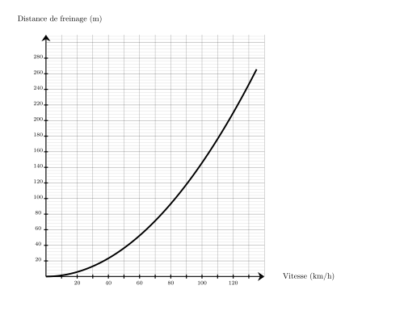
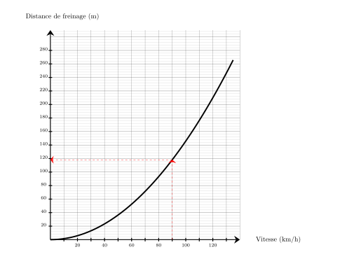
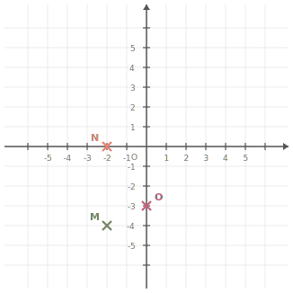




---Q---
Donner l'écriture scientifique de $0{,}69$.
---CORR---
$0{,}69 = {\color{#8B3C52}\mathbf{6{,}9 \times 10^{-1}}}$.


---Q---
Teresa doit acheter du gazon.  Sur la notice, il est indiqué de prévoir $10$ kg pour $50\text{ m}^2$.   Combien doit-elle en acheter pour une surface de $250\text{ m}^2$ ?
---CORR---
Commençons par trouver combien de kg il faut prévoir pour $1\text{ m}^2$.  
 $1\text{ m}^2$, c'est ${\color{#C5607A}\boldsymbol{50}}$ fois moins que 50$\text{ m}^2$. $10$ kg $\div {\color{#C5607A}\boldsymbol{50}} = 0{,}2$ kg   on a donc besoin de ${\color{#C5607A}\boldsymbol{0{,}2}}$ kg pour recouvrir $1\text{ m}^2$.  Cherchons maintenant la quantité de kg nécessaire pour recouvrir $250\text{ m}^2$.  $250\text{ m}^2$, c'est ${\color{#C5607A}\boldsymbol{250}}$ fois plus que $1\text{ m}^2$.  ${\color{#C5607A}\boldsymbol{0{,}2}}$ kg $\times {\color{#C5607A}\boldsymbol{250}} = 50$ kg  Teresa aura besoin de ${\color{#8B3C52}\boldsymbol{50}}$ kg pour recouvrir $250\text{ m}^2$.


---Q---
Donner le nom du solide suivant : 
---CORR---
Prisme droit avec une base ayant $5$ sommets.


---Q---
Déterminer la valeur exacte de $NO$. 
---CORR---
On utilise le théorème de Pythagore dans le triangle $MNO$,  rectangle en $N$. 
      On obtient :

 

      $\begin{aligned}
        MN^2+NO^2&=MO^2\\
        NO^2&=MO^2-MN^2\\
        NO^2&=7^2-5^2\\
        NO^2&=49-25\\
        NO^2&=24\\
        NO&={\color{#8B3C52}\boldsymbol{\sqrt{24}}}
        \end{aligned}$ 
        En simplifiant, on obtient : $NO = {\color{#8B3C52}\boldsymbol{2\sqrt{6}}}$.
         Mentalement :  
    La longueur $NO$ est donnée par la racine carrée de la différence des carrés de $7$ et de $5$. 
    Cette différence vaut $49-25=24$.  
    La valeur cherchée est donc : $\sqrt{24}=2\sqrt{6}$.






---Q---
Quel est le carré de $9$ ?
---CORR---
Le carré d'un nombre est ce nombre multiplié par lui-même : $9\times9=81$


---Q---
Une voiture roule à la vitesse de $90\text{ km/h}$ sur une route mouillée. 
    En utilisant le graphique ci-dessous, quelle est la distance de freinage en mètres ? 
---CORR---
Pour une vitesse de $90\text{ km/h}$, la distance de freinage est d'environ ${\color{#8B3C52}\boldsymbol{118}}\text{ m}$. 


---Q---
$1$ minute = $\ldots$ secondes
---CORR---
$1$ minute = ${\color{#8B3C52}\boldsymbol{60}}$ secondes


---Q---
Sur la figure suivante : 
          $\leadsto X$ est sur $[WU]$,
          $\leadsto Y$ est sur $[WV]$,  $\leadsto$ les droites $(UV)$ et $(XY)$ sont parallèles. Écrire la double égalité de Thalès. 
---CORR---
Dans le triangle $UVW$ :
         $\leadsto$ $X\in[WU]$,
         $\leadsto$ $Y\in[WV]$,
         $\leadsto$  $(UV)//(XY)$,
         donc d'après le théorème de Thalès, les triangles $UVW$ et $XYW$ ont des longueurs proportionnelles.

 
$\dfrac{WX}{WU}=\dfrac{WY}{WV}=\dfrac{XY}{UV}$ <strong>Remarque</strong> On pourrait aussi écrire : $\dfrac{WU}{WX}=\dfrac{WV}{WY}=\dfrac{UV}{XY}$






---Q---
Donner la valeur décimale de  $\dfrac{9}{4}$.
---CORR---
$\dfrac{9}{4}={\color{#8B3C52}\boldsymbol{2{,}25}}$ 
            Mentalement :  
          $\dfrac{9}{4}=\dfrac{8}{4}+\dfrac{1}{4}=
          2+0{,}25=2{,}25$.


---Q---
Calculer $B = 8 \times x + 7$, pour $x = 15$.
---CORR---
$B = 8 \times 15 + 7$ $B = {\color{#8B3C52}\boldsymbol{127}}$


---Q---
Déterminer les coordonnées respectives des points $O$, $N$ et $M$ 
---CORR---
Les coordonnées respectives des points sont :  $O({\color{#8B3C52}\boldsymbol{0}};{\color{#8B3C52}\boldsymbol{-3}})$, $N({\color{#8B3C52}\boldsymbol{-2}};{\color{#8B3C52}\boldsymbol{0}})$ et $M({\color{#8B3C52}\boldsymbol{-1{,}5}};{\color{#8B3C52}\boldsymbol{-4}})$


---Q---
Compléter à l'aide des longueurs $HG$, $HE$ et $GE$ :  
    

$$
    \cos\left(\widehat{HGE}\right)=\dfrac{\ldots}{\ldots}
    $$ 
---CORR---
$HGE$ est rectangle en $H$ donc :
    

$$
    \cos\left(\widehat{HGE}\right)
    = {\color{#8B3C52}\mathbf{\dfrac{HG}{GE}}}.
    $$



