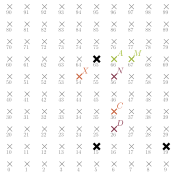
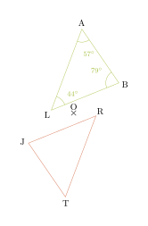



11
---Q---
Factoriser l'expression suivante. $A=(3x+2)(2x-4)+(3x+2)(x+3)$
---CORR---
$A=(3x+2)(2x-4)+(3x+2)(x+3)$ On remarque que $(3x+2)$ est un facteur commun. $A={\color{#EB7F73}\boldsymbol{(3x+2)}}{\color{#C5607A}\boldsymbol{(2x-4)}}+{\color{#EB7F73}\boldsymbol{(3x+2)}}{\color{#C5607A}\boldsymbol{(x+3)}}$ $A={\color{#EB7F73}\boldsymbol{(3x+2)}}{\color{#C5607A}\boldsymbol{(2x-4+x+3)}}$ $A={\color{#EB7F73}\boldsymbol{(3x+2)}}{\color{#C5607A}\boldsymbol{(3x-1)}}$


22
---Q---
Traduire le calcul par une phrase en français. $44-7 \times 6$
---CORR---
$44-7 \times 6$ s'écrit : la différence entre 44 et le produit de 7 par 6.


33
---Q---
Résoudre : $7(-6x-4)=4x+5$
---CORR---
$$\begin{aligned}
7(-6x-4) &= 4x+5 \\
-42x-28 &= 4x+5 \\
-42x-28{\color{#C5607A}\boldsymbol{-4x}} &= 4x+5{\color{#C5607A}\boldsymbol{-4x}} \\
-46x-28 &= 5 \\
-46x-28{\color{#C5607A}\boldsymbol{+28}} &= 5{\color{#C5607A}\boldsymbol{+28}} \\
-46x &= 33 \\
-46x{\color{#C5607A}\boldsymbol{\div(-46)}} &= 33{\color{#C5607A}\boldsymbol{\div(-46)}} \\
x &= {\color{#EB7F73}\boldsymbol{-\dfrac{33}{46}}}
\end{aligned}$$


44
---Q---
Tracer les triangles suivants, puis construire leur cercle circonscrit. Le triangle $VXW$ rectangle en $V$ tel que $VX=3~\text{cm}$ et $XW=5~\text{cm}$.
 

---CORR---
Voici la construction qu'il fallait réaliser. Pour cette construction, nous avons utilisé la règle graduée, le compas et l'équerre.



55
---Q---

a. Donner le numéro de l'image du point $19$ par la translation qui transforme C en X. b. Donner le numéro de l'image du point $15$ par la translation qui transforme A en M. c. Donner le numéro de l'image du point $65$ par la translation qui transforme N en D.

---CORR---
a. L'image du point $19$ par la translation qui transforme C en X est le point ${\color{#EB7F73}\boldsymbol{37}}$. b. L'image du point $15$ par la translation qui transforme A en M est le point ${\color{#EB7F73}\boldsymbol{16}}$. c. L'image du point $65$ par la translation qui transforme N en D est le point ${\color{#EB7F73}\boldsymbol{35}}$.







1
---Q---
Supprimer les parenthèses et réduire l'expression : $A=-7x-(-5x+9)$
---CORR---
$A=-7x-(-5x+9)$ $A=-7x+5x-9$ $A= {\color{#EB7F73}\boldsymbol{-2x-9}}$


2
---Q---
Calculer : $A = 3(1+3) \div 2$
---CORR---
$A = 3(1+3) \div 2$ $A = 3 \times 4 \div 2$ $A = 12 \div 2$ $A = {\color{#EB7F73}\boldsymbol{6}}$


3
---Q---
Le triangle $VWX$ est tel que $VX=12~\text{cm}$, $VW=17~\text{cm}$ et $WX=9~\text{cm}$. Ce triangle est-il rectangle ?
---CORR---
Dans le triangle $VWX$, le plus grand côté est $[VW]$. $VW^2=17^2=289$ $VX^2+WX^2=12^2+9^2=144+81=225$ On constate que $VW^2\not=VX^2+WX^2$, l'égalité de Pythagore n'est pas vérifiée. D'après la contraposée du théorème de Pythagore, le triangle $VWX$ n'est pas rectangle.


4
---Q---
Un joueur lance deux dés : un dé à 4 faces numérotées de 1 à 4 et un dé à 6 faces numérotées de 1 à 6. Pour gagner, il faut que la somme des deux dés soit inférieure ou égale à 5. Calculer la probabilité de gagner à ce jeu.
---CORR---
Pour gagner, il faut que la somme des deux dés soit inférieure ou égale à 5.
<table style="border-collapse:collapse;margin:0.8rem auto;font-size:0.9rem">
<tr><th style="background:#FDF2F4;color:#8B3C52;border:1px solid #ddb8c0;padding:6px 12px;font-weight:600">Dé 4 faces \ Dé 6 faces</th><th style="background:#FDF2F4;color:#8B3C52;border:1px solid #ddb8c0;padding:6px 12px;font-weight:600">1</th><th style="background:#FDF2F4;color:#8B3C52;border:1px solid #ddb8c0;padding:6px 12px;font-weight:600">2</th><th style="background:#FDF2F4;color:#8B3C52;border:1px solid #ddb8c0;padding:6px 12px;font-weight:600">3</th><th style="background:#FDF2F4;color:#8B3C52;border:1px solid #ddb8c0;padding:6px 12px;font-weight:600">4</th><th style="background:#FDF2F4;color:#8B3C52;border:1px solid #ddb8c0;padding:6px 12px;font-weight:600">5</th><th style="background:#FDF2F4;color:#8B3C52;border:1px solid #ddb8c0;padding:6px 12px;font-weight:600">6</th></tr>
<tr><th style="background:#FDF2F4;color:#8B3C52;border:1px solid #ddb8c0;padding:6px 12px;font-weight:600">1</th><td style="border:1px solid #ddb8c0;padding:6px 12px;text-align:center;color:#2D2226"><strong>gagné</strong></td><td style="border:1px solid #ddb8c0;padding:6px 12px;text-align:center;color:#2D2226"><strong>gagné</strong></td><td style="border:1px solid #ddb8c0;padding:6px 12px;text-align:center;color:#2D2226"><strong>gagné</strong></td><td style="border:1px solid #ddb8c0;padding:6px 12px;text-align:center;color:#2D2226"><strong>gagné</strong></td><td style="border:1px solid #ddb8c0;padding:6px 12px;text-align:center;color:#2D2226">perdu</td><td style="border:1px solid #ddb8c0;padding:6px 12px;text-align:center;color:#2D2226">perdu</td></tr>
<tr><th style="background:#FDF2F4;color:#8B3C52;border:1px solid #ddb8c0;padding:6px 12px;font-weight:600">2</th><td style="border:1px solid #ddb8c0;padding:6px 12px;text-align:center;color:#2D2226"><strong>gagné</strong></td><td style="border:1px solid #ddb8c0;padding:6px 12px;text-align:center;color:#2D2226"><strong>gagné</strong></td><td style="border:1px solid #ddb8c0;padding:6px 12px;text-align:center;color:#2D2226"><strong>gagné</strong></td><td style="border:1px solid #ddb8c0;padding:6px 12px;text-align:center;color:#2D2226">perdu</td><td style="border:1px solid #ddb8c0;padding:6px 12px;text-align:center;color:#2D2226">perdu</td><td style="border:1px solid #ddb8c0;padding:6px 12px;text-align:center;color:#2D2226">perdu</td></tr>
<tr><th style="background:#FDF2F4;color:#8B3C52;border:1px solid #ddb8c0;padding:6px 12px;font-weight:600">3</th><td style="border:1px solid #ddb8c0;padding:6px 12px;text-align:center;color:#2D2226"><strong>gagné</strong></td><td style="border:1px solid #ddb8c0;padding:6px 12px;text-align:center;color:#2D2226"><strong>gagné</strong></td><td style="border:1px solid #ddb8c0;padding:6px 12px;text-align:center;color:#2D2226">perdu</td><td style="border:1px solid #ddb8c0;padding:6px 12px;text-align:center;color:#2D2226">perdu</td><td style="border:1px solid #ddb8c0;padding:6px 12px;text-align:center;color:#2D2226">perdu</td><td style="border:1px solid #ddb8c0;padding:6px 12px;text-align:center;color:#2D2226">perdu</td></tr>
<tr><th style="background:#FDF2F4;color:#8B3C52;border:1px solid #ddb8c0;padding:6px 12px;font-weight:600">4</th><td style="border:1px solid #ddb8c0;padding:6px 12px;text-align:center;color:#2D2226"><strong>gagné</strong></td><td style="border:1px solid #ddb8c0;padding:6px 12px;text-align:center;color:#2D2226">perdu</td><td style="border:1px solid #ddb8c0;padding:6px 12px;text-align:center;color:#2D2226">perdu</td><td style="border:1px solid #ddb8c0;padding:6px 12px;text-align:center;color:#2D2226">perdu</td><td style="border:1px solid #ddb8c0;padding:6px 12px;text-align:center;color:#2D2226">perdu</td><td style="border:1px solid #ddb8c0;padding:6px 12px;text-align:center;color:#2D2226">perdu</td></tr>
</table>
Il y a $10$ issues gagnantes parmi $24$ issues possibles. La probabilité de gagner à ce jeu est donc de $\dfrac{10}{24}={\color{#EB7F73}\boldsymbol{\dfrac{5}{12}}}$.


5
---Q---
Pour la figure suivante, tracée à main levée, préciser s'il s'agit d'un parallélogramme.
 

---CORR---
Seulement deux côtés opposés sont de même longueur, ${\color{#EB7F73}\boldsymbol{KLMN}}$ n'est donc pas forcément un parallélogramme comme le montre le contre-exemple suivant (il s'agit d'un trapèze).






1
---Q---
Supprimer les parenthèses et réduire l'expression : $A= (7a-2) - (-7a^2+9a-9)$
---CORR---
$A= (7a-2) - (-7a^2+9a-9)$ $A= 7a-2 +7a^2-9a+9$ $A= {\color{#EB7F73}\boldsymbol{7a^2-2a+7}}$


2
---Q---
Traduire la phrase par un calcul : Le produit de la différence entre 12 et 9 par la somme de 10 et du produit de 7 par 7.
---CORR---
Le produit de la différence entre 12 et 9 par la somme de 10 et du produit de 7 par 7 s'écrit : ${\color{#EB7F73}\boldsymbol{(12-9) \times(10+7 \times 7)}}$.


3
---Q---
Résoudre : $4x(6x +5) = 24x^2 +7$
---CORR---
$$\begin{aligned}
4x(6x+5) &= 24x^2+7 \\
24x^2+20x &= 24x^2+7 \\
24x^2+20x{\color{#C5607A}\boldsymbol{-24x^2}} &= 24x^2+7{\color{#C5607A}\boldsymbol{-24x^2}} \\
20x &= 7 \\
20x{\color{#C5607A}\boldsymbol{\div 20}} &= 7{\color{#C5607A}\boldsymbol{\div 20}} \\
x &= {\color{#EB7F73}\boldsymbol{\dfrac{7}{20}}}
\end{aligned}$$


4
---Q---
Dans le triangle $ABC$ rectangle en $B$, on sait que $\widehat{A} = 25^\circ$. Calculer $\widehat{C}$.
 

---CORR---
On sait que la somme des angles d'un triangle est égale à $180^\circ$. Donc, dans le triangle $ABC$, on a : $\widehat{A} + \widehat{B} + \widehat{C} = 180^\circ$. Or, comme le triangle est rectangle en $B$, on a $\widehat{B} = 90^\circ$. Donc, $25^\circ + 90^\circ + \widehat{C} = 180^\circ$. D'où $\widehat{C} = 180^\circ - 90^\circ - 25^\circ = {\color{#EB7F73}\boldsymbol{65}}^\circ$.


5
---Q---
Les points $J$, $R$ et $T$ sont les symétriques respectifs de $B$, $L$ et $A$ par rapport à $O$. Quelle est la mesure de l'angle $\widehat{JTR}$ ? Justifier.
 

---CORR---
Les angles $\widehat{BAL}$ et $\widehat{JTR}$ sont symétriques par rapport à $O$. Or, le symétrique d'un angle est un angle de même mesure. Donc les angles $\widehat{BAL}$ et $\widehat{JTR}$ ont la même mesure et ${\color{#EB7F73}\boldsymbol{\widehat{JTR} = 57^\circ}}$.



