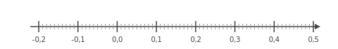
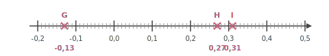




---Q---
Calculer. $ (-15)  \div (-3)$
---CORR---
$ {\color{#A4485F}\boldsymbol{(-15)}}  \div {\color{#A4485F}\boldsymbol{(-3)}} = {\color{#8B3C52}\boldsymbol{(+5)}}$


---Q---
Résoudre l'équation suivante : $-13a-3=0$
---CORR---
$-13a-3=0$ $-13a-3{\color{blue}\boldsymbol{\,\,+\,\,3}}=0{\color{blue}\boldsymbol{\,\,+\,\,3}}$ $-13a=3$ $-13a{\color{blue}\boldsymbol{\,\div\,(-13)}}=3{\color{blue}\boldsymbol{\,\div\,(-13)}}$ $a=-\dfrac{3}{13}$  La solution de l'équation $-13a-3=0$ est ${\color{#8B3C52}\boldsymbol{-\dfrac{3}{13}}}$.


---Q---
$DBX$ est un triangle quelconque. L'angle $\widehat{DBX}$ mesure $35^\circ$ et l'angle $\widehat{BDX}$ mesure $41^\circ$. Quelle est la mesure de l'angle $\widehat{BXD}$ ?
---CORR---
Dans un triangle, la somme des angles est égale à $180^\circ$. D'où : $\widehat{DBX} + \widehat{BXD} + \widehat{BDX}=180^\circ$. D'où : $\widehat{BXD}=180- \left(\widehat{DBX} + \widehat{BDX}\right)$. D'où : $\widehat{BXD}= 180^\circ-\left(35^\circ+41^\circ\right)=180^\circ-76^\circ=104^\circ$. L'angle ${\color{black}\boldsymbol{\widehat{BXD}}}$ mesure ${\color{#8B3C52}\boldsymbol{104}}^\circ$. 


---Q---
Rémi relève les prix des maquettes sur un catalogue par correspondance en fonction de la quantité saisie dans le panier. Il note les prix dans le tableau suivant :

 
$$\def\arraystretch{1.5}\begin{array}{|c|c|c|c|c|c|}\hline  \text{maquettes}&5&6&11&18\\\hline \text{Prix (en €})&49&60&110&180\\\hline\end{array}$$

 
Le prix des maquettes est-il proportionnel à la quantité achetée ? 
---CORR---
On peut calculer le prix unitaire des maquettes dans chaque cas de figure :

 
$\dfrac{60\text{ \, €}}{6\text{ maquettes}}=\dfrac{110\text{ \, €}}{11\text{ maquettes}}=\dfrac{180\text{ \, €}}{18\text{ maquettes}}=10\text{ \, €}/_{\text{maquette}}$

 
Mais $\dfrac{49\text{ \, €}}{5\text{ maquettes}}
            =9{,}80\text{ \, €}/_{\text{maquette}}$. Le prix des maquettes n'est pas proportionnel à leur nombre. 






---Q---
Un article coûtait $250$ € et son prix a augmenté de $20\,\%$. Calculer son nouveau prix.
---CORR---
Une augmentation de $20\,\%$ revient à multiplier par $100\,\% + 20\,\% = 120\,\% = 1{,}2$. $250\times 1{,}2 = 300$ Le nouveau prix de cet article est ${\color{#8B3C52}\boldsymbol{300}}$ €.


---Q---
Placer les points : $G(-0{,}13), H(0{,}27), I(0{,}31)$.

  
---CORR---



---Q---
Calculer le périmètre exact d'un carré de côté $5{,}4\text{ cm}$
---CORR---
$\mathcal{P}_\text{carré} = 4 \times c$ $\mathcal{P}_\text{carré} = 4 \times 5{,}4\text{ cm}$ $\mathcal{P}_\text{carré} = {\color{#8B3C52}\boldsymbol{21{,}6}}\text{ cm}$


---Q---
Plusieurs amis reviennent du marché.   
    Il s'agit de Béatrice, Vanessa et Aude.   

    Béatrice rapporte $9$ kiwis, $8$ coings, $2$ bananes et $10$ melons.   
    Vanessa rapporte $6$ bananes, $4$ kiwis, $8$ melons et $1$ coing.   
    Aude rapporte $7$ kiwis, $8$ coings, $5$ melons et $8$ bananes. 

     
    <strong>a.</strong> Compléter le tableau.   
    <strong>b.</strong> Quel est le nombre total de fruits achetés ?   
    <strong>c.</strong> Qui a rapporté le plus de fruits ?   
    <strong>d.</strong> Quel fruit a été rapporté en la plus grande quantité ?

    

$$
    
    \begin{array}{|c|c|c|c|c|c|}
    \hline
      \text{Amis\textbackslash fruits} &
      \text{Kiwi} &
      \text{Banane} &
      \text{Coing} &
      \text{Melon} &
      \text{TOTAL}\\
    \hline
      \text{Béatrice} & & & & & \\
    \hline
      \text{Vanessa} & & & & & \\
    \hline
      \text{Aude} & & & & & \\
    \hline
      \text{TOTAL} & & & & & \\
    \hline
    \end{array}
    
    $$
---CORR---
<strong>a.</strong> Tableau complété :

    

$$
    
    \begin{array}{|c|c|c|c|c|c|}
    \hline
      \text{Amis\textbackslash fruits} &
      \text{Kiwi} &
      \text{Banane} &
      \text{Coing} &
      \text{Melon} &
      \text{TOTAL}\\
    \hline
      \text{Béatrice} & 9 & 2 & 8 & 10 & 29\\
    \hline
      \text{Vanessa} & 4 & 6 & 1 & 8 & 19\\
    \hline
      \text{Aude} & 7 & 8 & 8 & 5 & 28\\
    \hline
      \text{TOTAL} & 20 & 16 & 17 & 23 & 76\\
    \hline
    \end{array}
    
    $$

<strong>b.</strong> Total de fruits : **76**.   
<strong>c.</strong> Celle qui a rapporté le plus de fruits : **Béatrice** (29 fruits).   
<strong>d.</strong> Fruit le plus rapporté : **le melon** (23 melons).






---Q---
Donner l'écriture scientifique de $70\,000$
---CORR---
$70\,000 = {\color{#8B3C52}\boldsymbol{7\times 10^{4}}}$


---Q---
Teresa doit acheter du gazon.  Sur la notice, il est indiqué de prévoir $10$ kg pour $50\text{ m}^2$.   Combien doit-elle en acheter pour une surface de $250\text{ m}^2$ ?
---CORR---
Commençons par trouver combien de kg il faut prévoir pour $1\text{ m}^2$.  
 $1\text{ m}^2$, c'est ${\color{#C5607A}\boldsymbol{50}}$ fois moins que 50$\text{ m}^2$. $10$ kg $\div {\color{#C5607A}\boldsymbol{50}} = 0{,}2$ kg   on a donc besoin de ${\color{#C5607A}\boldsymbol{0{,}2}}$ kg pour recouvrir $1\text{ m}^2$.  Cherchons maintenant la quantité de kg nécessaire pour recouvrir $250\text{ m}^2$.  $250\text{ m}^2$, c'est ${\color{#C5607A}\boldsymbol{250}}$ fois plus que $1\text{ m}^2$.  ${\color{#C5607A}\boldsymbol{0{,}2}}$ kg $\times {\color{#C5607A}\boldsymbol{250}} = 50$ kg  Teresa aura besoin de ${\color{#8B3C52}\boldsymbol{50}}$ kg pour recouvrir $250\text{ m}^2$.


---Q---
Calculer le volume d'une pyramide de hauteur $5\text{ cm}$ et dont la base est un triangle.  
La base du triangle mesure $8\text{ cm}$ et la hauteur associée à cette base mesure $3\text{ cm}$.
---CORR---
$\mathcal{V}=\dfrac{1}{3} \times \mathcal{B} \times h=\dfrac{1}{3}\times\dfrac{8\text{ cm} \times 3\text{ cm}}{2}\times5\text{ cm}=\dfrac{8 \times 3 \times 5}{6}\text{ cm}^3={\color{#8B3C52}\boldsymbol{20\mathbf{ cm}^3}}$


---Q---
Une élève souhaite réaliser un programme pour dessiner un triangle équilatéral.  
    Par quelles valeurs doit-elle compléter les lignes 3 et 5 ? 
---CORR---
Pour obtenir un triangle équilatéral, il faut répéter ${\color{#8B3C52}\mathbf{3}}$ fois  
    et tourner de ${\color{#8B3C52}\mathbf{120}}$ degrés.



