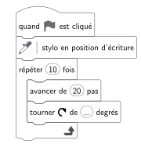
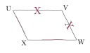
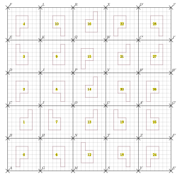



1
---Q---
Supprimer les parenthèses et réduire l'expression :<br>$A= -(y+3) + (-7y+1)$
---CORR---
$A= -(y+3) + (-7y+1)$<br>$A= -y-3-7y+1$<br>$A= {\color{#EB7F73}\boldsymbol{-8y-2}}$


2
---Q---
Traduire le calcul par une phrase en français.<br>$6 \times 5-90 \div 9$
---CORR---
$6 \times 5-90 \div 9$ s'écrit : <span class="rep">la différence entre le produit de 6 par 5 et le quotient de 90 par 9</span>.


3
---Q---
Un angle rentrant mesure entre $\ldots\ldots\ldots^\circ$ et $\ldots\ldots\ldots^\circ$.
---CORR---
Un angle rentrant mesure entre ${\color{#EB7F73}\boldsymbol{180}}^\circ$ et ${\color{#EB7F73}\boldsymbol{360}}^\circ$.



4
---Q---
$DVKZ$ est un parallélogramme tel que ses diagonales $[DK]$ et $[VZ]$ sont perpendiculaires.<br>Déterminer la nature de $DVKZ$.

---CORR---
On sait que $[DK]\perp[VZ]$.<br>Si un parallélogramme a des diagonales perpendiculaires, alors c'est un losange.<br>$DVKZ$ est donc un <span class="rep">losange</span>.



5
---Q---
Quel nombre doit-on écrire à la place des pointillés pour tracer un décagone régulier ?<br><br>
```
répéter 10 fois
  avancer de 20 pas
  tourner ↻ de ... degrés
fin
```
<br>

---CORR---
Un décagone régulier a des angles de $144^\circ$. Le lutin doit tourner de $180-144={\color{#EB7F73}\boldsymbol{36}}^\circ$ après avoir tracé un côté.<br>Mentalement on divise $360$ par $10$ : $\dfrac{360}{10}=36$.








1
---Q---
Développer et réduire l'expression suivante.<br>$A=-2(5x-7)(-9x-4)$
---CORR---
$A=-2(5x-7)(-9x-4)$<br>$\phantom{A}=-2(-45x^2-20x+63x+28)$<br>$\phantom{A}=-2(-45x^2+43x+28)$<br>$\phantom{A}= {\color{#EB7F73}\boldsymbol{90x^2-86x-56}}$


2
---Q---
Traduire le calcul par une phrase en français.<br>$(130-80) \div (3+7)$
---CORR---
$(130-80) \div (3+7)$ s'écrit : <span class="rep">le quotient de la différence entre 130 et 80 par la somme de 3 et 7</span>.


3
---Q---
$RLV$ est un triangle quelconque. L'angle $\widehat{RLV}$ mesure $37^\circ$ et l'angle $\widehat{LRV}$ mesure $34^\circ$.<br>Quelle est la mesure de l'angle $\widehat{LVR}$ ?
---CORR---
Dans un triangle, la somme des angles est égale à $180^\circ$.<br>D'où : $\widehat{RLV} + \widehat{LVR} + \widehat{LRV}=180^\circ$.<br>D'où : $\widehat{LVR}=180- \left(\widehat{RLV} + \widehat{LRV}\right)$.<br>D'où : $\widehat{LVR}= 180^\circ-\left(37^\circ+34^\circ\right)=180^\circ-71^\circ={\color{#EB7F73}\boldsymbol{109^\circ}}$.


4
---Q---
$1{,}2~\text{h} =$ ..... h ..... min
---CORR---
$1{,}2~\text{h} = 1~\text{h} + 0{,}2 \times 60~\text{min} = {\color{#EB7F73}\boldsymbol{1}}~\text{h}~{\color{#EB7F73}\boldsymbol{12}}~\text{min}$


5
---Q---
Pour la figure suivante, tracée à main levée, préciser s'il s'agit d'un parallélogramme.
<br>

---CORR---
Les côtés consécutifs de $UVWX$ sont de même longueur deux par deux, ${\color{#EB7F73}\boldsymbol{UVWX}}$ <span class="rep">n'est donc pas forcément un parallélogramme</span> comme le montre le contre-exemple suivant (il s'agit d'un cerf-volant).






11
---Q---
Développer et réduire l'expression suivante.<br>$A=-3(-11x-10)-(-7-7x)$
---CORR---
$A=-3(-11x-10)-(-7-7x)$<br>$\phantom{A}=33x+30-(-7-7x)$<br>$\phantom{A}=33x+30+7+7x$<br>$\phantom{A}= {\color{#EB7F73}\boldsymbol{40x+37}}$


22
---Q---
Quel est l'inverse de $0{,}8$ ? (Une fraction est attendue)
---CORR---
Comme $0{,}8=\dfrac{8}{10}=\dfrac{4}{5}$, l'inverse de $0{,}8$ est ${\color{#EB7F73}\boldsymbol{\dfrac{5}{4}}}$ car $\dfrac{4}{5} \times \dfrac{5}{4} = 1$.


33
---Q---
$1~\text{m}^2$ est égal à $\ldots\ldots\ldots\ldots\ldots\ldots\ldots\ldots\ldots$ de $1~\text{dm}^2$.
---CORR---
$1~\text{m}^2$ est égal à <span class="rep">une centaine</span> de $1~\text{dm}^2$.


44
---Q---
Déterminer la valeur exacte de $XY$.
<br>

---CORR---
On utilise le théorème de Pythagore dans le triangle $WXY$, rectangle en $X$.<br>$WX^2+XY^2=WY^2$<br>$XY^2=WY^2-WX^2=8^2-4^2=64-16=48$<br>$XY={\color{#EB7F73}\boldsymbol{\sqrt{48}}}={\color{#EB7F73}\boldsymbol{4\sqrt{3}}}$<br>Mentalement : La longueur $XY$ est donnée par la racine carrée de la différence des carrés de $8$ et de $4$. Cette différence vaut $64-16=48$. La valeur cherchée est donc : $\sqrt{48}=4\sqrt{3}$.


55
---Q---
a. Quelle transformation permet de passer de la figure 20 à la figure 26 ?<br>b. Quelle transformation permet de passer de la figure 1 à la figure 2 ?<br>c. Quelle transformation permet de passer de la figure 7 à la figure 13 ?
<br>

---CORR---
a. La figure $20$ a pour image la figure ${\color{#EB7F73}\boldsymbol{26}}$ par <span class="rep">la symétrie d'axe $(A'B')$</span>.<br>b. La figure $1$ a pour image la figure ${\color{#EB7F73}\boldsymbol{2}}$ par <span class="rep">la symétrie dont le centre est le milieu de $[CI]$</span>.<br>c. La figure $7$ a pour image la figure ${\color{#EB7F73}\boldsymbol{13}}$ par <span class="rep">la symétrie d'axe $(NO)$</span>.



