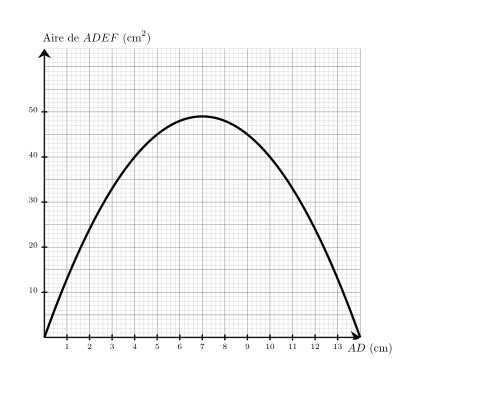
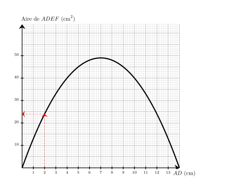
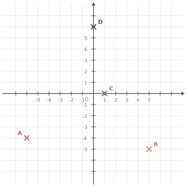




---Q---
Calculer le carré de $13$
---CORR---
$13^2={\color{#8B3C52}\boldsymbol{169}}$


---Q---
Sur le graphique ci-dessus, on a représenté la relation entre la longueur $AD$ et l'aire du rectangle $ADEF$. Quelle est l'aire du rectangle $ADEF$ lorsque la longueur $AD$ vaut $2\text{ cm}$ ? 
---CORR---
On cherche $Aire_{ADEF}$ lorsque $AD = 2\text{ cm}$. On trouve $Aire_{ADEF}={\color{#8B3C52}\boldsymbol{24}}\text{ cm}^2$. 


---Q---
Convertir $136$ secondes en minutes ($\text{min}$) et secondes ($\text{s}$).
---CORR---
Mentalement :  
      On cherche le multiple de $60$ inférieur à $136$ le plus grand possible. C'est $2\times 60 = 120$. 
      Ainsi $136 = 120 + 16$ donc $136\text{\,s\,}= 2\text{\,min\,}16\text{\,s}$. $136 = (2 \times 60) + 16$ donc $136$ s = ${\color{#8B3C52}\boldsymbol{2\mathbf{\,min\,}16\mathbf{\,s}}}$.


---Q---
$KLM$ est un triangle rectangle en $K$ dans lequel
      $KL=3$ et $KM=\sqrt{3}$. 
       Calculer la valeur exacte de $LM$ .
---CORR---
On utilise le théorème de Pythagore dans le triangle $KLM$,  rectangle en $K$. 
On obtient : 
$\begin{aligned}
LM^2&=KL^2+KM^2\\
LM^2&=\sqrt{3}^2+3^2\\
LM^2&=3+9\\
LM^2&=12\\
LM&={\color{#8B3C52}\boldsymbol{\sqrt{12}}}
\end{aligned}$ 







---Q---
Simplifier le plus possible la fraction suivante  $\dfrac{4}{70}$
---CORR---
$\dfrac{4}{70}=\dfrac{\cancel{2}\times2}{\cancel{2}\times5\times7}={\color{#8B3C52}\boldsymbol{\dfrac{2}{35}}}$


---Q---
Développer et réduire : $B=-7c(2c-4)$
---CORR---
$B=-7c(2c-4)$ $B={\color{blue}\boldsymbol{-7c\times 2c + (-7c)\times (-4)}}$ En réduisant l'expression, on obtient :   $B=$ ${\color{#8B3C52}\boldsymbol{-14c^2+28c}}$.


---Q---
Placer les points suivants : $A(-6\;;\;-4)$ ; $B(5\;;\;-5)$ ; $C(1\;;\;0)$ et $D(0\;;\;6)$.

      
---CORR---
Les points sont placés aux coordonnées indiquées : 


---Q---
 
Sur la figure ci-dessus, dans le triangle $BVW$, les droites $(VW)$ et $(YF)$ sont parallèles. Déterminer la longueur $BV$. 
---CORR---
Dans le triangle $BVW$, les droites $(VW)$ et $(YF)$ sont parallèles.  
    D'après le théorème de Thalès, on a :  
    $\dfrac{BV}{BF} =
    \dfrac{VW}{YF}$.  
    En remplaçant par les longueurs, on obtient :  
    $\dfrac{BV}{BF} = \dfrac{6}{4}=1{,}5$. 
    On en déduit que :  
    $BV = 1{,}5 \times 8 = {\color{#8B3C52}\boldsymbol{12}}$ cm.






---Q---
Compléter avec le signe < ou >. $$-1{,}4 \quad \ldots   \quad-1{,}8$$
---CORR---
$-1{,}4 \quad {\color{#8B3C52}\boldsymbol{>}} \quad -1{,}8$


---Q---
Choisis le calcul qui permet de résoudre l'équation suivante :  
Pour résoudre $8x+1=23$ : 

      <strong>A</strong>. $23\times 8-1$&emsp;&emsp; 
    <strong>B</strong>. $(23-8)-1$&emsp;&emsp; 
    <strong>C</strong>. $\dfrac{23}{8}-1$&emsp;&emsp; 
    <strong>D</strong>. $\dfrac{23-1}{8}$
---CORR---
$8x+1=23$   
    On enlève $1$ : $8x=23-1$.   
    Puis on divise par $8$ : $x=\dfrac{23-1}{8}$.   
    Bonne réponse : <strong>D</strong>.


---Q---
$SRTW$ est un carré et $WTV$ est un triangle équilatéral ($V$ est à l'intérieur du carré $SRTW$).  $RTU$ est un triangle isocèle en $U$ ($U$ est à l'extérieur du carré $SRTW$). Représenter cette configuration par un schéma à main levée et ajouter les codages nécessaires.
---CORR---
Voilà ci-dessous un schéma qui pourrait convenir à la situation. 


---Q---
Dans le triangle $MLJ$, rectangle en $L$, quel calcul doit-on effectuer pour déterminer le cosinus de l’angle $\widehat{LMJ}$ ? 
---CORR---
La bonne formule est :  
    $\text{cosinus}(\widehat{LMJ}) = \dfrac{\text{longueur du côté adjacent à l’angle } \widehat{LMJ}}{\text{longueur de l’hypoténuse }}=\dfrac{ML}{MJ}$.



