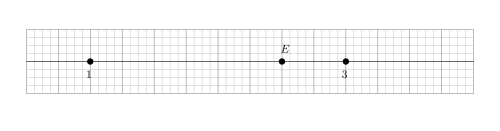
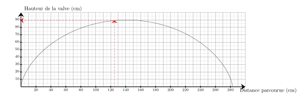
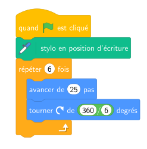




---Q---
Déterminer la valeur de $10\,\%$ de $25$.
---CORR---
$10\,\%$ de $25$ :   
    $\dfrac{10 \times 25}{100} = 0{,}1 \times 25 = 2{,}5$.    
    Donc la valeur est <strong>2</strong>.


---Q---
Sur chaque droite graduée, déterminer l’abscisse du point $E$.  <strong>A</strong>. $\dfrac{9}{4}$ &emsp;
    <strong>B</strong>. $\dfrac{13}{4}$ &emsp;
    <strong>C</strong>. $2$ &emsp;
    <strong>D</strong>. $\dfrac{5}{2}$ 
---CORR---
On remarque qu'il y a 8 divisions entre $1$ et $3$, donc chaque division vaut $\dfrac{1}{4}$. 
    Le point $E$ est situé après $10$ divisions à partir de l'origine. 
    Donc l'abscisse de $E$ est $\dfrac{5}{2}$. 
    Bonne réponse : D.


---Q---
Calculer l'aire d'un rectangle de longueur $5\text{ cm}$ et de largeur $2{,}4\text{ cm}$
---CORR---
$\mathcal{A}_\text{rectangle} = L \times l$ $\mathcal{A}_\text{rectangle} = 5\text{ cm} \times 2{,}4\text{ cm}$ $\mathcal{A}_\text{rectangle} = {\color{#F15929}\boldsymbol{12}}\text{ cm}^2$


---Q---
On tire une boule au hasard dans une urne contenant $8$ boules noires et $6$ boules blanches.              Quelle est la probabilité d'obtenir une boule blanche ?               On donnera le résultat sous forme d'une fraction irréductible.
---CORR---
Dans une situation d'équiprobabilité,
        on calcule la probabilité d'un événement par le quotient :
        $\dfrac{\text{Nombre d'issues favorables}}{\text{Nombre total d'issue}}$.  
        La probabilité est donc donnée par : 
        $\dfrac{\text{Nombre de boules blanches}}{\text{Nombre total de boules}}
             =\dfrac{6}{14}  =\dfrac{3{\color{#2563a5}\boldsymbol{\times2}} }{7{\color{#2563a5}\boldsymbol{\times2}}}={\color{#F15929}\boldsymbol{\dfrac{3}{7}}}$






---Q---
Donner l'écriture scientifique de $0{,}919$.
---CORR---
$0{,}919 = {\color{#F15929}\mathbf{9{,}19 \times 10^{-1}}}$.


---Q---
Teresa doit acheter du gazon.  Sur la notice, il est indiqué de prévoir $10$ kg pour $50\text{ m}^2$.   Combien doit-elle en acheter pour une surface de $250\text{ m}^2$ ?
---CORR---
Commençons par trouver combien de kg il faut prévoir pour $1\text{ m}^2$.  
 $1\text{ m}^2$, c'est ${\color{#216D9A}\boldsymbol{50}}$ fois moins que 50$\text{ m}^2$. $10$ kg $\div {\color{#216D9A}\boldsymbol{50}} = 0{,}2$ kg   on a donc besoin de ${\color{#216D9A}\boldsymbol{0{,}2}}$ kg pour recouvrir $1\text{ m}^2$.  Cherchons maintenant la quantité de kg nécessaire pour recouvrir $250\text{ m}^2$.  $250\text{ m}^2$, c'est ${\color{#216D9A}\boldsymbol{250}}$ fois plus que $1\text{ m}^2$.  ${\color{#216D9A}\boldsymbol{0{,}2}}$ kg $\times {\color{#216D9A}\boldsymbol{250}} = 50$ kg  Teresa aura besoin de ${\color{#F15929}\boldsymbol{50}}$ kg pour recouvrir $250\text{ m}^2$.


---Q---
Donner le nom du solide suivant : 
---CORR---
Pyramide avec une base ayant $8$ sommets.


---Q---
Voici une série de 4 notes : $10, 6, 14, 8$.   
    Quelle est la moyenne de cette série ?

     
      <strong>A</strong>. $7{,}5$ &emsp;
    <strong>B</strong>. $9{,}5$ &emsp;
    <strong>C</strong>. $8{,}5$ &emsp;
    <strong>D</strong>. $10$
---CORR---
La moyenne de cette série est :
    

$$
    \frac{10+6+14+8}{4}=\frac{38}{4}=9{,}5.
    $$

    Bonne réponse : B.






---Q---
Compléter le tableau en mettant oui ou non dans chaque case. $$\begin{array}{|l|c|c|c|c|}
    \hline
    \text{... est divisible} & \text{par }2 & \text{par }3 & \text{par }5 & \text{par }9\\
    \hline
    1\,635 & & & & \\
    \hline
    \end{array}$$
---CORR---
$$\begin{array}{|l|c|c|c|c|}
    \hline
    \text{... est divisible} & \text{par }2 & \text{par }3 & \text{par }5 & \text{par }9\\
    \hline
    1\,635 & \text{non} & \color{blue}{\text{oui}} & \color{blue}{\text{oui}} & \text{non} \\
    \hline
    \end{array}$$


---Q---
Sur le graphique ci-dessus, on a représenté la hauteur de la valve d'une roue de vélo en fonction de la distance parcourue en $\text{cm}$ lors d'un tour complet. Quelle est la hauteur de la valve lorsque la distance parcourue est de $125\text{ cm}$ ? 
---CORR---
La hauteur de la valve lorsque la distance parcourue est de $125\text{ cm}$ est de $89\text{ cm}$. 


---Q---
Un concours dure $470$ minutes. Quelle est sa durée en heures et minutes ?
---CORR---
Une heure contient 60 minutes.  
    $470=420+50=7\times 60+50$, donc dans $470$ minutes il y a 7 h 50 min.


---Q---
Laquelle des 4 figures ci-dessous va être tracée avec le script fourni ?

  

    
    
Figure 1

  

  

    
    
Figure 2

  

  

    
    
Figure 3

  

  

    
    
Figure 4

  

 
---CORR---
C'est la figure 2.



