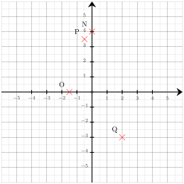
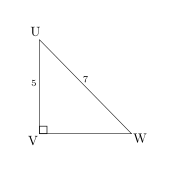
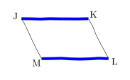
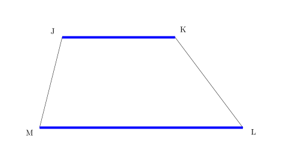
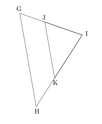
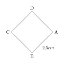
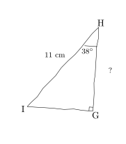




---Q---
Effectuer le calcul suivant en donnant le résultat sous forme d'une fraction.  
$B = \dfrac{7}{5} \times \dfrac{3}{4}$
---CORR---
$B = \dfrac{7}{5} \times \dfrac{3}{4}$ $B =$ ${\color{#8B3C52}\boldsymbol{ \dfrac{21}{20}}}$ 


---Q---
Factoriser :  $B=55k-66k^2$
---CORR---
$B=55k-66k^2$ $\phantom{B}=11k\times5-11k\times6k$ $\phantom{B}=$ ${\color{#8B3C52}\boldsymbol{11k(5-6k)}}$


---Q---
Déterminer les coordonnées respectives des points $O$, $P$, $Q$ et $N$ 
---CORR---
Les coordonnées respectives des points sont :  $O({\color{#8B3C52}\boldsymbol{-1{,}5}};{\color{#8B3C52}\boldsymbol{0}})$, $P({\color{#8B3C52}\boldsymbol{-0{,}5}};{\color{#8B3C52}\boldsymbol{3{,}5}})$, $Q({\color{#8B3C52}\boldsymbol{2}};{\color{#8B3C52}\boldsymbol{-3}})$ et $N({\color{#8B3C52}\boldsymbol{0}};{\color{#8B3C52}\boldsymbol{4}})$


---Q---
Déterminer la valeur exacte de $VW$. 
---CORR---
On utilise le théorème de Pythagore dans le triangle $UVW$,  rectangle en $V$. 
      On obtient :

 

      $\begin{aligned}
        UV^2+VW^2&=UW^2\\
        VW^2&=UW^2-UV^2\\
        VW^2&=7^2-5^2\\
        VW^2&=49-25\\
        VW^2&=24\\
        VW&={\color{#8B3C52}\boldsymbol{\sqrt{24}}}
        \end{aligned}$ 
        En simplifiant, on obtient : $VW = {\color{#8B3C52}\boldsymbol{2\sqrt{6}}}$.
         Mentalement :  
    La longueur $VW$ est donnée par la racine carrée de la différence des carrés de $7$ et de $5$. 
    Cette différence vaut $49-25=24$.  
    La valeur cherchée est donc : $\sqrt{24}=2\sqrt{6}$.






---Q---
Calculer. $ (-10) + (-6) $
---CORR---
$  {\color{#A4485F}\boldsymbol{(-10)}} + {\color{#A4485F}\boldsymbol{(-6)}} = {\color{#8B3C52}\boldsymbol{(-16)}} $


---Q---
Résoudre l'équation suivante : $5z+6=-8z+9$
---CORR---
$5z+6=-8z+9$ $5z+6{\color{blue}\boldsymbol{\,\,+\,\,8z}}=-8z+9{\color{blue}\boldsymbol{\,\,+\,\,8z}}$ $13z+6=9$ $13z+6{\color{blue}\boldsymbol{\,\,-\,\,6}}=9{\color{blue}\boldsymbol{\,\,-\,\,6}}$ $13z=3$ $13z{\color{blue}\boldsymbol{\,\div\,13}}=3{\color{blue}\boldsymbol{\,\div\,13}}$ $z=\dfrac{3}{13}$  La solution de l'équation $5z+6=-8z+9$ est ${\color{#8B3C52}\boldsymbol{\dfrac{3}{13}}}$.


---Q---
Préciser s'il s'agit d'un parallélogramme. $(JK) // (LM)$ 
---CORR---
$JKLM$ a deux côtés opposés parallèles, ${\color{#8B3C52}\boldsymbol{JKLM}}$ n'est donc pas forcément un parallélogramme comme le montre le contre-exemple suivant (il s'agit d'un trapèze). 


---Q---
Sur la figure suivante : 
          $\leadsto J$ est sur $[IG]$,
          $\leadsto K$ est sur $[IH]$,  $\leadsto$ les droites $(GH)$ et $(JK)$ sont parallèles. Écrire la double égalité de Thalès. 
---CORR---
Dans le triangle $GHI$ :
         $\leadsto$ $J\in[IG]$,
         $\leadsto$ $K\in[IH]$,
         $\leadsto$  $(GH)//(JK)$,
         donc d'après le théorème de Thalès, les triangles $GHI$ et $JKI$ ont des longueurs proportionnelles.

 
$\dfrac{IJ}{IG}=\dfrac{IK}{IH}=\dfrac{JK}{GH}$ <strong>Remarque</strong> On pourrait aussi écrire : $\dfrac{IG}{IJ}=\dfrac{IH}{IK}=\dfrac{GH}{JK}$






---Q---
Dans une association, $25\%$ des 150 membres participent à une olympiade de mathématiques. 
    Combien de membres ne participent pas à cette olympiade ?
---CORR---
Le nombre de membres participant à cette olympiade est égal à : 
    $150 \times \dfrac{25}{100} = 38$. 
    Le nombre de membres ne participant pas à cette olympiade est donc égal à : 
    $150 - 38 = {\color{#8B3C52}\boldsymbol{112}}$. 

 
Une autre méthode consiste à calculer le pourcentage de membres ne participant pas à cette olympiade, qui est égal à $100\% - 25\% = 75\%$. 
    Le nombre de membres ne participant pas à cette olympiade est donc égal à : 
    $150 \times \dfrac{75}{100} = {\color{#8B3C52}\boldsymbol{112}}$.


---Q---
Lire l'abscisse de chacun des points suivants. 
---CORR---
 $\ G $ $(-3{,}2)$ &emsp; $\ H $ $(-1{,}2)$ &emsp; $\ I $ $(0{,}3)$


---Q---
Calculer le périmètre du carré $ABCD$ représenté ci-dessous : 

 
---CORR---
	Le polygone a $4$ côtés de longueur $2{,}5$ cm. 
Le périmètre est donc égal à : 
$4 \times 2{,}5 = {\color{#8B3C52}\boldsymbol{10}}$ cm.



---Q---
Dans le triangle $GHI$ rectangle en $G$,  $HI=11\text{ cm}$ et $\widehat{GHI}=38^\circ$. Calculer $GH$ à $0,1\text{ cm}$ près. 
---CORR---
Dans le triangle $GHI$ rectangle en $G$,  le cosinus de l'angle $\widehat{GHI}$ est défini par : $\cos\left(\widehat{GHI}\right)=\dfrac{GH}{HI}$. Avec les données numériques : $\dfrac{\cos\left(38^\circ\right)}{\color{red}{1}}=\dfrac{GH}{11}$ $GH=11 \times \cos\left(38^\circ\right)$ soit $GH\approx{\color{#8B3C52}\boldsymbol{8{,}7}}\text{ cm}$.



