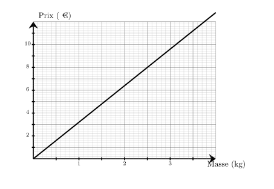
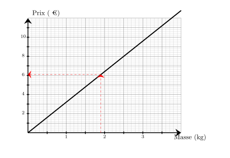
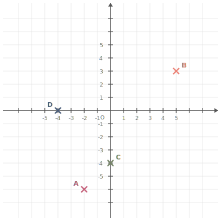
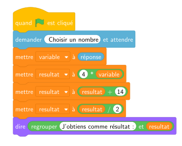




---Q---
Donner l'écriture scientifique de $100$
---CORR---
$100 = {\color{#F15929}\boldsymbol{1\times 10^{2}}}$


---Q---
Teresa doit acheter du gazon.  Sur la notice, il est indiqué de prévoir $10$ kg pour $50\text{ m}^2$.   Combien doit-elle en acheter pour une surface de $250\text{ m}^2$ ?
---CORR---
Commençons par trouver combien de kg il faut prévoir pour $1\text{ m}^2$.  
 $1\text{ m}^2$, c'est ${\color{#216D9A}\boldsymbol{50}}$ fois moins que 50$\text{ m}^2$. $10$ kg $\div {\color{#216D9A}\boldsymbol{50}} = 0{,}2$ kg   on a donc besoin de ${\color{#216D9A}\boldsymbol{0{,}2}}$ kg pour recouvrir $1\text{ m}^2$.  Cherchons maintenant la quantité de kg nécessaire pour recouvrir $250\text{ m}^2$.  $250\text{ m}^2$, c'est ${\color{#216D9A}\boldsymbol{250}}$ fois plus que $1\text{ m}^2$.  ${\color{#216D9A}\boldsymbol{0{,}2}}$ kg $\times {\color{#216D9A}\boldsymbol{250}} = 50$ kg  Teresa aura besoin de ${\color{#F15929}\boldsymbol{50}}$ kg pour recouvrir $250\text{ m}^2$.


---Q---
Calculer le volume d'un prisme droit de hauteur $1{,}4\text{ m}$ et dont les bases sont des triangles de base $9\text{ dm}$ et de hauteur correspondante $42\text{ cm}$.
---CORR---
$\mathcal{V}=\mathcal{B} \times h=\dfrac{9\text{ dm}\times42\text{ cm}}{2}\times1{,}4\text{ m}=\dfrac{9\text{ dm}\times4{,}2\text{ dm}}{2}\times14\text{ dm}={\color{#F15929}\boldsymbol{264{,}6\mathbf{ dm}^3}}$


---Q---
On choisit au hasard un ticket parmi contenant $8$ tickets gagnants et $14$ tickets perdants.              Quelle est la probabilité d'obtenir un ticket gagnant ?               On donnera le résultat sous forme d'une fraction irréductible.
---CORR---
Dans une situation d'équiprobabilité,
        on calcule la probabilité d'un événement par le quotient : 
        $\dfrac{\text{Nombre d'issues favorables}}{\text{Nombre total d'issue}}$.  
        La probabilité est donc donnée par :   $\dfrac{\text{Nombre de boules gagnants}}{\text{Nombre total de boules}}
             =\dfrac{8}{22}  =\dfrac{4{\color{#2563a5}\boldsymbol{\times2}} }{11{\color{#2563a5}\boldsymbol{\times2}}}={\color{#F15929}\boldsymbol{\dfrac{4}{11}}}$.






---Q---
Quel est le carré de $10$ ?
---CORR---
Le carré d'un nombre est ce nombre multiplié par lui-même : $10\times10=100$


---Q---
Sur le graphique ci-dessus, on a représenté le prix en euros en fonction de la masse en kilogrammes de cerises achetés. Quel est le prix à payer pour l'achat de $1{,}9$ kg de cerises ? 
---CORR---
Le prix à payer pour l'achat de $1{,}9$ kg de cerises est de ${\color{#F15929}\boldsymbol{6{,}10}}$ €. 


---Q---
Compléter. $ 12\,\text{dag} = \ldots \,\text{g}$
---CORR---
Un décagramme est une dizaine de grammes donc : $ 12\,\text{dag} =  12\times10\,\text{g} ={\color{#F15929}\boldsymbol{ 120\,\mathbf{g}}}$$\,\text{g}$.


---Q---
$6 \,\, ; \,\, 9 \,\, ; \,\, 11\,\, ; \,\, 14$ 
   
        La moyenne de cette série est :

 
 
    
    	  <strong>A</strong>. $12$&emsp;&emsp; <strong>B</strong>. $9{,}5$&emsp;&emsp; <strong>C</strong>. $10$&emsp;&emsp; <strong>D</strong>. $11$&emsp;&emsp;  
---CORR---
La somme des $4$ valeurs est : $6+9+11+14 =40$. 
         La moyenne est donc $\dfrac{40}{4}=10$. La bonne réponse est la réponse C.






---Q---
Combien valent les deux quarts de $16$ ?
---CORR---
Un quart de $16$ est égal à $16 \div 4$, soit 4. 
        Donc les deux quarts de $16$ valent $2 \times 4 = 8$.


---Q---
Exprimer le quart de $m$  en fonction de $m$.
---CORR---
Le quart de $m$ peut se noter : ${\color{#F15929}\boldsymbol{\dfrac{m}{4}}}$, ${\color{#F15929}\boldsymbol{m\div 4}}$, ou ${\color{#F15929}\boldsymbol{0,25m}}$.


---Q---
Placer les points suivants : $A(-2\;;\;-6)$ ; $B(5\;;\;3)$ ; $C(0\;;\;-4)$ et $D(-4\;;\;0)$.

      
---CORR---
Les points sont placés aux coordonnées indiquées : 


---Q---
On considère l’algorithme suivant :

    

    Qu’obtient‑on si on choisit $1$ comme nombre de départ ? 
---CORR---
Si on choisit $1$ comme nombre de départ, alors variable prend la valeur $1$. 
    Ensuite, resultat prend la valeur $4 \times 1 = 4$. 
    Puis, resultat prend la valeur $4 + 14 = 18$. 
    Enfin, resultat prend la valeur $\dfrac{18}{2} = 9$. 
    Résultat final : ${\color{#F15929}\mathbf{9}}$.



