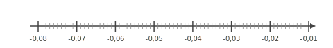
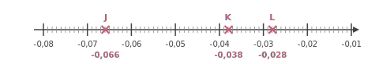




---Q---
Compléter avec le signe < ou >. $-9{,}67 \quad \ldots\ldots   \quad9{,}51$
---CORR---
$-9{,}67 \quad {\color{#8B3C52}\boldsymbol{<}} \quad 9{,}51$


---Q---
Choisis le calcul qui permet de résoudre l'équation suivante :  
Pour résoudre $7x+1=23$ :

      <strong>A</strong>. $(23-7)-1$&emsp;&emsp; 
    <strong>B</strong>. $23\times 7-1$&emsp;&emsp; 
    <strong>C</strong>. $\dfrac{23}{7}-1$&emsp;&emsp; 
    <strong>D</strong>. $\dfrac{23-1}{7}$
---CORR---
$7x+1=23$   
    On enlève $1$ : $7x=23-1$.   
    Puis on divise par $7$ : $x=\dfrac{23-1}{7}$.   
    Bonne réponse : <strong>D</strong>.


---Q---
$ZRSB$ est un parallélogramme tel que ses diagonales $[ZS]$ et $[RB]$ ont la même longueur et sont perpendiculaires. Déterminer la nature de $ZRSB$ en justifiant la réponse.
---CORR---
Les segments de même couleur sont parallèles sur le schéma suivant : 
On sait que $[ZS]\perp[RB]$ et $ZS=RB$. Si un parallélogramme a des diagonales perpendiculaires et de même longueur, alors c'est un carré. $ZRSB$ est donc un carré.


---Q---
$WXY$ est un triangle rectangle en $W$ dans lequel
      $WX=6$ et $WY=\sqrt{10}$. 
       Calculer la valeur exacte de $XY$ .
---CORR---
On utilise le théorème de Pythagore dans le triangle $WXY$,  rectangle en $W$. 
On obtient : 
$\begin{aligned}
XY^2&=WX^2+WY^2\\
XY^2&=\sqrt{10}^2+6^2\\
XY^2&=10+36\\
XY^2&=46\\
XY&={\color{#8B3C52}\boldsymbol{\sqrt{46}}}
\end{aligned}$







---Q---
Dans une école de 1100 étudiants, $25\%$ des étudiants portent des lunettes. 
    Combien d'étudiants portent des lunettes ?
---CORR---
Le nombre d'étudiants qui portent des lunettes est égal à : 
    $1\,100 \times \dfrac{25}{100} = \dfrac{27\,500}{100}={\color{#8B3C52}\boldsymbol{275}}$.


---Q---
Placer les points : $J(-0{,}066), K(-0{,}038), L(-0{,}028)$.

  
---CORR---



---Q---
Calculer le périmètre exact d'un rectangle de longueur $7{,}3\text{ cm}$ et de largeur $2{,}4\text{ cm}$
---CORR---
$\mathcal{P}_\text{rectangle} = 2 \times (L + l)$ $\mathcal{P}_\text{rectangle} = 2 \times (7{,}3 + 2{,}4)\text{ cm}$ $\mathcal{P}_\text{rectangle} = 2 \times 9{,}7\text{ cm}$ $\mathcal{P}_\text{rectangle} = {\color{#8B3C52}\boldsymbol{19{,}4}}\text{ cm}$


---Q---
 
Sur la figure ci-dessus, dans le triangle $YXT$, les droites $(XT)$ et $(UV)$ sont parallèles. Déterminer la longueur $YX$. 
---CORR---
Dans le triangle $YXT$, les droites $(XT)$ et $(UV)$ sont parallèles.  
    D'après le théorème de Thalès, on a :  
    $\dfrac{YX}{YV} =
    \dfrac{XT}{UV}$.  
    En remplaçant par les longueurs, on obtient :  
    $\dfrac{YX}{YV} = \dfrac{18}{12}=1{,}5$. 
    On en déduit que :  
    $YX = 1{,}5 \times 24 = {\color{#8B3C52}\boldsymbol{36}}$ cm.






---Q---
Donner l'écriture scientifique de $7\,290$.
---CORR---
$7\,290 = {\color{#8B3C52}\mathbf{7{,}29 \times 10^{3}}}$.


---Q---
Teresa doit acheter du gazon.  Sur la notice, il est indiqué de prévoir $10$ kg pour $50\text{ m}^2$.   Combien doit-elle en acheter pour une surface de $250\text{ m}^2$ ?
---CORR---
Commençons par trouver combien de kg il faut prévoir pour $1\text{ m}^2$.  
 $1\text{ m}^2$, c'est ${\color{#C5607A}\boldsymbol{50}}$ fois moins que 50$\text{ m}^2$. $10$ kg $\div {\color{#C5607A}\boldsymbol{50}} = 0{,}2$ kg   on a donc besoin de ${\color{#C5607A}\boldsymbol{0{,}2}}$ kg pour recouvrir $1\text{ m}^2$.  Cherchons maintenant la quantité de kg nécessaire pour recouvrir $250\text{ m}^2$.  $250\text{ m}^2$, c'est ${\color{#C5607A}\boldsymbol{250}}$ fois plus que $1\text{ m}^2$.  ${\color{#C5607A}\boldsymbol{0{,}2}}$ kg $\times {\color{#C5607A}\boldsymbol{250}} = 50$ kg  Teresa aura besoin de ${\color{#8B3C52}\boldsymbol{50}}$ kg pour recouvrir $250\text{ m}^2$.


---Q---
Donner le nom de chacun des solides.   
---CORR---
Prisme droit avec une base ayant $4$ sommets.


---Q---
Compléter à l'aide des longueurs $WT$, $WV$ et $TV$ :  
    

$$
    \cos\left(\widehat{WTV}\right)=\dfrac{\ldots}{\ldots}
    $$ 
---CORR---
$WTV$ est rectangle en $W$ donc :
    

$$
    \cos\left(\widehat{WTV}\right)
    = {\color{#8B3C52}\mathbf{\dfrac{WT}{TV}}}.
    $$



